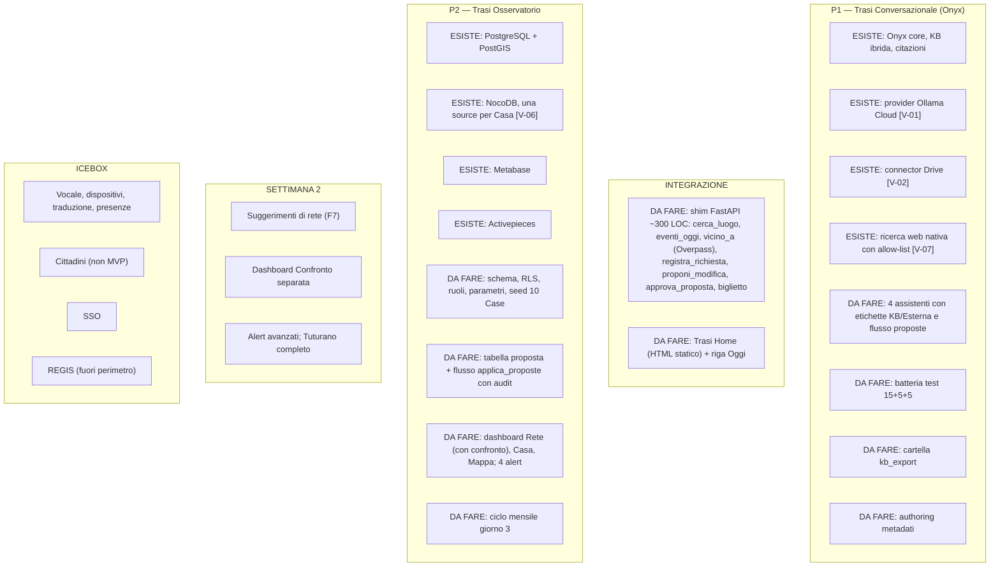
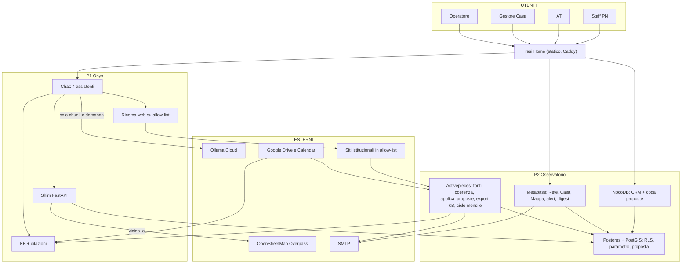
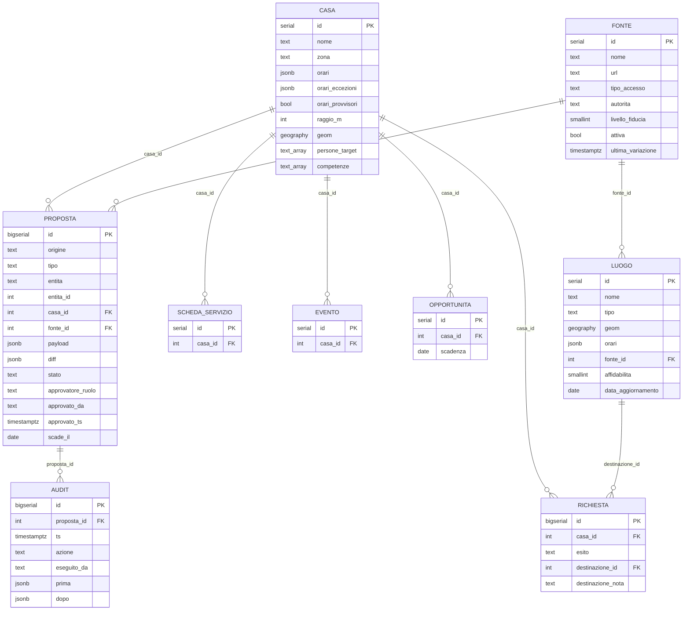
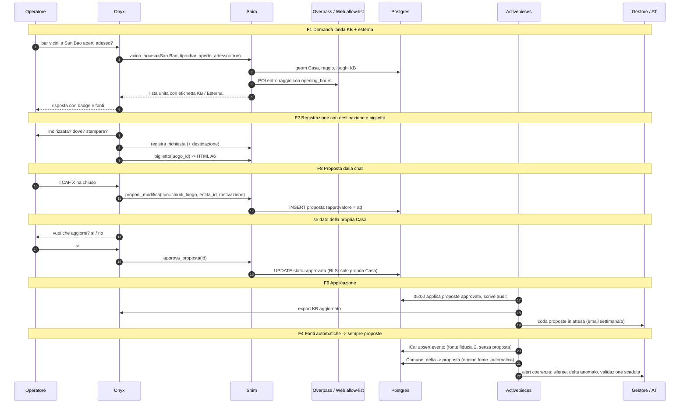

# Trasi — Portierato di Quartiere
## Documento di architettura e implementazione · v1.2

**Trasi**: strumento digitale con AI a supporto del servizio di Portierato di Quartiere della Rete delle Case di Quartiere di Brindisi
PN Metro Plus e Città Medie Sud 2021-2027 · Progetto BR5.4.11.1a · CUP J89I24000140001

| Campo | Valore |
|---|---|
| Versione | **1.2** — 15/09/2026 · recepisce: 10 Case (9 + Tuturano), V3/V4/V6 riscritti, sezione UX/UI, compressione a 72h. Changelog in App. C |
| Destinatari | Team di sviluppo (sprint 72h + settimana 2) · TI · PM |
| Impostazione | **Due prodotti**: P1 *Trasi Conversazionale* (Onyx) + P2 *Trasi Osservatorio* (CRM + dashboard + mappa + automazioni), **un solo punto d'ingresso** (Trasi Home) |
| Fonti | [A] Documento quadro · [B] Sintesi riunione · [C] Mansionario · [D] Governance · [E] Determina 1377/2026 · [F] CASAXCASA 2026 (foglio Google «Scheda per Casa») · [G] Commenti gruppo di lavoro + risposte del 15/09 |
| Convenzioni | `[V-xx]` verifica tecnica (Blocco 0) · `[DA VALIDARE]` governance · `[DA VALIDARE – Processi]` rimesso al gruppo Processi · `[ASSUNZIONE]` · `[P]` parametro modificabile da dashboard · `[S2]` settimana 2 |

**Indice** — 1 Sintesi · 2 Contesto e vincoli · 3 Decisioni · 4 UX/UI · 5 Inventario moduli · 6 Architettura · 7 Modello dati · 8 Flussi · 9 Contratto d'integrazione e assistenti · 10 Piano 72h + S2 · 11 Governance · 12 Privacy · 13 Rischi · 14 User stories · 15 Glossario · App. A Verifiche · App. B compose · App. C Changelog

---

## 1. Sintesi esecutiva

Trasi è il layer digitale del Portierato di Quartiere: dà agli operatori una **memoria condivisa interrogabile in linguaggio naturale**, capace di **combinare i dati della rete con fonti esterne autorevoli** (P1), e alla rete un **registro strutturato** con viste tabellari, grafiche e geografiche (P2). Per 12 mesi lo usano solo operatori e team; il cittadino è sempre mediato.

**Quattro principi (v1.2):**
1. **Mai senza fonte.** Ogni informazione porta fonte, data e livello di fiducia — sia che venga dalla KB sia da una fonte esterna trasparente e autorevole.
2. **Proponi → approva → applica.** La memoria si aggiorna anche da sola, ma **nessuna scrittura senza un umano che approva**; tutto è tracciato.
3. **Tutti leggono tutto, ognuno scrive il proprio.** Garantito dal database (RLS), non dall'interfaccia.
4. **L'umano decide.** L'Osservatorio osserva, mostra l'evidenza, può suggerire; non ordina, non esegue, non assegna compiti.

**Cosa si costruisce:** Onyx e quattro prodotti open source configurati; codice di progetto = schema SQL con RLS e parametri, **shim FastAPI (~300 righe: 3 endpoint di lettura, 1 geografico, 2 per le proposte, 1 biglietto stampabile)**, una pagina statica Trasi Home, flussi Activepieces predefiniti.

**Decisione richiesta al PM/TI** (RACI: A = PM, R = TI): approvare v1.2 e i `[DA VALIDARE]` di App. C; girare al gruppo Processi i `[DA VALIDARE – Processi]` (approvatori delle proposte).

---

## 2. Contesto e vincoli

### 2.1 Le 10 Case di Quartiere (seed, fonte [F] + indicazione del 15/09)

| Casa | Zona | Ente gestore | Target / vocazione | Note dal foglio [F] |
|---|---|---|---|---|
| Santa Spazio Culturale | Centro Storico | YEAHJASì aps | biblioteca, musica, giovani, NEET | — |
| Molo 12 | Centro Storico | ATS The Qube | coworking, impresa | lun–ven 9-18 |
| Accademia degli Erranti | Centro Storico | Brindisi e le Antiche Strade | turismo lento, pellegrini | orari **stagionali** (estate 10-12 / 17:20-20) |
| Parco Buscicchio | Sant'Elia | Legami di Comunità | educativa 6-19, famiglie, caregiver | **psicologa di comunità** e «portineria di comunità» in squadra |
| San Bao | La Rosa | Coop. NauKleros | anziani, benessere | portierato attivo; weekend «per eventi» |
| Minimus | Centro Storico | WWF Brindisi odv | ambiente, 13-19 | — |
| POP — Piccolo Opificio Popolare | Perrino | CE.F.A.S. | laboratori, bambini, formazione | orari **in fase di definizione** |
| Centro di Aggregazione Bozzano | Bozzano | L'Officina Sociale aps | over 60 | **gestione bar** interna |
| Dream: Laboratorio Creativo | Paradiso | ANGSA + Il Bene Che Ti Voglio | autismo, disabilità, caregiver | sportello informativo |
| **Tuturano** | **Tuturano (frazione)** | `[DA VALIDARE]` | `[DA VALIDARE]` | fuori dal centro urbano: la «vicinanza» va calcolata in **distanza reale**, non per zona |

Conseguenze sul modello: `casa.orari` deve reggere **eccezioni** (stagionali, per eventi) e uno stato **provvisorio**; ogni Casa ha un **raggio di vicinanza** proprio (`casa.raggio_m`, default `[P]` 800 m urbano; Tuturano più ampio); la squadra è eterogenea e variabile (Servizio Civile, UEPE, tirocini) → utenti **per ruolo di Casa**, non nominativi, onboarding in 5 minuti.

### 2.2 Vincoli (riscritti dove indicato)

- **V1** — 12 mesi solo operatori; cittadino mediato; **nessuna funzione per cittadini nell'MVP**.
- **V2** — Open source, replicabile.
- **V3 (riscritto) — Mai senza fonte.** L'assistente risponde combinando la **knowledge base** e **fonti esterne trasparenti e autorevoli** (allow-list configurabile, §3), **mai da memoria del modello**. Ogni frammento è etichettato: *KB* (fonte, data, affidabilità 1-3) oppure *Esterna* (nome fonte, URL, ora della consultazione, dicitura *«non verificata dalla rete»*). Se nessuna fonte risponde, lo dichiara.
- **V4 (riscritto) — Proponi, poi applica.** L'AI e i flussi automatici possono **proporre** aggiornamenti alla memoria (nuovi luoghi, orari, schede, promozione di un dato esterno). **Nessuna scrittura senza approvazione umana**; approvatore per tipo di dato in §3; audit completo. Restano esclusi: compagnia, valutazioni cliniche.
- **V5** — Privacy by design; minimizzazione verso il LLM cloud; nessun dato personale nelle proposte.
- **V6 (riscritto) — L'umano decide.** Ogni output dell'Osservatorio dichiara *cosa è stato osservato*, *su quale evidenza*, *cosa si potrebbe fare* (facoltativo), *chi decide*. Il sistema **non esegue azioni sulla rete e non assegna compiti**. «Mai prescrizioni» = mai frasi imperative rivolte a persone o Case.
- **V7** — Aggiornamento automatico da fonti ufficiali con controlli di coerenza; altrimenti scheda con responsabile e frequenza.

---

## 3. Decisioni (delta v1.2; il resto come v1.1)

| Nodo | Decisione | Motivazione | Reversibilità |
|---|---|---|---|
| **Fonti esterne** (V3) | Allow-list in `fonte` con `livello_fiducia` 1-3 e `tipo_accesso` (`osm_overpass`, `web`, `api`). **Iniziale:** OpenStreetMap/Overpass (POI, orari), siti istituzionali (Comune, ASL, INPS, Regione Puglia, Questura), siti degli ETS della rete, Google Calendar già in uso. **Il TI amplia** senza deploy. Ricerca web nativa di Onyx limitata ai domini in allow-list `[V-07]` | Trasparenti e autorevoli, a discrezione tecnica, sempre citate | Aggiungere una fonte = una riga |
| **Ragionamento geografico** | Tool `vicino_a(casa, tipo, aperto_adesso)` nello shim: coordinate della Casa dal DB + query Overpass entro `casa.raggio_m`; filtra su `opening_hours` OSM; unisce con `luogo` della KB (es. il bar di Bozzano) | «Bar più vicini alle Case aperti adesso» | Sostituibile con API commerciali |
| **Proposte di aggiornamento** (V4) | Tabella `proposta` (ex `fonte_esterna` generalizzata): `origine` (chat, fonte automatica, ricerca esterna, flusso di coerenza), `tipo`, `payload`, `diff`, `stato`, `approvatore_ruolo`. Approvazione **in chat** con click solo per la **propria Casa**; tutto il resto in coda NocoDB. Applica il flusso `applica_proposte` (ruolo `automazioni`) con riga di audit. Scadenza proposte `[P] 30 gg` | Un solo meccanismo per tutto ciò che scrive | Regole approvatore = dati |
| **Approvatori** | Casa → **gestore**; territorio → **AT**; Comune → **AT** con referente consultato (timeout `[P]`); promozione dato esterno in KB → AT | `[DA VALIDARE – Processi]` — default proposto | — |
| **Memoria dalle conversazioni** | L'operatore può dire in chat *«il CAF X ha chiuso»*: l'assistente **crea una proposta** (non modifica). Le chat restano a retention `[P] 30 gg`; **solo la proposta persiste**, senza testo libero oltre 80 caratteri | Impara senza scrivere | — |
| **UX/UI** | Chat-first · **Trasi Home** (pagina statica, 4 riquadri) · biglietto stampabile · WCAG 2.1 AA · PC/tablet | §4 | Shell applicativa in S2+ se serve |
| **Compressione** | In 72h: tutto il core (RLS, parametri, proposte, fonti esterne, Home, biglietto). **S2:** suggerimenti di rete, dashboard Confronto separata, alert oltre i 4 base, Tuturano completo | Rispetto dei tempi | — |
| Invariati | Metabase; nessun SSO; REGIS fuori perimetro; bandi con scadenza; destinazione della persona; «pre» nel Presidio; ciclo mensile a tutte le Case | v1.1 | — |

---

## 4. UX/UI

### 4.1 Persone e priorità

| Persona | Contesto | Dispositivo | Obiettivo in ≤ 3 azioni |
|---|---|---|---|
| **P1 Operatore allo sportello** (primaria) | Cittadino davanti, poco tempo, alfabetizzazione digitale variabile, turnover alto | PC o tablet | Chiedere → leggere risposta con fonti → **stampare/inviare** il biglietto e registrare |
| P2 Gestore di Casa | Fine giornata / settimana | PC | Inserire scheda/evento/opportunità; approvare proposte della Casa |
| P3 AT | Settimanale + giorno 3 | PC | Validare proposte del territorio; leggere digest e alert |
| P4 Staff PN / PM / MF | Mensile | PC | Report aggregato; CSV |

### 4.2 Principi

Chat-first (la domanda è il punto d'ingresso) · **una sola porta**: Trasi Home · ogni risposta mostra **da dove viene** (badge KB/Esterna) · **niente dato personale da digitare** · testo ≥ 16 px, contrasto AA, italiano semplice · azioni frequenti a un click · la mappa è a un click ma non è la home · palette neutra `[ASSUNZIONE: manuale identità MT non disponibile]`.

### 4.3 Trasi Home (pagina statica servita da Caddy)

```
+------------------------------------------------------------------+
|  TRASI · Casa: [San Bao ▼]                    [Aiuto] [Esci]      |
+------------------------------------------------------------------+
|  +------------------+  +------------------+                       |
|  |  CHIEDI          |  |  MAPPA           |                       |
|  |  Rispondi al     |  |  Luoghi, servizi |                       |
|  |  cittadino       |  |  e Case vicine   |                       |
|  +------------------+  +------------------+                       |
|  +------------------+  +------------------+                       |
|  |  REGISTRA /      |  |  OSSERVATORIO    |                       |
|  |  AGGIORNA        |  |  Digest, alert,  |                       |
|  |  schede, eventi, |  |  proposte da     |                       |
|  |  opportunità     |  |  approvare (3)   |                       |
|  +------------------+  +------------------+                       |
|  Oggi a San Bao: 2 eventi · 1 scheda in scadenza · 3 proposte     |
+------------------------------------------------------------------+
```
I riquadri aprono rispettivamente: Onyx (assistente preselezionato per Casa), Metabase «Mappa», NocoDB (source della Casa), Metabase «Casa» + coda proposte. La riga «Oggi» è una piccola chiamata allo shim.

### 4.4 Risposta dell'assistente (layout in chat)

```
Dove si fa l'ISEE vicino a La Rosa?
--------------------------------------------------
1) CAF ACLI La Rosa · via ... · lun-ven 9-13
   [KB · Comune di Brindisi · agg. 10/09/2026 · affidabilità 3]
2) CAF CISL · via ... · aperto ora fino alle 13
   [Esterna · OpenStreetMap · consultata 11:42 · non verificata dalla rete]
--------------------------------------------------
[ Stampa biglietto ]  [ Registra richiesta ]  [ Proponi correzione ]
La persona è stata indirizzata? Dove? ▸ CAF ACLI La Rosa
```
Il **biglietto** è una pagina HTML A6 generata dallo shim: nome, indirizzo, orari, come arrivare, fonte e data; nessun dato del cittadino.

### 4.5 Coda proposte (in NocoDB, vista «Da approvare»)

Colonne: cosa cambia (diff leggibile) · origine · chi propone · quando · **Approva / Rifiuta** · nota. Le proposte della propria Casa compaiono anche in chat come *«Vuoi che aggiorni … ? Sì / No»*.

### 4.6 Accessibilità e adozione

WCAG 2.1 AA come obiettivo (contrasto, focus visibile, tastiera) `[V-08: verificare le tre app]` · onboarding operatore in 5 minuti con un video da 3' e una pagina «Aiuto» · formazione TI trimestrale (Mansionario) · test con operatori reali in B7.

---

## 5. Inventario moduli



---

## 6. Architettura



**Deployment:** come v1.1 (VM unica, compose unico, Caddy) + Trasi Home come sito statico su Caddy `/` e Onyx su `/chat`. Cron: 01:00 export KB · 02:00 backup · 03:00 retention chat · 05:00 `applica_proposte` (solo approvate) · 06:00 coerenza fonti · giorno `[P]` 3 ciclo mensile.

---

## 7. Modello dati (delta v1.2)



### 7.1 DDL — solo le parti nuove o modificate (`db/001_schema.sql`, il resto come v1.1)

```sql
-- Casa: eccezioni orari, provvisorietà, geografia
ALTER TABLE casa ADD COLUMN orari_eccezioni jsonb,           -- es. stagionali, weekend per eventi
                 ADD COLUMN orari_provvisori bool DEFAULT false,
                 ADD COLUMN raggio_m int,                     -- NULL = usa parametro
                 ADD COLUMN geom geography(Point,4326);

-- Fonte: allow-list con fiducia
ALTER TABLE fonte ADD COLUMN tipo_accesso text CHECK (tipo_accesso IN ('kb','drive','ical','http','osm_overpass','web','api')),
                  ADD COLUMN livello_fiducia smallint CHECK (livello_fiducia BETWEEN 1 AND 3),
                  ADD COLUMN attiva bool DEFAULT true;

-- Proposta: unico meccanismo di scrittura mediata (sostituisce fonte_esterna)
CREATE TYPE stato_prop_t AS ENUM ('proposta','approvata','rifiutata','applicata','scaduta');
CREATE TABLE proposta (
  id bigserial PRIMARY KEY,
  origine text NOT NULL CHECK (origine IN ('chat','fonte_automatica','ricerca_esterna','coerenza','manuale')),
  tipo text NOT NULL CHECK (tipo IN ('nuovo_luogo','modifica_luogo','chiudi_luogo','modifica_scheda','nuova_scheda',
                                     'modifica_evento','nuova_opportunita','promuovi_esterno','modifica_orari_casa')),
  entita text NOT NULL, entita_id int,
  casa_id int REFERENCES casa,                -- NULL = territorio / rete
  fonte_id int REFERENCES fonte,
  payload jsonb NOT NULL,                      -- valori proposti
  diff jsonb,                                  -- prima/dopo leggibile
  motivazione text CHECK (char_length(motivazione) <= 80),
  stato stato_prop_t NOT NULL DEFAULT 'proposta',
  approvatore_ruolo text NOT NULL CHECK (approvatore_ruolo IN ('gestore','at','ti')),
  proposto_da text, proposto_ts timestamptz DEFAULT now(),
  approvato_da text, approvato_ts timestamptz,
  scade_il date DEFAULT current_date + 30      -- sovrascritto dal flusso con p_int('gg_scadenza_proposta')
);
CREATE TABLE audit (
  id bigserial PRIMARY KEY, proposta_id bigint REFERENCES proposta, ts timestamptz DEFAULT now(),
  azione text NOT NULL, eseguito_da text NOT NULL, prima jsonb, dopo jsonb
);

-- Regola approvatore per default (modificabile: e' una funzione, non hardcoded nei flussi)
CREATE OR REPLACE FUNCTION approvatore_default(p_tipo text, p_casa int) RETURNS text LANGUAGE sql STABLE AS $$
  SELECT CASE WHEN p_casa IS NOT NULL AND p_tipo IN ('modifica_scheda','nuova_scheda','modifica_evento',
                                                    'nuova_opportunita','modifica_orari_casa') THEN 'gestore'
              ELSE 'at' END $$;

-- RLS su proposta: tutti leggono; il gestore approva solo la propria Casa; AT approva territorio e Comune
ALTER TABLE proposta ENABLE ROW LEVEL SECURITY;
CREATE POLICY sel_all ON proposta FOR SELECT USING (true);
CREATE POLICY ins_any ON proposta FOR INSERT WITH CHECK (true);       -- chiunque puo' proporre
CREATE POLICY upd_own ON proposta FOR UPDATE
  USING ( (approvatore_ruolo='gestore' AND casa_id = casa_corrente())
       OR (approvatore_ruolo IN ('at','ti') AND current_user IN ('rete','ti')) );
```

### 7.2 Parametri aggiunti (`003_parametri.sql`)

| Chiave | Iniziale | Uso |
|---|---|---|
| `raggio_vicinanza_m` | 800 | `vicino_a` se `casa.raggio_m` è NULL (Tuturano: impostare ~2000) |
| `gg_scadenza_proposta` | 30 | proposte non trattate → `scaduta` + alert |
| `fiducia_min_esterna` | 2 | sotto questa soglia la fonte esterna non viene usata |
| `max_risultati_esterni` | 5 | per risposta |
| Invariati | — | `gg_validazione_comune` 7, `gg_escalation_pm` 14, `gg_preavviso_scadenza` 15, `k_anonimato` 5, `gg_retention_chat` 30, `giorno_ciclo_mensile` 3 |

### 7.3 Viste

Come v1.1 (`v_scaduti`, `v_in_scadenza`, `v_kb_export`, `v_report_mensile`, `v_confronto_case`, `v_destinazioni`) + `v_proposte_aperte` (per Casa, con giorni in attesa) e `v_oggi_casa` (eventi, scadenze, proposte: alimenta la riga «Oggi» della Home).

---

## 8. Flussi



| Flusso | Descrizione | Cosa NON transita |
|---|---|---|
| **F1 Domanda ibrida** | Retrieval KB → se la domanda implica luoghi/vicinanza/orari correnti l'assistente chiama `vicino_a` (Overpass entro `raggio_m`, filtro `opening_hours`) e/o la ricerca web su allow-list; unisce i risultati con **badge di provenienza**; fonti esterne sotto `[P] fiducia_min_esterna` scartate | Dati personali; fonti fuori allow-list |
| **F2 Registrazione + biglietto** | Come v1.1 + `biglietto(luogo_id)` HTML stampabile | Dati del cittadino |
| **F3 Export KB** | 01:00, solo elementi validi | — |
| **F4 Fonti + coerenza** | iCal: upsert diretto (fiducia 2, reversibile). Comune e altre fonti: **sempre proposte**. Controlli: silente, delta anomalo, validazione scaduta, errore | Scritture dirette da fonti esterne |
| **F5 Ciclo mensile** | Giorno `[P]`: digest a tutte le Case, report staff PN, CSV; **con sezione «proposte in attesa»** | REGIS |
| **F6 Alert** (4 in MVP) | scaduti, in scadenza, senza risposta, **proposte in attesa oltre 7 gg** | — |
| **F7 Suggerimenti** `[S2]` | come v1.1, settimana 2 | — |
| **F8 Proposta** | Da chat (operatore), da ricerca esterna (*«promuovere in KB il CAF trovato su OSM?»*), da coerenza. Approvazione in chat **solo** se `casa_id = Casa dell'operatore` e tipo consentito; altrimenti coda NocoDB | Testo libero oltre 80 caratteri |
| **F9 Applica** | 05:00 e su richiesta: applica le approvate con ruolo `automazioni`, scrive `audit` (prima/dopo), aggiorna `data_aggiornamento`, `fonte_id`, `affidabilita` (promosso da esterno = 2) | Proposte non approvate |

---

## 9. Contratto d'integrazione e assistenti

### 9.1 Shim — endpoint (OpenAPI completo in `shim/openapi.yaml`)

| operationId | Metodo | Parametri | Note |
|---|---|---|---|
| `cerca_luogo` | GET | q, tipo, quartiere | KB |
| `eventi_oggi` | GET | casa, data | KB |
| **`vicino_a`** | GET | casa, tipo (bar, farmacia, caf, fermata, …), aperto_adesso, raggio_m? | Unisce `luogo` KB + Overpass; ogni item ha `provenienza: kb|esterna`, `fonte`, `url`, `consultato_ts`, `fiducia` |
| `registra_richiesta` | POST | come v1.1 (+ destinazione obbligatoria se `inviata_altrove`) | 422 su payload non ammesso |
| **`proponi_modifica`** | POST | tipo, entita, entita_id?, payload, motivazione ≤ 80 | Crea `proposta`; `approvatore_ruolo` da funzione DB |
| **`approva_proposta`** | POST | proposta_id, decisione (approva/rifiuta) | Solo se la RLS lo consente per il ruolo dell'operatore; altrimenti 403 con messaggio *«da approvare in coda»* |
| **`biglietto`** | GET | luogo_id | HTML A6 stampabile |
| `oggi` | GET | casa | Riga «Oggi» della Home |

Regole: ruolo DB per Casa scelto dall'identità Onyx; timeout 3 s (Overpass 5 s) con fallback dichiarato; log senza corpo; `additionalProperties: false`.

### 9.2 Assistenti — delta di prompt (comune a tutti)

> «Rispondi **solo** con informazioni che provengono dai documenti della knowledge base o dagli strumenti. Etichetta ogni informazione: **[KB · fonte · data · affidabilità]** oppure **[Esterna · fonte · ora · non verificata dalla rete]**. Se uno strumento esterno non risponde, dichiaralo. Se l'operatore ti segnala un cambiamento (orario, chiusura, nuovo servizio) **non modificare nulla**: crea una proposta con `proponi_modifica` e, se riguarda la sua Casa, chiedi se vuole approvarla ora. Non chiedere né trascrivere dati personali. A fine colloquio: categoria, esito, destinazione, biglietto.»

Presidio solitudine: aggiungere *«se una Casa della rete ha un servizio professionale interno (es. psicologa di comunità a Parco Buscicchio) proponilo prima di servizi esterni»*.

### 9.3 Batteria di test (B2, ridotta)

15 domande KB (10 con risposta, 5 fuori) + **5 ibride** (bar aperti vicino a San Bao; farmacia di turno vicino a Tuturano; orari autobus per Tuturano; CAF più vicino a Perrino aperto ora; eventi oggi a Bozzano) + **5 di proposta** (segnalazioni di cambiamento → deve creare una proposta, non modificare). Soglie: etichette di provenienza presenti 100%; astensioni 5/5; tool call ≥ 8/10; **zero scritture dirette** 5/5.

---

## 10. Piano 72h + Settimana 2

```mermaid
gantt
    title Piano 72h v1.2
    dateFormat YYYY-MM-DD HH:mm
    axisFormat %H:%M
    section Blocchi
    B0 Deploy e verifiche V-01..V-08          :b0, 2026-09-16 00:00, 4h
    B1 Schema, RLS, parametri, proposta, seed :b1, after b0, 10h
    B2 Onyx, allow-list web, assistenti, test :b2, after b1, 10h
    B3 Shim 8 endpoint, Overpass, biglietto   :b3, after b2, 12h
    B4 Activepieces: fonti, coerenza, applica :b4, after b3, 10h
    B5 Metabase Rete, Casa, Mappa, 4 alert    :b5, after b4, 8h
    B6 Trasi Home, ciclo mensile, backup      :b6, after b5, 10h
    B7 E2E operatori, 8 user stories, README  :b7, after b6, 8h
```

| Blocco | Obiettivo | Validazione (criterio di done) |
|---|---|---|
| **B0** (0-4) | Stack su; `V-01..V-08` chiusi | Container healthy; chat ok; `docs/verifiche.md`; V-07 decide se la ricerca web è nativa o passa dallo shim |
| **B1** (4-14) | DB con RLS, parametri, `proposta`, seed **10 Case** (Tuturano con `[DA VALIDARE]` e `raggio_m` 2000) | `count(casa)=10`; RLS: ruolo San Bao non aggiorna Bozzano; gestore approva solo proposte della propria Casa (test SQL); `luogo ≥ 20` incl. presidi d'ascolto |
| **B2** (14-24) | Onyx: provider, Drive, **allow-list web**, 4 assistenti, batteria 15+5+5 | Provenienza etichettata 100%; astensioni 5/5; zero scritture dirette; p95 < 4 s |
| **B3** (24-36) | Shim completo | `vicino_a(San Bao, bar, aperto_adesso)` restituisce il bar di Bozzano da KB **e** POI OSM con badge; `proponi_modifica` crea proposta; `approva_proposta` 403 su altra Casa; biglietto HTML valido |
| **B4** (36-46) | Flussi: iCal, Comune → proposte, coerenza, **applica_proposte con audit**, export KB | Proposta approvata → applicata alle 05:00 con riga `audit` e visibile in chat il giorno dopo; delta anomalo non applicato; proposta scaduta → alert |
| **B5** (46-54) | Metabase Rete (con confronto k-anon), Casa, Mappa; 4 alert; subscription | Dashboard < 3 s; alert alla Casa giusta; celle < k mascherate |
| **B6** (54-64) | **Trasi Home**, riga «Oggi», ciclo mensile, backup/restore, retention, README | Home apre le 4 destinazioni con la Casa preselezionata; ciclo manuale → 10 digest + report + CSV; restore ok |
| **B7** (64-72) | E2E con 2 operatori + 1 gestore + 1 AT; 8 user stories | ≥ 7/8 passate; risposta < 2 min; **biglietto stampato** in sessione; backlog al TI |

**Settimana 2 `[S2]`:** suggerimenti di rete (F7) · dashboard Confronto separata · alert avanzati (trend, fonte errore) · completamento Tuturano (ente, orari, luoghi, fermate) · verifica WCAG con checklist su 3 app · video onboarding 3'.

---

## 11. Governance del dato (delta)

| Dato / azione | Propone | **Approva** | Applica | Consulta |
|---|---|---|---|---|
| Schede, eventi, opportunità, orari **della Casa** | Gestore, operatore (chat), flussi | **Gestore** `[DA VALIDARE – Processi]` | flusso `applica_proposte` | Tutte le Case |
| Luoghi e servizi del territorio | AT, AQ, operatore (chat), ricerca esterna | **AT** `[DA VALIDARE – Processi]` | idem | Tutte |
| Dati del Comune | fonte automatica | **AT**, referente Comune consultato; provvisorio dopo `[P]` 7 gg | idem | Tutte |
| Promozione di un dato esterno in KB | assistente (dopo `vicino_a` / web) | **AT** | idem, affidabilità 2 | Tutte |
| Allow-list fonti esterne | TI, AT | **TI** | riga in `fonte` | Tutti |
| Parametri | TI | PM | riga in `parametro` | Tutti |
| Ciclo mensile, alert | automatico | AT (R) | — | Tutte le Case; staff PN |
| REGIS | — | — | **fuori perimetro** | — |

Ruoli DB: uno per Casa + `rete` (AT/AQ) + `ti` + `metabase_ro` + `automazioni` + `shim_rw`.

---

## 12. Privacy (delta)

| Trattamento | Misura |
|---|---|
| Fonti esterne | Solo allow-list; nessun dato personale nelle query (si cercano luoghi, non persone); URL e ora registrati per trasparenza |
| Proposte | `motivazione` ≤ 80 caratteri; prompt vieta dati personali; controllo campione mensile dell'AT; audit conserva prima/dopo dei soli dati di luogo/scheda |
| Biglietto | Contiene solo dati del luogo; nessun campo per il cittadino |
| Chat | Retention `[P]` 30 gg; **solo la proposta persiste** |
| Invariati | DPA provider LLM `[DA VALIDARE con DPO]`; k-anonimato; segregazione in scrittura; nessun riuso di fogli firme nominativi |

---

## 13. Rischi (delta)

| Rischio | Prob. | Impatto | Mitigazione |
|---|---|---|---|
| Copertura OSM a Brindisi/Tuturano scarsa (orari mancanti) | Alta | Medio | Etichetta *«orari non disponibili»*; proposta di promozione in KB quando l'operatore verifica; API commerciale in S2+ se necessario |
| Ricerca web nativa Onyx non limitabile per dominio `[V-07]` | Media | Medio | Ricerca via shim su allow-list (SearxNG o API) |
| Coda proposte ignorata | Alta | Medio | Alert a 7 gg; sezione nel digest; scadenza `[P]` 30 gg; approvazione in chat per la propria Casa |
| Operatori che approvano tutto senza leggere | Media | Medio | Diff leggibile obbligatorio; audit; campione mensile AT |
| Sforamento 72h | Media | Alto | `[S2]` già definita; B3 è il blocco critico → assegnare 2 persone |

---

## 14. User stories (test B7)

| ID | Storia | Criteri di accettazione |
|---|---|---|
| **US-01** Orientamento con biglietto | Operatore San Bao: «dove si fa l'ISEE vicino a La Rosa?» → 2 CAF (uno KB, uno OSM) con badge → destinazione → **biglietto stampato** → registrazione | Badge corretti; `richiesta` con destinazione; biglietto senza dati personali; < 15 s |
| **US-02** Informazione mancante | Nessuna fonte risponde → astensione dichiarata → `non_trovata` | Nessuna invenzione; compare in «senza risposta» |
| **US-03** Interculturale | Come v1.1 + destinazione obbligatoria | Destinazione valorizzata; nessuna traduzione dall'AI |
| **US-04** Presidio (pre) | Ascolto/accoglienza → **psicologa di comunità di Parco Buscicchio** come opzione → attività per over 60 | Ordine rispettato; nessuna compagnia; scelta alla persona |
| **US-05** Ciclo mensile | 10 digest + report staff PN + CSV; sezione proposte in attesa | Ricevuti entro le 9:00; k-anonimato; nessun invio REGIS |
| **US-06** Bando scaduto | Esce dalla KB; alert | Non più citato |
| **US-07** Scrittura solo propria Casa | Gestore Bozzano non modifica San Bao; **propone** → gestore San Bao approva | 0 righe aggiornate; proposta → approvata → applicata con audit |
| **US-08** Domanda ibrida + proposta | «Bar vicino a Bozzano aperti ora?» → bar interno (KB) + 2 OSM (Esterna) → operatore: «il secondo ha chiuso» → **proposta** `chiudi_luogo`/nota, non modifica | Badge; proposta creata con approvatore AT; nessuna scrittura diretta; il giorno dopo la chat non lo cita se approvata |

---

## 15. Glossario (aggiunte)

**Fonte esterna** · dato non della rete, da allow-list trasparente e autorevole, sempre citato con URL e ora. **Provenienza** · badge KB/Esterna su ogni informazione. **Proposta** · richiesta di modifica alla memoria, in attesa di approvazione umana. **Applica** · flusso che esegue le proposte approvate con audit. **Biglietto** · scheda stampabile per il cittadino. **Trasi Home** · pagina d'ingresso unica. **Raggio di vicinanza** · distanza reale (metri) usata per «vicino», diversa per Casa.

---

## Appendice A — Verifiche Blocco 0 (aggiunte)

| ID | Verifica | Se negativo |
|---|---|---|
| **V-07** | Ricerca web nativa di Onyx configurabile e **limitabile a domini** | Endpoint `cerca_web` nello shim su allow-list (SearxNG self-hosted o API) |
| **V-08** | Accessibilità base (contrasto, tastiera) delle 3 UI | Checklist e correzioni in S2; Home statica già conforme |
| V-01…V-06 | come v1.1 | come v1.1 |

## Appendice B — compose (delta)

Aggiungere a Caddy il sito statico `./home` su `/` e Onyx su `/chat`; allo shim le variabili `OVERPASS_URL` (default `https://overpass-api.de/api/interpreter`), `OVERPASS_TIMEOUT_S=5`, `ALLOWLIST_FILE`. Il resto come v1.1.

## Appendice C — Changelog v1.1 → v1.2

| Indicazione | Decisione | Sezioni |
|---|---|---|
| Case = 10 (9 + Tuturano) | Seed a 10; Tuturano `[DA VALIDARE]`; vicinanza per distanza reale, `raggio_m` per Casa | §2.1, §7, §10 B1, `[S2]` |
| V3: combinare KB e dati esterni | «Mai senza fonte»; allow-list con fiducia; `vicino_a` (Overpass); ricerca web su allow-list; badge di provenienza | §2.2, §3, §7.1, §8 F1, §9 |
| V4: la memoria si aggiorna ma chiede all'umano | Coda `proposta` + `audit`; approvazione in chat solo per la propria Casa; flusso `applica_proposte`; approvatori `[DA VALIDARE – Processi]` | §2.2, §3, §7.1, §8 F8-F9, §9, §11 |
| V6 poco chiaro | Riscritto: osservato / evidenza / possibile azione / chi decide; nessuna azione né compito assegnato | §2.2 |
| UX/UI carente | §4: persone, principi, Trasi Home, layout risposta, biglietto, coda proposte, accessibilità | §4, §8 F2, §9, §10 B6 |
| Stare nei tempi | Suggerimenti, Confronto separato, alert avanzati, Tuturano completo → `[S2]`; batteria test ridotta; alert MVP = 4 | §5, §10 |

**`[DA VALIDARE]` residui:** dati di Tuturano · approvatori per tipo di dato (**Processi**) · DPA/residenza dati LLM (DPO) · manuale identità visiva (MT) · valori iniziali dei parametri.
