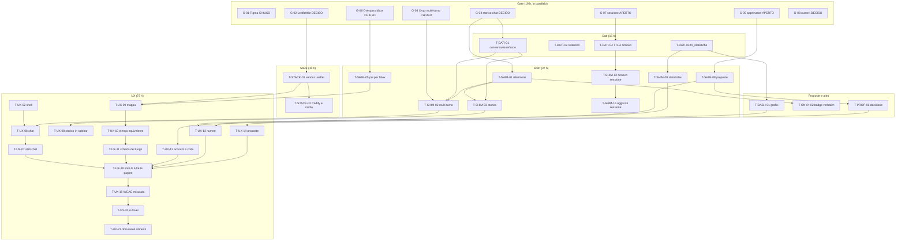

# Trasi — Piano di realizzazione del wireframe funzionante (Home · Osservatorio · Account)

**Data**: 2026-09-16 · **Stato**: piano esecutivo, da approvare · **Committente**: PM di progetto
**Oggetto**: prototipo funzionante delle tre pagine, in veste di wireframe, collegato a shim/Onyx/Postgres reali.
**Fuori oggetto**: il design visivo (è di **X**, dopo — D9).

---

## 0. Come leggere questo piano

**Cos'è questo documento.** Il piano esecutivo per realizzare il **wireframe funzionante** del nuovo sito Trasi a tre pagine: *Home* (la chat), *Osservatorio* (la mappa), *Account* (la Casa), con una sidebar condivisa e un accesso per Casa. Non è un riassunto degli abbozzi Figma: gli abbozzi sono **l'intenzione**, questo piano è **la resa** — con misure, stati, fonte dati per ogni elemento e criteri di done verificabili da terzi.

**Chi lo esegue.** Sviluppatori e sub-agenti con gli scope della tabella §6. Ogni task ha un ID, una stima in ore (≤ 4 h, altrimenti è scomposto), un criterio di done **osservabile** (un comando con l'output atteso) e le dipendenze.

**Cosa resta a X.** Tutto il *come appare*: palette, tipografia di marca, iconografia, spaziature fini. Il wireframe è in scala di grigi e porta i **soli token strutturali** del design system (`design/tokens/`): scala tipografica, passo di spaziatura di 4 px, bersagli ≥ 44 px, focus a due anelli, il filetto di stato di 4 px. Il CSS è separato in **struttura** (layout e agganci: la tocca chi costruisce) e **veste** (ciò che X sostituisce senza toccare l'HTML): §9.

**Le cinque cose che questo piano decide e che i documenti non decidevano.**

| # | Buco nei documenti | Decisione presa qui | Dove |
|---|---|---|---|
| 1 | La pagina **Account** non esiste in nessun documento (solo D7 la elenca) | otto sezioni con sotto-navigazione in parole, una pagina per sezione, nella stessa shell; la testata della Casa è sola lettura | §4.3 |
| 2 | Lo **storico chat** non è persistito da Trasi: oggi ogni messaggio apre una nuova sessione Onyx (`shim/app/chat.py`, `_conversa`) | tabelle `trasi.conversazione`/`trasi.turno` con RLS per Casa e scadenza a 30 gg (opzione A), **non** la mappa verso Onyx: la retention lato Onyx è ferma per licenza (`ops/retention_chat.py:60-83`) | §5.1, G-04 |
| 3 | La **sidebar** non è in nessun documento | un componente, due pannelli contestuali: storico in Home, chat compatta in Osservatorio e Account; **una sola** conversazione corrente fra le pagine | §3.2 |
| 4 | La **mappa** era delegata a Metabase (dashboard 4), che però non disegna raggi né accetta filtri per bbox | Leaflet self-hosted (**168 KB** di file serviti, misurati) + tile OSM, con elenco equivalente da tastiera; la dashboard 4 resta e non si duplica | §4.2, G-02 |
| 5 | Il **legame `evento` ↔ `luogo.id`** non esiste (`evento.luogo_testo` è testo libero) | per i luoghi non-Casa la scheda **dichiara** «nessun evento collegato»; il legame resta domanda aperta §11, non si inventa una colonna | §4.2, §11 Q-04 |

**Le nove decisioni già prese (D1–D9) non si riaprono:** sono pianificate, non discusse. Dove una di esse incontra un vincolo tecnico, il piano lo dichiara nella riga del gate o nella domanda aperta, senza aggirarlo in silenzio.

**Le migliorie M1–M8** stanno in §10 con beneficio, costo e default «non inclusa»: **non sono nel percorso critico**. Chi legge decide con un sì/no per riga. Nessuna miglioria è disegnata nel wireframe prima dell'approvazione; dove il wireframe la nomina (riga «Oggi», cerchio del raggio), la marca `(Mn)`.

**Stato dei gate al momento della scrittura.** Tre gate su otto sono **già chiusi con prove reali** eseguite su questo stack (G-01, G-03, G-06), due hanno la prova raccolta e la decisione presa (G-02, G-08), due richiedono una decisione di governance (G-04, G-05) e uno una decisione di configurazione (G-07). Ogni gate in §2 dichiara se è **chiuso**, **aperto** o **deciso**, con il comando e l'output.

---

## 1. Lettura del draft e tabella *draft → wireframe*

### 1.1 Il file Figma oggi (G-01 — **chiuso**)

Il file `https://www.figma.com/design/NyuZ9c757w8WwVACK9H1ME/Untitled` è **pubblico in lettura** e raggiungibile senza account: verificato il 2026-09-16 con un browser headless che ha aperto i sei `node-id` e ha restituito il titolo `Untitled – Figma` con il canvas renderizzato. Il file è **modificato il 2026-09-16 18:32 UTC**; i sei render salvati sono **più recenti** della modifica (`design/uploads/wireframe/*.webp`, mtime **19:38:45 UTC**), quindi descrivono lo stato attuale del file. Il nodo `4-2` è stato riletto dal vivo: mostra «TRASI», la sidebar con «Nuova Chat / Osservatorio / About», «Recenti» con due voci, «Santa Chiara» in fondo, il logotipo TRASI grande al centro e quattro domande ripetute — **coerente con il render W1 salvato**.

`FIGMA_TOKEN` **non è nell'ambiente** di questa macchina: la lettura via API REST (`/v1/files/{key}/nodes`) non è stata eseguita, quindi testi e misure vengono dai render, non dai nodi. **Differenze rispetto alla lettura del prompt: nessuna sostanziale.** I sei frame corrispondono uno a uno alle sigle W1–W6 (etichette Figma `Wireframe - 1..6`, l'ultima su `16-131`). Le uniche divergenze sono ortografiche e riguardano i testi segnaposto del draft, che comunque si sostituiscono: cfr. la colonna «cosa cambia» della tabella §1.2. **Azione**: chi esegue `T-UX-01` ripete la rilettura con `FIGMA_TOKEN` in ambiente (mai nel piano, mai nei log) e, se un frame è cambiato, aggiorna la riga corrispondente di §1.2 **prima** di scrivere l'HTML.

### 1.2 Tabella *draft → wireframe*, frame per frame

Legenda: **RESTA** = l'intenzione si tiene tale e quale · **CAMBIA** = la resa cambia · **AGGIUNTO** = non c'era nel draft · motivo = *vincolo* (regola del design system o V3–V6) · *dato* (ciò che il database dice davvero) · *miglioria* (M1–M8, solo se approvata).

| Frame | Cosa mostra il draft (verificato sul render) | Cosa RESTA | Cosa CAMBIA | Perché | Cosa si AGGIUNGE |
|---|---|---|---|---|---|
| **W1** Home, sidebar aperta | Sidebar: «TRASI», «Nuova Chat», «Osservatorio», «About»; «Recenti» con «Pizzeria Sabato Sera», «Voglio andare a scuola»; in fondo «Santa Chiara». Centro: logotipo «TRASI» a ~120 px, una barra con una «×», quattro domande come righe di testo centrate | tre destinazioni, una sidebar, la chat al centro | la navigazione diventa **Home · Osservatorio · Account** e basta; «Nuova conversazione» scende **dentro il pannello dello storico** come azione; «About» esce (non è nel prodotto); il logotipo torna alla misura del marchio; le domande diventano **bottoni** con etichetta, massimo sei; la barra diventa un compositore con **etichetta visibile**, riga d'aiuto e bottone «Chiedi» | *vincolo*: il nome della Casa è in `db/010_seed_case.sql:28` — «Santa Spazio Culturale», non «Santa Chiara» né una via; «sobrio, di servizio, di carta» (`design/readme.md` § Visual Foundations); `design/readme.md` § Iconography: **nessuna icona**, quindi la «×» esce; *dato*: le 10 Case sono nel DB e la navigazione è derivata da `GET /me` | testata sidebar con nome e zona della Casa; piede con **Aiuto · Esci** e la riga privacy; riga «Oggi» in testa al contenuto (`(M1)`); suggerimenti presi dalle user stories |
| **W2** Home, sidebar ridotta | Sidebar ridotta a tre icone più una in fondo | la possibilità di ridurre la sidebar | **non** esiste lo stato «sole icone»: il ridotto si fa **nascondendo** la barra, e in testa al contenuto compare il bottone **«Menu»** (parola) | *vincolo*: Trasi non ha iconografia (`design/readme.md` § Iconography); una colonna di sole icone non passa WCAG senza etichetta testuale | il comportamento sotto 62 rem e sotto 40 rem (§3.1), con `aria-expanded` sul bottone |
| **W3** Home in modalità chat | Domanda in alto a destra, risposta a sinistra, compositore in basso alto circa un terzo dello schermo | la chat in colonna, il compositore che scende in basso | **colonna unica** di turni con etichetta di turno (`MessaggioChat`), **etichetta di provenienza sotto ogni informazione**, stato di attesa, astensione dichiarata, azioni sulla risposta, compositore di 2–4 righe con contatore | *vincolo*: V3 è il cuore del prodotto — `design/readme.md` § «Mai senza fonte»; le bolle destra/sinistra sono messaggistica, non un turno di sportello; l'etichetta va **sotto** la risposta, su riga propria | la conversazione entra nello storico della sidebar; multi-turno reale; i quattro stati della schermata (§4.1) |
| **W4** Osservatorio, mappa | Fotografia **satellitare** di Brindisi a tutto schermo, ~5–7 pin **rossi**, testo «OpenStreetMap prototype (this image is a placeholder)», nessuna legenda, nessun filtro | la mappa che riempie la pagina | tile **OSM standard** (non satellitari, D8); pin distinti per **forma e parola**, mai rossi; **legenda in parole**; filtri per tipo; **elenco equivalente da tastiera** con selezione sincronizzata; la Casa della sessione visibile e centrata | *vincolo*: nessun rosso in Trasi (`design/readme.md` § Colore: «nulla è un allarme rivolto a una persona»); la mappa ha sempre un equivalente accessibile (WCAG 2.1 AA); *dato*: `v_mappa_case` (10 righe) e `v_mappa_luoghi` (22 righe) esistono e il ruolo della Casa le legge (verificato: `SET ROLE casa_sanbao` → 10 e 22) | legenda, filtri, elenco, cerchio del raggio `(M3)`, chat compatta in sidebar (D6) |
| **W5** Scheda del luogo | Mappa ridotta a una **striscia verticale** a sinistra; «Casa SANTA», «Via Santa Chiara, 57», «Dove: info about the house», «Servizi: …»; «Calendar with written events (Clickable)» come riquadro vuoto; «Event Details»; «Image event» | la scheda del luogo come pannello del contenuto | la mappa **resta** e il pin si evidenzia; il calendario diventa **elenco per data** (settimana \| mese); «Image event» esce e al suo posto c'è la **scheda evento stampabile**; testata con nome vero, tipo, zona, distanza, orari, provenienza; sezioni servizi ed eventi | l'operatore deve poter rispondere a «dov'è rispetto a qui?» — con la mappa ridotta a striscia la domanda resta senza risposta; la griglia mensile è vuota per definizione (oggi 7 eventi in tutto il DB, 4 futuri, tutti di una Casa) e le celle vuote sono rumore; `evento` non ha immagini e l'interfaccia non ne ha | «Torna all'elenco» (e chiusura con Esc); azioni `[Stampa il biglietto]` `[Segnala un cambiamento]`; per le Case, i **servizi** da `scheda_servizio`; `(M7)` stampa della scheda evento |
| **W6** Account della Casa | Un rettangolo grigio (immagine), i dati della Casa ripetuti in **due colonne identiche**, tre barre grigie (bottoni senza nome), «Archive of Demands» con tre righe piene | l'idea di una pagina della Casa | tutto il resto: le otto sezioni di D7 con sotto-navigazione in parole, i **numeri** della Casa con k-anonimato, la **coda delle proposte** con diff leggibile, registra, attrezzoteca, messaggi, conversazioni, impostazioni | *vincolo*: D7 elenca le sezioni e oggi non ne esiste nessuna; niente immagini decorative (`design/readme.md` § Sfondi); le due colonne identiche sono un errore di lettura, non una scelta; «Archive of Demands» è ambiguo — richieste registrate o conversazioni? — e si sostituisce con due voci distinte e nominate | riga di presenza della coda in testa; fonte e data su ogni blocco; «Esci» e «Aiuto» |
| **tutti** | — | — | manca **tutto lo stato**: nessuna schermata di accesso (D4), nessuno stato di attesa, di dati non disponibili, di vuoto, di `422`, di `503`; nessun comportamento sotto 62/40 rem; testi in inglese o in prima persona («Voglio andare a scuola», «Devo fare lo SPID?») | *vincolo*: `design/readme.md` § Content Fundamentals — italiano semplice, **terza persona**, niente «tu»/«noi», niente imperativi, niente punti esclamativi; contrasto grigio-su-grigio sotto 4,5:1 | le schermate di stato di §4, il comportamento responsive di §3.1, la tabella dei testi |

**Nota metodologica sui testi del draft.** I render del draft contengono testi **segnaposto** che non vanno corretti ma **sostituiti**: «Pizzeria Sabato Sera», «Voglio andare a scuola», «Sara Chies», «Santa Chiara», «Casa SANTA», «Via Santa Chiara, 57», «Other info about the house», «Archive of Demands», «Image event», «Calendar with written events (Clickable)». Nessuno di questi testi entra nel wireframe. Le **domande** del draft sono invece il germe giusto dei suggerimenti, ma vanno riscritte in terza persona e prese dalle user stories (§4.1): «Mi sento solo come posso trovare qualcuno con cui fare quattro chiacchiere?» diventa «Una persona sola cerca qualcuno con cui parlare: dove?» (US-04).

### 1.3 Le dieci regole che il wireframe deve soddisfare (criteri di accettazione del wireframe)

Sono i criteri del prompt, resi verificabili. Ognuno è ripreso e strumentato in §8.

| # | Regola | Come si verifica (comando o ispezione) |
|---|---|---|
| 1 | **Nessuna icona in nessuno stato**; la sidebar ha due stati: aperta (parole) e nascosta (bottone «Menu») | `grep -Ec '<svg\|]*icon\|class="icon'` su `home/**/*.html` → **0**; ispezione dei due stati in browser a 1280 px e 500 px |
| 2 | **Ogni informazione** — chat, elenco, scheda, Account — porta l'etichetta di provenienza dello shim, **alla lettera**, su riga propria; tratteggio per Esterna | su 20 informazioni mostrate a campione, 20 con etichetta; confronto carattere per carattere con `badge` dello shim (`diff <(echo "$BADGE")`) |
| 3 | La mappa ha **sempre** l'elenco equivalente da tastiera con selezione sincronizzata, legenda in parole, tile OSM con attribuzione, la Casa visibile; **nessun rosso** | navigazione da tastiera: `Tab` fino all'elenco, `Invio` sulla voce → la mappa evidenzia il pin (`aria-expanded="true"`); calcolo contrasto della legenda; `grep -Ei '#f00\|#e00\|red'` sui CSS → 0 |
| 4 | La scheda sta **accanto** alla mappa, mai al suo posto; si chiude con «Torna all'elenco» ed **Esc** | ispezione a 1280 px (scheda e mappa visibili insieme); `Esc` con focus nella scheda → la scheda si chiude e il focus torna alla voce dell'elenco |
| 5 | Gli eventi sono un **elenco per data** (settimana \| mese), mai una griglia di celle vuote; niente immagini, al loro posto la scheda evento stampabile | presenza del selettore settimana/mese; `GET /op/scheda_evento?evento_id=<id>` → 200 e HTML stampabile |
| 6 | L'Account ha le **otto sezioni di D7** con sotto-navigazione in parole e la riga di presenza della coda in testa | conteggio delle voci di sotto-navigazione = 8; riga di presenza presente in tutte |
| 7 | Ogni schermata ha **disegnati** gli stati: attesa, dati non disponibili, vuoto, `422`, `503`, e per la mappa la fonte esterna che non risponde | pagina `stati.html` per ogni schermata (come `design/ui_kits/trasi-home/stati.html`), con le sei condizioni forzate |
| 8 | Testi in **italiano semplice, terza persona**, senza imperativi né punti esclamativi; i testi esistenti si riusano **tali e quali** | `python3 -c "from flussi.comune import verifica_v6; …"` sui testi → 0 violazioni; controllo di `tu`/`noi`/`!`; elenco dei testi riusati verbatim in §9.3 |
| 9 | I suggerimenti sono **bottoni**, dalle user stories, personalizzati con la Casa, **al massimo sei** | conteggio ≤ 6; ispezione: sono `<button>`, non `<li>` o testo |
| 10 | Il compositore ha etichetta visibile, riga d'aiuto, bottone «Chiedi», contatore, 2–4 righe; una volta agganciato in basso **non copre mai l'ultimo turno** | ispezione a 1280×720 con conversazione lunga: l'ultimo turno è interamente visibile sopra il compositore |

---

## 2. Gate di fattibilità (0–4 h)

**Regola d'uso.** Un gate si chiude **prima** del task che da esso dipende. Ogni gate ha un criterio **pass/fail** con un comando, l'azione-se-negativo e una stima ≤ 4 h. I gate chiusi restano nel piano con la prova, perché chi riprende il lavoro non deve rifarli.

| ID | Domanda | Criterio pass/fail (comando → output atteso) | Azione se negativo | Stato | h |
|---|---|---|---|---|---|
| **G-01** | Il file Figma è leggibile e i sei frame sono quelli? | `read design/uploads/wireframe/*.webp` (sei immagini) + apertura di `?node-id=4-2` in browser headless → titolo `Untitled – Figma`, canvas renderizzato, sidebar «Nuova Chat / Osservatorio / About» | si lavora sui render salvati e §1 lo dichiara; nessuna ricostruzione da descrizione | **CHIUSO** — file pubblico, render più recenti della modifica (19:38:45 > 18:32 UTC) | 1 |
| **G-02** | Leaflet self-hosted e tile OSM sono compatibili con il vincolo «zero CDN» e con il budget di peso? | `tar -tzvf` sul pacchetto `leaflet@1.9.4` → `leaflet.js` 147 552 B, `leaflet.css` 14 806 B, `leaflet.js.map` 225 544 B (licenza **BSD-2**, `registry.npmjs.org/leaflet/latest` → `license: BSD-2-Clause`); `grep -Ec 'https?://' deployment/home/vendor/leaflet/*` → richieste esterne **solo** nei tile | se il peso non entra: si serve la **sola** mappa Leaflet su `osservatorio.html` e la Home resta leggera; se i tile non sono ammessi, la mappa mostra i pin su fondo neutro con l'elenco equivalente (già previsto come stato) | **DECISO** — vedi §2.1 | 2 |
| **G-03** | Onyx sa tenere una conversazione multi-turno via API? | due chiamate in sequenza al container: `create-chat-session` → `chat_session_id`, poi `send-chat-message` con `parent_message_id` della prima risposta → **eseguito**: risposta 1 = `message_id 729`, risposta 2 = `message_id 731` e il testo usa il contesto («non riesco a confermarlo: per il CAF CISL Perrino…» riferito alla domanda precedente) | lo shim concatena gli ultimi N turni nel prompt (fallback dichiarato, costo 3 h) | **CHIUSO** — 1 chiamata extra, 72 s end-to-end per la coppia | 2 |
| **G-04** | Dove vive lo storico chat: tabelle Trasi o mappa verso Onyx? | `docker exec onyx-background-1 …` e la lettura di `ops/retention_chat.py:60-83` → la retention nativa esiste ma è **chiusa dal tier** (`FEATURE_NOT_AVAILABLE`, 402, «requires the Enterprise plan»); il task `check-ttl-management` gira ogni ora e **non fa nulla** perché la soglia è `None` | **opzione A** (tabelle Trasi) — decisione raccomandata e motivata in §5.1: la retention lato Onyx non è governabile senza licenza Enterprise, e una UI che promette 30 giorni su una retention che non esiste è una dichiarazione falsa | **DECISO** — §5.1 | 3 |
| **G-05** | Con **un solo account per Casa**, chi può approvare cosa? | query reali su questo DB (transazioni di prova, `ROLLBACK`): una proposta creata da `casa_bozzano` → `proposto_da = casa_bozzano` → `UPDATE … FROM casa_bozzano` → **`UPDATE 0`** (non decidibile da sé); la stessa proposta creata da `rete` → in coda per `casa_sanbao` → `UPDATE 1` (**decidibile**); per `rete` la coda mostra 1 riga | la proposta **si mostra ma non si decide** da questo accesso: pulsante presente, dichiarato «da approvare in coda a chi compete». Domanda a Processi §11 Q-01 con fallback già applicabile | **APERTO (governance)** — il gate è *deciso in fallback*: §5.4 | 3 |
| **G-06** | Overpass risponde a una query per **bbox e più tipi** in una sola chiamata, compreso il tipo `scuola` che manca nell'enum? | `curl -A 'Trasi/0.1 …' -X POST https://overpass.openstreetmap.fr/api/interpreter --data-urlencode 'data=[out:json][timeout:25];(nwr["amenity"="pharmacy"]…;nwr["amenity"="bar"]…;nwr["highway"="bus_stop"]…;);out center 60;'` → **200, 15 768 B, 0,59 s**, 60 elementi (14 bar, 9 farmacie, 35 fermate, 2 terminal); con `["amenity"="school"]` su una bbox più larga → **200, 30 scuole** (es. «Istituto Comprensivo Sant'Elia») | i tipi mancanti si aggiungono al vocabolario `TIPI_OSM` (`shim/app/vicinanza.py:47-60`); se Overpass cade, l'elenco mostra **solo** la memoria della rete e la riga dichiara lo stato della fonte | **CHIUSO** — una chiamata per N tipi, ~16 KB; l'endpoint `overpass-api.de` ha risposto **504** in 11,6 s, il failover `.fr` risponde | 2 |
| **G-07** | La sessione «non scade durante l'uso» si ottiene senza indebolire il presidio anti-abuso? | `select valore from trasi.parametro where chiave='session_ttl_hours'` → **12**; `db/013_credenziali.sql:100` → `scade_ts default now() + interval '12 hours'`; `shim/app/auth.py:129-172` valida il token **a ogni richiesta** con `s.scade_ts > now()` → dopo 13 h di uso continuo `GET /op/me` risponde **401** | rinnovo scorrevole: `UPDATE trasi.sessione SET scade_ts = now() + <TTL>` nella dipendenza di sessione, con TTL lungo (30 gg) e blocco tentativi invariato; la revoca resta il `DELETE` di `logout` | **APERTO** — §5.5, con criterio «dopo 13 h di uso continuo `GET /me` → 200» e nota DPO | 3 |
| **G-08** | I numeri dell'Account: endpoint su viste `k_anon` o embed Metabase? | confronto A/B in §4.3; il k-anonimato è **nella vista** (`db/004_views.sql:29-36`, `k_anon()` con soglia da `[P] k_anonimato=5`): `SET ROLE casa_sanbao; SELECT … FROM trasi.v_report_mensile` → 3 righe con `n_label` già mascherato | **A**: `GET /op/casa/statistiche` + SVG inline. B (embed) richiede `MB_EMBEDDING_SECRET_KEY`, iframe, CSP e cookie di terze parti, e non è governabile nella veste (D9) | **DECISO** — §4.3, §5.3 | 3 |

**Totale dei gate: 19 h**, eseguibili in parallelo 3 a 3 (G-01/G-02 in una persona, G-03/G-06 in un'altra, G-04/G-05/G-07/G-08 in una terza).

### 2.1 G-02 in dettaglio — peso, licenza, policy dei tile

**Leaflet.** Versione **1.9.4**, licenza **BSD-2-Clause** (verificata dal registro npm). File da servire da `deployment/home/vendor/leaflet/` (`./home` è montato read-only in Caddy: `deployment/docker-compose.yml:304`), **senza sorgenti né mappe di debug**:

| File | Byte | Nota |
|---|---|---|
| `leaflet.js` | 147 552 | build minificata |
| `leaflet.css` | 14 806 | |
| `images/marker-icon.png` | 1 466 | |
| `images/marker-icon-2x.png` | 2 464 | |
| `images/marker-shadow.png` | 618 | |
| `images/layers.png`, `images/layers-2x.png` | 696 + 1 259 | servono solo per il controllo livelli: **omissibili** se non si usa `L.control.layers` |
| **Totale** | **≈ 168 KB** | contro i **150 KB** stimati dal prompt: la stima era sul solo `leaflet.js`, e il numero da mettere nel budget è il totale dei file serviti |

**Perché non entra nel budget della Home.** La Home di oggi pesa **21 KB** con HTML+CSS e **31 KB** con anche `home.js` (misurato: `index.html` 9 669 B + `style.css` 10 542 B = 20,1 KB; `+ home.js` 11 398 B → 30,9 KB; **10,8 KB compressi** con `gzip -9` sui tre). Leaflet da solo, **non compresso**, è **5,4 volte** quel totale compresso. Il piano fissa quindi budget **per pagina**, non per sito:

| Pagina | Budget sorgenti | Budget compresso (gzip) | Cosa comprende | **Misurato il 17/09** (sorgenti / gzip) |
|---|---|---|---|---|
| **Accesso** | 30 KB | 10 KB | modulo, testi, stati, CSS condiviso | 25,0 KB / **8,8 KB** |
| **Home** | 60 KB | 24 KB | pagina + CSS + shell + chat + storico | 56,2 KB / **22,3 KB** |
| **Osservatorio** | 90 KB (+164 KB vendor) | 30 KB (+≈45 KB Leaflet) | pagina + CSS + shell + mappa/elenco/scheda | 84,7 KB / **28,4 KB** |
| **Account** | 120 KB | 42 KB | pagina + CSS + shell + 7 moduli di sezione | 114,6 KB / **40,3 KB** |

**Perché questi numeri e non i precedenti.** La prima stesura di questa tabella (12/40/60/45 KB) era **sbagliata**: stimavo le pagine come se fossero documenti singoli, mentre l'Account carica **sette** moduli di sezione (`account.js` + `grafici` + `registra` + `attrezzoteca-op` + `messaggi-op` + `conversazioni-op` + `impostazioni-op`) e l'Osservatorio tre. I budget sono stati riportati ai valori **misurati sui file reali**, con un margine del ~10%: un budget che si sfora al primo giorno non è un budget, è un auspicio.

Il numero che conta davvero è quello **compresso** (8,8–40,3 KB), perché è ciò che attraversa la rete. I sorgenti sono più grandi di quanto servirebbe perché il codice di questo progetto è **commentato fittamente** — 13–26% delle righe sono commenti — e non è peso morto: è la ragione per cui chi riprende il lavoro capisce perché una riga c'è. Se il committente vuole stringere, la leva è **minificare in fase di consegna** (non a mano, non un bundler: `gzip` lo fa già Caddy) e non togliere i commenti dal sorgente.

Il budget **esclude** `vendor/` in modo esplicito perché altrimenti la cifra non direbbe più nulla su ciò che il progetto scrive. Criterio osservabile: `curl -s -o /dev/null -w '%{size_download}' http://127.0.0.1:8088/osservatorio.html` e somma dei soli asset di progetto.

**Tile OSM — policy letta per intero** (`operations.osmfoundation.org/policies/tiles/`, versione corrente). I punti che vincolano questo progetto:

1. URL esatto `https://tile.openstreetmap.org/{z}/{x}/{y}.png`, **HTTPS** (l'HTTP è vietato).
2. **Attribuzione visibile** «© OpenStreetMap contributors», non nascosta dietro un toggle né fuori schermo → nel wireframe è una riga **in parole** sotto la mappa, non un'icona.
3. **User-Agent identificativo** e, dalle pagine web, **Referer** valido; è vietato *togliere* il Referer. La pagina `deployment/caddy/Caddyfile:43` imposta `Referrer-Policy "strict-origin-when-cross-origin"`: **con questa policy il Referer viene inviato sull'origine** (è `strict-origin-when-cross-origin`, non `no-referrer`), quindi è compatibile; il proxy, se si sceglie, **non deve azzerare** il Referer.
4. **Cache** come da header del server (o ≥ 7 giorni se il client non li legge); mai `Cache-Control: no-cache` di default.
5. **Vietato** il bulk download e qualunque prefetch: nessun «scarica la zona», nessun preriscaldamento di zoom, nessun bot che panoramica.
6. **Proxy di cache**: «generally **do not recommend**»; se si fa, **deve** avere User-Agent contattabile e rispettare la cache ≥ 7 giorni.

**Decisione (D8) — raccomandazione: A, tile diretti dal browser.** Motivazione, in ordine di peso:

- La policy **sconsiglia** esplicitamente il proxy di cache (§5). Farlo significa assumersi un obbligo in più (UA contattabile, TTL, storage) per risolvere un problema che non c'è: **il volume è di 10 operatori**, un viewport di quartiere sono ~12 tile per apertura.
- Il vantaggio dichiarato del proxy in D8 è **nascondere l'IP dell'operatore**. Ma il browser invia già Referer e UA, che identificano l'**applicazione**, non la persona; e OSMF pubblica i log dei tile **aggregati e anonimizzati** (`planet.openstreetmap.org/tile_logs/`). Il proxy sposterebbe l'esposizione dal browser al server, senza eliminarla: l'IP del server diventerebbe quello visibile.
- `deployment/caddy/Caddyfile:28-36` non registra gli IP nei log di Caddy — che è il presidio del progetto per gli operatori — e resta valido in entrambi i casi: nessuno dei due tocca i log di Caddy.
- **Costo**: il proxy richiede un modulo di cache che `caddy:2-alpine` **non ha** (verificato in B0: `caddy list-modules` → 0 moduli `rate*`, e analogamente non c'è `cache-handler`), quindi un container aggiuntivo (nginx/varnish) con memoria e disco — dentro i limiti di RAM già stretti del compose.

**Fallback documentato**: se il DPO chiede che l'IP dell'operatore non raggiunga OSMF, si attiva l'**opzione B** (proxy `/tile/*` con `User-Agent: Trasi/0.1 (+https://trasi.lascuolaopensource.org; contatto: rete@trasi.local)`, cache su disco ≥ 7 giorni, `Referer` inoltrato) come **task `T-STACK-04` già stimato (4 h)** — non come variante da inventare. In entrambi i casi: **stato «tile non raggiungibili»** disegnato, con mappa senza sfondo, pin ed elenco leggibili e una riga che lo dice.

---

## 3. Architettura dell'informazione e shell

### 3.1 Shell, breakpoint, ordine di tabulazione

```
┌ sidebar (18 rem) ─────┬ contenuto ────────────────────────────────────────┐
│ TRASI                 │ (bottone «Menu» visibile solo sotto 62 rem)       │
│ <Casa della sessione> │                                                   │
│ <zona> · «dati        │                                                   │
│  provvisori» se serve │                                                   │
│───────────────────────│                                                   │
│ Home            ●     │                                                   │
│ Osservatorio          │                                                   │
│ Account               │                                                   │
│───────────────────────│                                                   │
│ <pannello contestuale>│                                                   │
│  Home: storico (D5)   │                                                   │
│  Oss./Account: chat   │                                                   │
│───────────────────────│                                                   │
│ Aiuto · Esci          │                                                   │
│ «non conserva dati    │                                                   │
│  personali»           │                                                   │
└───────────────────────┴───────────────────────────────────────────────────┘
```

| Breakpoint | Comportamento | Criterio osservabile |
|---|---|---|
| **≥ 62 rem** (≥ 992 px) | sidebar **fissa** a 18 rem; contenuto nel resto | a 1280 px `getBoundingClientRect()` della sidebar = 288 px e nessun bottone «Menu» nel DOM visibile |
| **40–62 rem** | sidebar **a comando**: chiusa per default, il bottone **«Menu»** in testa al contenuto la apre (`aria-expanded`, `aria-controls`); chiusa = `hidden` | a 900 px: sidebar non visibile, «Menu» presente; click → sidebar visibile e `aria-expanded="true"` |
| **< 40 rem** (< 640 px) | sidebar **a scomparsa** *overlay*, contenuto a tutta larghezza; si chiude con `Esc` e cliccando fuori; il focus entra nel pannello e torna al bottone alla chiusura | a 380 px: `document.documentElement.scrollWidth === 380` (nessuno scorrimento orizzontale, 1.4.10) |

**Ordine di tabulazione dichiarato**: *salta al contenuto* → *sidebar* (testata → navigazione → pannello → piede) → *contenuto*. Il primo elemento focalizzabile di ogni pagina è il collegamento «Salta al contenuto» (come `design/components/navigazione/SaltaContenuto.prompt.md` e `deployment/home/index.html:14`). Bersagli ≥ 44 px (`design/tokens/spaziature.css` → `--bersaglio-min: 44px`). Focus a due anelli (`design/tokens/focus.css`: `outline` giallo sole + `box-shadow` scuro).

### 3.2 Il pannello contestuale della sidebar (D6)

**Un solo componente, due contenuti, un solo modello di stato.**

| Pagina | Pannello | Cosa contiene | Azione in testa |
|---|---|---|---|
| **Home** | **Storico** (D5) | «Nuova conversazione» + elenco per data (`OGGI` · `IERI` · `ULTIMI 7 GIORNI` · `ULTIMI 30 GIORNI`), titolo = prima domanda troncata a 40 caratteri, ora dell'ultimo turno; riga di piede «le conversazioni restano 30 giorni» | «Nuova conversazione» |
| **Osservatorio** | **Chat compatta** | l'ultimo scambio della **conversazione corrente** (domanda + risposta troncata) e il compositore compatto; in testa il collegamento **«Apri nella Home»** | «Apri nella Home» |
| **Account** | **Chat compatta** | identico all'Osservatorio | «Apri nella Home» |

Regole del modello di stato (§4.1): la conversazione corrente è **una sola** per sessione; aprirne una dallo storico della Home **non** cambia lo stato di Osservatorio/Account, che mostrano sempre la corrente; «Apri nella Home» naviga a `home.html?c=<id>` e la Home apre quella conversazione.

### 3.3 Accesso (D4)

La prima schermata è **unica**: `index.html` = accesso se non c'è sessione, Home se c'è. Non esiste un selettore della Casa dentro le pagine: la Casa arriva da `GET /me` (`shim/app/auth.py:250-256` → `{casa, casa_id, ruolo}`), e il ruolo DB è quello della Casa (`SET LOCAL ROLE`, `shim/app/auth.py:166`).

| Elemento | Testo | Fonte |
|---|---|---|
| Titolo | «TRASI · Rete delle Case di Quartiere» | `design/readme.md` § Visual Foundations |
| Campo 1 | «Casa di riferimento» — `<select>` con le **10** Case; per Tuturano il testo dell'opzione è «Tuturano — dati provvisori» | `db/010_seed_case.sql` (10 righe; `tuturano` ha `da_validare=true`, `orari_provvisori=true`) |
| Campo 2 | «Parola d'ordine della Casa» + pulsante «Mostra» | `deployment/home/operatore.html:40-43` |
| Azione | `[Entra]` | idem |
| Stato credenziali errate | «Parola d'ordine non riconosciuta per Santa Spazio Culturale.» | il `detail` dello shim è «casa o password non valide» (`shim/app/auth.py:55`): **la UI dice il fatto in parole proprie**, senza esporre il `detail` tecnico |
| Stato blocco | «Accesso bloccato per qualche minuto.» — dopo 4 tentativi in 10 minuti | `db/006_fn_proposte.sql:950` (`v_fallimenti > 4` → `NULL` + audit `login_bloccato`) |
| Nota | «La sessione resta aperta su questo computer finché non si esce. Non conserva dati personali.» | riga privacy (`deployment/home/index.html` piede) |

**`401` su qualunque chiamata** → si torna all'accesso **senza perdere il testo digitato nel compositore**: il testo vive in una variabile JS di modulo (mai `localStorage`, V5) e viene riscritto al ritorno. Criterio osservabile: con la sessione revocata a mano (`DELETE FROM trasi.sessione`) e il compositore pieno, il primo invio riporta all'accesso e, dopo il nuovo login, il testo è ancora nel campo.

### 3.4 Stati trasversali (testi verbatim da riusare)

| Stato | Testo | Fonte da cui è preso **alla lettera** |
|---|---|---|
| Attesa (≤ 3 s) | «Lettura in corso…» + `aria-busy="true"` | `design/components/stato/RigaOggi.prompt.md` (stato di attesa della riga «Oggi») |
| Dati non disponibili | «Dati non disponibili: la memoria della rete non risponde in questo momento» | `deployment/home/WCAG.md` § 3.3.1 — **non si riscrive**, e si aggiunge la seconda riga già esistente: «È un'informazione, non un guasto» |
| Vuoto (coda) | «Nessuna proposta in attesa a San Bao.» | `design/components/stato/AvvisoCoda.prompt.md` |
| Vuoto (conversazioni) | «Nessuna conversazione negli ultimi 30 giorni.» | nuovo, composto secondo `design/readme.md` § Content Fundamentals |
| `422` dato personale | «Il testo sembra contenere un dato personale — telefono, email, codice fiscale — e non è stato inviato. Si può riscrivere senza quel dato.» | il `detail` dello shim è `dato_personale_sospetto` (`shim/app/pii.py`); la frase è quella del prompt § Home |
| **503** Onyx | «L'assistente non risponde in questo momento. La domanda resta scritta qui sotto.» | il `detail` è «chat non disponibile: Onyx non ha risposto entro il tempo dichiarato» (`shim/app/chat.py:115`) |
| Tile non raggiungibili | «Sfondo della mappa non disponibile: i luoghi e l'elenco restano leggibili.» | nuovo; coerente con «un guasto è un'informazione» |
| Servizio non attivo | «Servizio non ancora attivo» | `design/components/base/Etichetta.prompt.md` — **verbatim**, per ciò che non è pronto |

Il **filetto di stato** (`design/readme.md` § Visual Foundations) è l'unico segno di stato: 4 px a sinistra, blu mare per «Oggi», **terracotta** per la coda, **giallo sole** per l'attenzione, grigio quando è spento. Mai solo il colore: accanto c'è sempre la parola.

---
## 4. Specifica per pagina

**Come si legge questa sezione.** Ogni elemento della UI ha accanto la sua **fonte**: un endpoint (`/op/…`), una vista del database, un valore già composto dallo shim, oppure la marca **«dato finto dichiarato»** — che in questo prototipo è **zero volte** tranne dove indicato esplicitamente in §4.4. Il wireframe non inventa informazioni: dove il dato non c'è, mostra lo stato «dato non disponibile» o il vuoto, **che sono informazioni**. I testi fra virgolette basse sono già nel design system o nella Home e **non si riscrivono**; i testi nuovi seguono `design/readme.md` § Content Fundamentals (italiano semplice, terza persona, nessun imperativo, nessun punto esclamativo).

### 4.1 Home — la chat

#### 4.1.1 Macchina a stati (la catena completa, con le transizioni)

Gli stati sono **cinque** e le transizioni sono dichiarate: ogni passaggio ha un trigger, un effetto sul DOM e una persistenza. Lo stato vive in **una sola** struttura in memoria (`stato.js`, modulo ES) e si serializza nell'URL quando è un fatto condivisibile (`?c=<id>`), **mai** in `localStorage`.

```
       ┌──────────────┐  invio (primo)      ┌────────────────┐
       │  VUOTO       │ ──────────────────► │  ATTESA        │
       │  titolo +    │                     │  turno operatore│
       │  compositore │ ◄────────────────── │  + «in attesa»  │
       │  centrato +  │   errore 422/503    └────────────────┘
       │  suggerimenti│   (la domanda resta         │ risposta
       └──────────────┘    scritta)                   ▼
              ▲                              ┌────────────────┐
              │ «Nuova conversazione»        │  CHAT          │
              │                              │  turni in      │
              └──────────────────────────────│  colonna unica │
                                             │  + provenienza │
                                             └────────────────┘
                                                     │ click su una voce dello storico
                                                     ▼
                                             ┌────────────────┐
                                             │  CHAT RIAPERTA │  (stesso layout,
                                             │  dal primo     │   data del primo turno
                                             │  turno in testa│   in testa)
                                             └────────────────┘
```

| # | Stato | Trigger d'ingresso | Cosa cambia nel DOM | Persistenza |
|---|---|---|---|---|
| S0 | **Vuoto** | la Home si apre senza `?c=` e senza conversazione corrente | titolo + compositore **centrati**, suggerimenti visibili, storico in sidebar | nessuna |
| S1 | **Attesa** | invio dal compositore (o click su un suggerimento, che riempie e invia) | il compositore **scende in basso** e si aggancia; titolo e suggerimenti escono; il turno OPERATORE è subito in colonna; sotto compare il turno ASSISTENTE con «Ricerca nella memoria della rete in corso…» e `aria-busy="true"` | `POST /op/conversazioni` (se non esiste) poi `POST /op/conversazioni/{id}/messaggi` |
| S2 | **Chat** | arriva la risposta (o un errore) | il turno ASSISTENTE mostra il testo e **l'etichetta di provenienza verbatim su riga propria**; il compositore resta agganciato con 2–4 righe | il turno è scritto nella conversazione; la voce compare in cima allo storico |
| S3 | **Errore `422`** | lo shim risponde `422 dato_personale_sospetto` | la frase dichiara il perché; **il testo resta nel compositore** e non è stato inviato; nessun turno aggiunto | nessuna (non si conserva un testo rifiutato) |
| S4 | **Errore `503`** | Onyx non risponde entro il budget (120 s dichiarati, `shim/app/chat.py:110`) | «L'assistente non risponde in questo momento. La domanda resta scritta qui sotto.»; il compositore resta pieno | nessuna: la domanda **non** entra nello storico |
| S5 | **Riaperta** | click su una voce dello storico (sidebar Home) o `?c=<id>` | stesso layout di S2, con la data del primo turno in testa («Conversazione del 15/09/2026, 11:42 · Santa Spazio Culturale») | lettura da `GET /op/conversazioni/{id}` |

**Attesa: il turno assistente compare subito**, prima della risposta, perché è lo stato di attesa a dire all'operatore che la domanda è partita. La risposta di Onyx **non è in streaming** (`"stream": False`, `shim/app/chat.py:365`) e il piano non introduce lo streaming (§10 M8, default non inclusa).

**Cosa NON si replica** (dal prompt § 3.4, salvo approvazione in §10): selettore di assistente (la persona è fissa: id 2, «Trasi Casa», `shim/.onyx-kb.json`), allegati, pollici su/giù, rigenera. Nessuna di queste voci ha un dato dietro.

#### 4.1.2 Elementi della Home, con la fonte

| Elemento | Testo / comportamento | Fonte |
|---|---|---|
| Titolo dello stato vuoto | «La domanda della persona allo sportello» (sottotitolo: «Senza nomi e senza dati personali: servono solo il bisogno e la zona.») | nuovo; composto secondo le regole di contenuto |
| Compositore (vuoto) | `<textarea>` **≤ 2000 caratteri** (come `shim/app/chat.py`, `MessaggioIn`), etichetta visibile «La domanda della persona», riga d'aiuto, `[Chiedi]`, contatore `0/2000` | `deployment/home/operatore.html:60-65` (stesso limite) |
| Compositore (agganciato) | 2–4 righe, `position: sticky` in fondo; **non copre mai l'ultimo turno**; contatore `n/2000` | regola 10 di §1.3 |
| Suggerimenti | **bottoni**, massimo **sei**, personalizzati con la Casa, presi dalle user stories: US-01 «Dove si fa l'ISEE vicino a La Rosa?» · US-08 «Bar vicino a Bozzano aperti adesso?» · US-04 «Una persona sola cerca qualcuno con cui parlare: dove?» · §9.3 «Farmacia di turno vicino a Tuturano» · §9.3 «Eventi oggi a Bozzano» · !NEW US-1.2 «Laboratori per bambini questa settimana?» · !NEW US-5.1 «Cinque microfoni per domani: dove sono?» (**sei** si mostrano, gli altri ruotano se il committente approva `M9`-like; default: i primi sei) | `docs/trasi-architecture-v1.2.md` §9.3, `docs/user-stories-new.md`, §14 |
| Turno OPERATORE | etichetta di turno «OPERATORE» + testo | `design/components/chat/MessaggioChat.prompt.md` |
| Turno ASSISTENTE | etichetta «ASSISTENTE» + testo + **etichetta di provenienza** su riga propria | `badge` dello shim, **verbatim** (`shim/app/badge.py:46-53`) |
| Astensione | «Non trovo informazioni su questo nella memoria della rete.» — **senza** etichetta, perché non c'è fonte | `shim/app/chat.py:81` (`FONTE_NON_DICHIARATA`) + `docs/prompt-assistente-*.txt` |
| Azioni sulla risposta | `[Stampa il biglietto: <luogo>]` · `[Registra richiesta]` · `[Segnala un cambiamento]` — presenti **solo** se il turno ha `riferimenti` | dipende da `riferimenti` (§5.1); senza riferimenti le azioni non si mostrano, invece di mostrare un pulsante che non sa dove andare |
| Riferimenti del turno | `riferimenti: [{tipo: 'luogo'|'casa'|'evento', id, nome}]` — estratti dai `top_documents` di Onyx | oggi **non** esposti: `POST /op/chat` risponde `{risposta, fonte}` (`shim/app/chat.py:398`). Nuovo: §5.1, `T-SHIM-01`. Il formato reale è `document_id: "trasi%3Aluogo%3A21"` → URL-decoded `trasi:luogo:21` (verificato dal vivo) |
| Storico (sidebar) | elenco per data, riapribile, **30 giorni**, per Casa; «Nuova conversazione» in testa; nessun nome di operatore | `T-DATI-01`, `T-SHIM-03`; retention da `[P] gg_retention_chat = 30` |
| Riga di piede dello storico | «le conversazioni restano 30 giorni» | nuovo; è la dichiarazione della retention (V5) |
| Riga «Oggi» in testa al contenuto `(M1)` | «Oggi a Santa Spazio Culturale: 2 eventi · 1 scheda in scadenza · 3 proposte» — **composta dalla vista**, non dalla pagina | `v_oggi_casa.testo` (`db/004_views.sql:210-241`); il testo è già in italiano e non si ricompone lato pagina |

**Dati reali disponibili per la demo** (misurati su questo database): `casa` 10 righe · `luogo` 22 · `evento` 7 (di cui **4 futuri**, tutti di San Bao) · `scheda_servizio` **0** · `richiesta` 315 (314 San Bao, 1 Bozzano, dal 15 al 17/09/2026) · `proposta` 10 (di cui **1** in stato `proposta`: `chiudi_luogo` su `luogo_id=1`, `casa_id=8` Bozzano, approvatore **`at`**) · `messaggio` **0** · `oggetto` **0** · `movimento` **0** · `opportunita` **0**.

**Conseguenza, dichiarata:** le sezioni dell'Account che mostrano **servizi della Casa** e **attrezzoteca** sono **vuote su questo database**. Non si inventano dati per riempirle: si disegna il **vuoto** (che è un'informazione, regola del design system) e la sessione con gli operatori (§8.6) usa il percorso reale per popolarle — «Registra → servizi e orari» passa da `proponi_modifica`, «Attrezzoteca» da un oggetto inserito dalla Casa. Se il committente vuole la demo piena prima, la via è §10 **M10** (dati di esempio marcati), che è una miglioria e va approvata.

#### 4.1.3 Perché non si conserva la domanda quando fallisce

`422` e `503` non scrivono nessun turno. Tre ragioni concrete: (a) un `422` è un testo **rifiutato** dal filtro anti-PII — conservarlo significherebbe tenere in `turno` proprio ciò che V5 vieta; (b) un `503` è un guasto di Onyx, non una conversazione: uno storico pieno di domande senza risposta è rumore che l'operatore non può ripulire; (c) la conversazione «esiste» solo se ha almeno un turno dell'assistente, e questo rende lo storico una lista di cose **avvenute**.

### 4.2 Osservatorio — la mappa

#### 4.2.1 Struttura e interazioni

**Mappa a sinistra (o sopra, sotto 62 rem) ed elenco a destra: sono la stessa cosa vista due volte.** L'elenco non è un'aggiunta di accessibilità: è la forma da tastiera e da stampa della mappa, e la selezione è **sincronizzata nei due sensi**.

| Interazione | Comportamento | Criterio osservabile |
|---|---|---|
| Apertura | la mappa è centrata sulla Casa della sessione, zoom di quartiere (14), il pin della Casa è evidenziato; il **cerchio del raggio** `(M3)` ha raggio `raggio_m_eff` se M3 è approvata | `map.getCenter()` ≈ coordinate della Casa; per Tuturano `raggio_m_eff = 2000` (dal seed) |
| Selezione da elenco | `Tab` fino alla voce, `Invio` → il pin corrispondente si evidenzia e la mappa ci si sposta sopra | `aria-expanded="true"` sulla voce; il pin ha una classe di evidenza |
| Selezione da mappa | click sul pin → la voce corrispondente nell'elenco si evidenzia e si porta in vista | la voce è `document.activeElement` o ha `aria-selected="true"` |
| Filtri per tipo | caselle per **Case della rete** (10) e **Luoghi della rete** (22), poi i tipi dei POI: bar, farmacie, scuole, fermate, CAF, poste, altro | conteggio nell'elenco coerente con le caselle attive |
| `(M5)` «solo aperti adesso» | esclude i **chiusi noti**, tiene i POI **senza orari** (`aperto_adesso: null`) — è la regola già implementata (`shim/app/routes_geo.py:203-207`) | con il filtro attivo, un POI senza `opening_hours` resta in elenco |
| Clic su una voce o su un pin | apre la **scheda** al posto dell'elenco, **la mappa resta** | §4.2.2 |
| Fonte esterna che non risponde | l'elenco mostra **solo** la memoria della rete e una riga dichiara lo stato: «Fonti esterne: OpenStreetMap ha risposto in 1,2 s» oppure «non ha risposto: l'elenco mostra solo la memoria della rete» | il dato viene da `fonti_esterne[].stato` (`ok` / `timeout` / `errore` / `scartata_fiducia`), `shim/app/routes_geo.py:104-109` |
| Titolo della pagina | «Osservatorio · intorno a Santa Spazio Culturale (Centro Storico) · raggio 800 m» | `v_mappa_case.zona`, `raggio_m_eff` |
| Attribuzione | riga in parole sotto la mappa: «© OpenStreetMap contributors (ODbL)» | policy OSM § 2; **mai** un'icona, mai nascosta |

**Pin distinti per forma e parola, mai per il solo colore, mai rossi** (regola 3 di §1.3). Tre livelli, ognuno con la sua origine dichiarata nella legenda:

| Livello | Simbolo (wireframe) | Parola nella legenda | Provenienza | Fonte dati |
|---|---|---|---|---|
| Casa della rete | quadrato pieno | «■ Casa della rete — la rete lo sa» | `[KB · …]` | `v_mappa_case` (10 righe) |
| Luogo della rete | cerchio pieno | «● luogo della rete — la rete lo sa» | `[KB · …]` | `v_mappa_luoghi` (22 righe) |
| POI di quartiere | cerchio vuoto | «○ trovato su OpenStreetMap — trovato fuori, non verificato dalla rete» | `[Esterna · …]` tratteggiata | Overpass via `T-SHIM-05` |

**Perché l'elenco è obbligatorio e non opzionale**: la mappa Leaflet è un canvas con pin: da tastiera non è navigabile, e un lettore di schermo non ha nulla da leggere. L'elenco è l'**equivalente funzionale** — stessa informazione, stesso ordine (distanza), stessa azione (aprire la scheda). Il criterio di done non è «l'elenco esiste» ma «*tutte* le informazioni della mappa sono raggiungibili e usabili da tastiera attraverso l'elenco» (WCAG 2.1 AA 2.1.1, 1.1.1).

#### 4.2.2 La scheda del luogo

**Pannello nel contenuto, mai modale**: la mappa resta visibile con il pin evidenziato e gli altri attenuati. Si chiude con «← Torna all'elenco» **e** con `Esc`; alla chiusura il focus torna alla voce dell'elenco da cui si era partiti (o al pin, se si era cliccato lì).

| Sezione | Cosa mostra | Fonte |
|---|---|---|
| Testata | nome · tipo · zona · distanza dalla Casa (`840 m`, `1,2 km`) · indirizzo | `v_mappa_luoghi` (`indirizzo`, `lat`, `lon`), distanza calcolata con Haversine come già fa `shim/app/vicinanza.py:89` |
| Orari | orari leggibili oppure **«orari non disponibili»** — il luogo **non si scarta** | `orari_testo` da `v_mappa_luoghi` (funzione `trasi.orari_testo`, `db/004_views.sql:39`); per i POI il testo `opening_hours` di OSM |
| Provenienza | `[KB · Rete delle Case di Quartiere · agg. 15/09/2026 · affidabilità 3]` oppure `[Esterna · OpenStreetMap contributors (ODbL) · consultata 11:42 · non verificata dalla rete]` | `badge` composto dallo shim, verbatim |
| Azioni | `[Stampa il biglietto]` · `[Segnala un cambiamento]` · `[Chiedi all'assistente di questo luogo]` `(M4)` | `GET /op/biglietto?luogo_id=` (nuovo, §5.1); proposta via `POST /op/proponi_modifica`; M4 precompila la chat |
| **Servizi della Casa** | per una **Casa**: elenco di `scheda_servizio` (titolo, destinatari, quando, come accedere, referente **come ruolo**) con la sua provenienza. Per un **luogo non-Casa**: «Servizi: non nella memoria della rete» | `scheda_servizio` via `T-SHIM-07`. **Su questo database la tabella ha 0 righe**: la sezione mostra il **vuoto** dichiarato, non un segnaposto |
| **Prossimi eventi** | **elenco per data** con selettore `settimana | mese`; per ogni evento: giorno, ora, titolo, azione `[Stampa la scheda evento]` `(M7)`; in fondo «Nessun altro evento fino al 30/09.» | `v_eventi` via `T-SHIM-06`. Per i **POI non-Casa**: «Eventi: nessun evento collegato a questo luogo» — **dichiarato**, perché `evento` non ha `luogo_id` (solo `luogo_testo` libero): §11 Q-04 |
| Chiusura con `Esc` | la scheda si chiude, il focus torna da dove era partito | regola 4 di §1.3 |

**Perché l'elenco per data e non la griglia mensile del draft.** In questo database ci sono **7 eventi** in tutto, **4 futuri**, e **tutti di una sola Casa** (San Bao). Una griglia mensile mostrerebbe 27 celle vuote su 30: il vuoto non è l'assenza di un dato, è la forma sbagliata per il dato che c'è. L'elenco per data mostra le stesse informazioni senza mentire sulla densità. Il selettore `settimana | mese` cambia l'intervallo, non la forma.

### 4.3 Account — la Casa

**Struttura: una pagina per sezione, nella stessa shell, con sotto-navigazione in parole.** Il default dichiarato dal prompt è questo; la ragione per sceglierlo è concreta: la pagina unica diventerebbe lunga (otto sezioni con tabelle), e chi arriva da un alert deve poter aprire **una** sezione con un indirizzo proprio (`account.html#proposte`). Le pagine sono la stessa shell con lo stesso pannello contestuale: cambia solo il contenuto.

| # | Sezione | Cosa contiene | Fonte |
|---|---|---|---|
| 1 | **La Casa** | nome, zona, ente gestore, orari settimanali ed eccezioni, raggio di riferimento, «dati provvisori» se del caso, provenienza e data | tabella `casa` in **sola lettura** via `T-SHIM-11`; le modifiche passano da proposta |
| 2 | **Numeri** | i grafici del funzionamento della Casa, filtro periodo (default 30 gg) | `GET /op/casa/statistiche?dal&al` (`T-SHIM-09`) su viste con k-anonimato |
| 3 | **Proposte** (`n`) | coda con diff leggibile, `[Approva]` `[Rifiuta]` dove la Casa decide davvero | `GET /op/proposte` · `POST /op/proposte/{id}/decisione` (`T-SHIM-08`, `T-PROP-01`) |
| 4 | **Registra** | richiesta allo sportello · evento della Casa · servizi e orari («invia come proposta») · stato delle proprie proposte | `POST /op/registra_richiesta` (esiste) · `POST /op/eventi` (**nuovo**: oggi `crea_evento` è nel contratto LLM, `shim/app/scritture.py:318`) · `POST /op/proponi_modifica` (**nuovo**) |
| 5 | **Attrezzoteca** | inventario, prestiti da confermare, movimenti | `GET /op/attrezzoteca` · `GET /op/movimenti_da_confermare` · `POST /op/movimento` · `POST /op/movimento/{id}/conferma` (**esistono già**, `shim/app/attrezzoteca.py`) |
| 6 | **Messaggi** (`n nuovi`) | lista e invio verso Casa / PA | `GET /op/messaggi` · `POST /op/messaggi` (**esistono già**) |
| 7 | **Conversazioni** | la lista completa per data (30 gg); l'apertura porta alla **Home** in modalità chat su quella conversazione | `T-SHIM-03`; il collegamento è `home.html?c=<id>` |
| 8 | **Impostazioni** | Casa (sola lettura) · Aiuto (riscritto per le tre pagine) · Esci · stampa (biglietto A6, scheda evento) | `GET /me`, `POST /logout`, `GET /op/biglietto`, `GET /op/scheda_evento` |

**Riga di presenza della coda, in testa** (come `design/components/stato/AvvisoCoda.prompt.md`): «3 proposte aspettano una decisione a Santa Spazio Culturale · la più vecchia da 4 giorni» con il filetto **terracotta**; nessuna scadenza, nessun contatore a pallino, nessun imperativo. Con la coda vuota il filetto si spegne e il testo diventa grigio: «Nessuna proposta in attesa a Santa Spazio Culturale.»

**Qui il gate G-05 cambia il testo della riga, ed è la parte più delicata di tutto il piano.** Sul database reale la coda della Casa (`v_da_approvare`) è **vuota** per Bozzano, mentre le proposte **aperte** che la riguardano sono **1** — ed è una `chiudi_luogo` che l'AT deve decidere (`approvatore_ruolo='at'`, `proposto_da='casa_bozzano'`). Quindi la riga di presenza deve distinguere **due** fatti, che `AvvisoCoda` oggi confonde:

- «**1 proposta riguarda la Casa e la decisione è di AT** · la più vecchia da 1 giorno» → con un collegamento che apre la coda **in sola lettura**, con la colonna «chi decide»;
- e solo se `v_da_approvare` ha righe: «**N proposte aspettano una decisione a <Casa>**» → con `[Approva]` `[Rifiuta]` attivi.

Il criterio osservabile è il caso reale: da `bozzano` la coda mostra **1** riga con «chi decide: AT» e i pulsanti **assenti con nota**; da `rete` la stessa proposta ha i pulsanti **attivi**. Se Processi risponde alla domanda §11 Q-01, cambia la regola nel DB (`upd_client`), non la UI.

#### 4.3.1 La sezione «Numeri» — i grafici e il confronto endpoint vs embed (G-08)

**Confronto (G-08), con i numeri misurati sul campo.**

| | **A) Endpoint + SVG inline** | **B) Embed Metabase** |
|---|---|---|
| Cosa serve | `GET /op/casa/statistiche?dal&al`, ruolo DB della Casa, viste con k-anon già dentro | `MB_EMBEDDING_SECRET_KEY` (assente in `deployment/.env.example`), firma JWT, `iframe`, `MB_SITE_URL` |
| Vincolo «zero CDN» | rispettato (SVG nel documento) | rispettato nel senso stretto, ma l'iframe **è** una richiesta a un servizio dello stack: nessun dominio terzo, quindi ammissibile |
| Veste (D9) | **controllabile**: grigi, spessori, ordine li decide il wireframe e X li rifà | **non controllabile**: Metabase porta il suo tema; X non può vestire un iframe senza toccare Metabase |
| Cookie e privacy (V5) | nessun cookie di terze parti | l'embed **statico** non richiede login proprio, ma apre una sessione Metabase nel browser dell'operatore; il presidio «nessun IP negli access log» vale per Caddy, non per Metabase (che ha i suoi log) |
| k-anonimato | **dentro la vista** (`k_anon()`, soglia `[P] k_anonimato=5`), quindi identico nei due casi | idem, ma la resa del `<5` dipende dalla card |
| Costo di realizzazione | **6 h** (endpoint 3 h + SVG e accessibilità 3 h) | **4 h** (firma + iframe + filtro periodo), **più** il costo di manutenzione di una dashboard che va tenuta allineata alle viste |
| Riuso | le stesse query alimentano la scheda della Casa e qualunque futuro report | riusa le card esistenti di `metabase/dashboard.py` |

**Raccomandazione: A.** Il criterio che decide è D9: il committente ha chiesto una veste **sostituibile da X senza toccare la struttura**, e un iframe Metabase è precisamente la cosa che X non può vestire. In più B non aggiunge nulla che A non abbia: le viste con k-anon sono le stesse, e `k_anon()` vive nel database. **La dashboard Metabase 3 «Casa» non si spegne**: resta per `rete`/`ti` (§12), e il piano lo dichiara — non c'è doppia manutenzione perché la sorgente (le viste) è una sola.

**I grafici scelti (sei, dal catalogo delle card già definite in `metabase/dashboard.py`).**

| # | Titolo (terza persona) | Dato | Vista / funzione | Resa |
|---|---|---|---|---|
| 1 | «Richieste registrate» | totale nel periodo + per **categoria** | `v_report_mensile` (o `fn_statistiche_casa`) | barre orizzontali con **parola e numero** in testa, ordinati per valore |
| 2 | «Esito dei colloqui» | risolte · inviate altrove · non trovate · rinviate | `v_report_mensile.esito` | barre orizzontali + riga di riepilogo in parole |
| 3 | «Dove sono state indirizzate le persone» | destinazione, interna o esterna | `v_destinazioni` | tabella `Tabella` del design system con provenienza per riga |
| 4 | «Eventi in programma» | conteggio + prossimi tre | `v_eventi` | numero in testa + elenco compatto |
| 5 | «Schede in scadenza e proposte» | schede entro `[P] gg_preavviso_scadenza = 15`; proposte in attesa | `v_oggi_casa` | due numeri con la parola accanto |
| 6 | «Uso dell'attrezzoteca» | movimenti ultimi 12 mesi per oggetto | `v_uso_oggetti` | barre orizzontali; **vuoto su questo database** (0 oggetti → dichiarato) |

**Regole di resa, non negoziabili:** nessuna torta, nessun colore che porti significato, ordinamento dichiarato, `<5` al posto del numero sotto soglia **con la frase che lo spiega** («Sotto 5 il numero non si mostra (riservatezza).»), SVG inline con **tabella `<table>` equivalente** per i lettori di schermo (la barra è decorativa: il numero sta nel testo). Nessuna libreria di grafici: sarebbe una dipendenza da CDN o un bundle, entrambi fuori dai vincoli.

---

## 5. Mappa dati e contratto API

**La regola della mappa**: ogni elemento della UI ha una fonte, e ogni riga di «Cosa esiste e cosa manca» del prompt ha una direzione e un owner. Gli endpoint del browser stanno tutti sotto `/op/` con il **cookie di sessione** e restano **fuori** dal documento OpenAPI — che è il contratto congelato con Onyx e **non si tocca** (`shim/app/main.py:175-187`). Il prefisso pubblico è `/api/shim/…`, dove Caddy aggiunge `X-Trasi-Key` lato server (`deployment/caddy/Caddyfile:80-96`) e il browser non vede mai segreti.

### 5.1 Chat, storico, riferimenti

#### `POST /op/conversazioni` — **nuovo** (`T-SHIM-02`)

| Campo | Valore |
|---|---|
| Input | nessuno (la Casa viene dalla sessione) |
| Output `201` | `{"conversazione_id": 42, "creato_ts": "2026-09-16T11:42:00+02:00"}` |
| Ruolo DB | il ruolo della Casa (`casa_*`), come tutti i `/op/*` |
| RLS | `INSERT` con `WITH CHECK (casa_id = trasi.casa_corrente())` — la Casa non arriva mai dal corpo (Principio 3) |
| Errori | `401` sessione assente/scaduta · `503` database non raggiungibile |

Crea **una** `chat_session` Onyx e la lega alla conversazione (`onyx_session_id`), così i turni successivi riusano la stessa sessione: è ciò che oggi **non** accade (`shim/app/chat.py:349-366` crea una sessione per messaggio).

#### `POST /op/conversazioni/{id}/messaggi` — **nuovo** (`T-SHIM-01`, `T-SHIM-02`)

| Campo | Valore |
|---|---|
| Input | `{"messaggio": "<testo ≤ 2000>"}` — `extra="forbid"` |
| Output `200` | `{"risposta": "...", "fonte": "[KB · Rete delle Case di Quartiere di Brindisi · agg. 15/09/2026 · affidabilità 1]", "riferimenti": [{"tipo":"luogo","id":21,"nome":"CAF ACLI La Rosa"}], "turno_id": 128, "onyx_message_id": 731}` |
| Ordine dei controlli | **prima** il PII (locale, non dipende dalla configurazione), **poi** la configurazione (token, identità Onyx della Casa), **infine** la rete — l'ordine è già quello di `op_chat` (`shim/app/chat.py:396-428`) e si mantiene |
| Multi-turno | `send-chat-message` con `parent_message_id` = `onyx_message_id` dell'ultimo turno dell'assistente; per il primo turno `-1` |
| Ruolo DB / RLS | `casa_*`; `SELECT`/`INSERT` su `turno` e `conversazione` vincolati a `casa_id = casa_corrente()` |
| Errori | `401` · `404` conversazione non della propria Casa (**stessa** risposta di «non esiste»: non si rivela l'esistenza) · `409` conversazione chiusa · `422` `dato_personale_sospetto` · `503` Onyx non risponde entro 120 s |
| Estrazione dei `riferimenti` | da `top_documents[].document_id`: la forma reale è `trasi%3Aluogo%3A21` → URL-decode → `trasi:luogo:21` (misurato: `README.md` §7.2 e verifica dal vivo). Si mappano **solo** i prefissi noti (`trasi:luogo:`, `trasi:casa:`, `trasi:evento:`); tutto il resto si ignora silenziosamente, perché Onyx può citare documenti fuori dalla KB (verificato: compare anche `MEDIAWIKI_902759_…` e un URL INPS) |

#### `GET /op/conversazioni` · `GET /op/conversazioni/{id}` — **nuovi** (`T-SHIM-03`)

`GET /op/conversazioni?dal=&al=&limite=50` → `{"conversazioni":[{"id":42,"titolo":"Dove si fa l'ISEE vicino a…","primo_ts":"…","ultimo_ts":"…","turni":4}]}`, ordinato dal più recente, **solo** della Casa della sessione, **solo** entro la retention.
`GET /op/conversazioni/{id}` → `{"id":42,"turni":[{"ruolo":"operatore","testo":"…","ts":"…"},{"ruolo":"assistente","testo":"…","fonte":"[KB · …]","riferimenti":[…],"ts":"…"}]}`.
Errori: `401`, `404` (anche per una conversazione di un'altra Casa: **mai** `403` con dettaglio, che rivelerebbe l'esistenza), `503`.

**Titolo della conversazione**: la **prima domanda troncata a 40 caratteri** — come fa Onyx, e come dice il prompt § 3.3. Nessun nome di operatore, mai (account condiviso per Casa, V5).

#### Storico chat: dove vive (**G-04 — decisione**)

| | **A) Tabelle Trasi** (raccomandata) | **B) Mappa verso Onyx** |
|---|---|---|
| Schema | `trasi.conversazione` + `trasi.turno` | `trasi.conversazione(onyx_session_id)` + lettura via API Onyx |
| RLS per Casa | **sì**, con `casa_corrente()`: la RLS è l'autorità, come tutto il resto | **no**: Onyx è un database separato, la segregazione vive nello shim → una seconda copia della regola |
| Retention 30 gg | **governabile**: `scadi_conversazioni()` con `[P] gg_retention_chat`, agganciata al passo notturno (`flussi/notte.sh:24` già include `scadi_messaggi`) | **non governabile**: la retention nativa di Onyx è **chiusa dal tier** — `PATCH /api/admin/settings` con `maximum_chat_retention_days` → **402 `FEATURE_NOT_AVAILABLE`**, «Chat history retention requires the Enterprise plan»; il task `check-ttl-management` gira ogni ora e non cancella nulla perché la soglia è `None` (`ops/retention_chat.py:60-83`, verificato in B6) |
| Cancellazione reale | `DELETE` transazionale | richiede una chiamata all'API Onyx **e** la cancellazione dei file su MinIO (`ops/retention_chat.py` lo fa via `delete_chat_session`) |
| Costo | 5 h (DDL + RLS + test) | 3 h, **più** il costo di un secondo meccanismo di retention e di due copie della regola di visibilità |
| Rischio privacy | **basso**: la regola di visibilità è quella che il progetto già usa ovunque | **alto**: se lo shim sbaglia una query, l'operatore di una Casa legge le conversazioni di un'altra, e nessuna policy lo ferma |

**Decisione: A.** Il criterio decisivo non è il costo, è che con B la **retention non è governabile su questa installazione** (licenza Community) e la **segregazione per Casa perderebbe la RLS**, che `README.md` §5 dichiara come garanzia verificata («RLS *e* `casa_corrente()`: la Casa viene dall'identità, mai dal corpo»). Il piano non introduce la prima eccezione a un presidio verificato per risparmiare due ore, e non promette all'operatore 30 giorni di retention che il servizio non sa garantire.

**DDL proposto** (da `db/021_conversazioni.sql`, `T-DATI-01`):

```sql
CREATE TABLE trasi.conversazione (
  id              bigserial PRIMARY KEY,
  casa_id         integer NOT NULL REFERENCES trasi.casa(id),
  titolo          text    NOT NULL,          -- prima domanda, troncata a 40 caratteri
  onyx_session_id text,                      -- la sessione Onyx riusata per la conversazione
  creato_ts       timestamptz NOT NULL DEFAULT now(),
  ultimo_ts       timestamptz NOT NULL DEFAULT now(),
  scade_ts        timestamptz NOT NULL DEFAULT now()
                  + make_interval(days => COALESCE(trasi.p_int('gg_retention_chat'), 30))
);
CREATE INDEX conversazione_casa_ultimo_idx ON trasi.conversazione (casa_id, ultimo_ts DESC);
CREATE INDEX conversazione_scade_idx       ON trasi.conversazione (scade_ts);

CREATE TABLE trasi.turno (
  id               bigserial PRIMARY KEY,
  conversazione_id bigint NOT NULL REFERENCES trasi.conversazione(id) ON DELETE CASCADE,
  ruolo            text   NOT NULL CHECK (ruolo IN ('operatore','assistente')),
  testo            text   NOT NULL,
  fonte            text,                     -- il badge dello shim, verbatim (NULL sull'astensione)
  riferimenti      jsonb,                    -- [{tipo,id,nome}] dai top_documents
  onyx_message_id  bigint,                   -- parent_message_id del turno successivo
  ts               timestamptz NOT NULL DEFAULT now()
);
CREATE INDEX turno_conversazione_idx ON trasi.turno (conversazione_id, ts);
```

**RLS e permessi** (stesso disegno delle altre tabelle per-Casa, `db/015_messaggi.sql` è il modello da imitare): `ENABLE` + `FORCE ROW LEVEL SECURITY`; `owner_all` a `trasi_owner`, `appl_all` ad `applicatore`, `conv_sel_casa`/`conv_ins_casa` con `casa_id = (SELECT trasi.casa_corrente())` ai dieci ruoli `casa_*` **più** `rete` e `ti` in lettura; `GRANT SELECT, INSERT` colonnare ai ruoli Casa, `GRANT USAGE` sulle sequenze. **Nessun `UPDATE`** al browser: una conversazione non si modifica, si crea e si legge (l'unico `UPDATE` è `ultimo_ts`, fatto dalla funzione).

**Retention** (`T-DATI-02`): `trasi.scadi_conversazioni()` — `SECURITY DEFINER` owner `applicatore`, che cancella `WHERE scade_ts < now()` — agganciata al passo notturno esistente (`flussi/notte.sh`, dove `scadi_messaggi` è già invocato) **e** al `crontab` di `ops/`. Criterio osservabile: `INSERT` di una conversazione con `scade_ts = now() - interval '1 day'` → `SELECT trasi.scadi_conversazioni()` → `1`, e `SELECT count(*) … WHERE id = <id>` → **0**.

**Cosa NON si salva in `turno`**: nessun campo per il cittadino (non esistono campi liberi oltre `testo`, che è la domanda dell'operatore), nessun IP, nessun `user-agent`, nessun nome di operatore. Il testo passa **già** dal filtro anti-PII a monte: un testo con un telefono viene rifiutato con `422` **prima** di essere scritto (`shim/app/pii.py`, `rifiuta_se_presente`).

### 5.2 Mappa: Case, luoghi, POI

#### `GET /op/mappa` — **nuovo** (`T-SHIM-04`)

| Campo | Valore |
|---|---|
| Input | nessuno |
| Output | `{"case":[{"id":1,"slug":"santa-spazio","nome":"Santa Spazio Culturale","zona":"Centro Storico","lat":40.64036,"lon":17.94518,"raggio_m_eff":800,"da_validare":false,"geom_qualita":"verificata","orari_testo":"…","badge":"[KB · …]","aperto_adesso":true}], "luoghi":[{…,"casa_slug":"bozzano","indirizzo":null,"affidabilita":2,"badge":"[KB · …]"}]}` |
| Ruolo DB | `casa_*` (o `rete`/`ti`) |
| RLS | le viste sono `security_invoker=false` (`db/004_views.sql:366-371`): **il filtro per Casa sta nella query** e usa `casa_corrente()`, esattamente come fa `oggi` (`shim/app/testi.py:109-110`). Un ruolo senza Casa (`rete`, `ti`) vede tutto, come dice §11 |
| Errori | `401` · `503` |
| Nota | le Case e i luoghi sono **pubblici per natura** (indirizzi di servizi), ma la RLS resta applicata: la vista non è una scusa per saltarla |

Verificato: `SET ROLE casa_sanbao; SELECT count(*) FROM trasi.v_mappa_case` → **10**, `v_mappa_luoghi` → **22**; i GRANT ci sono già (`db/004_views.sql:376-381`).

#### `GET /op/poi?bbox=&tipi[]=&aperto_adesso=` — **nuovo** (`T-SHIM-05`, gate **G-06 chiuso**)

| Campo | Valore |
|---|---|
| Input | `bbox=minlon,minlat,maxlon,maxlat` (obbligatoria, validata: 4 numeri, lat −90..90, lon −180..180, area ≤ 0,02°²); `tipi[]` (1..8 valori dal vocabolario, **ripetibile**); `aperto_adesso` (bool, default falso) |
| Vocabolario | i 12 tipi esistenti (`shim/app/vicinanza.py:47-60`) **più `scuola`** → `("amenity","school")` — verificato dal vivo: 30 scuole nella bbox di Brindisi |
| Output | `{"poi":[{"nome":"…","tipo":"bar","lat":…,"lon":…,"orari_testo":"Mo-Fr 07:00-20:00","aperto_adesso":true,"orari_nota":null,"url":"https://www.openstreetmap.org/node/…","badge":"[Esterna · OpenStreetMap contributors (ODbL) · consultata 11:42 · non verificata dalla rete]"}],"fonti_esterne":[{"fonte":"OpenStreetMap contributors (ODbL)","stato":"ok","ms":588}]}` |
| Query Overpass | **una sola** chiamata per N tipi: `(nwr["amenity"="bar"](bbox);nwr["amenity"="pharmacy"](bbox);…);out center 120;` — misurata: **200, 15 768 B, 0,59 s** per 3 tipi su una bbox di quartiere; `out center` è necessario perché un bar mappato come way non ha coordinate proprie |
| Cache | in memoria per processo, **TTL 10 minuti**, chiave = `md5(bbox|tipi ordinati|aperto_adesso)`; tetto di 200 voci (eviction FIFO). Il tetto dichiarato evita che una cache senza limiti diventi una perdita di memoria nello shim da 256 MB |
| User-Agent | `Trasi/0.1 (portierato Brindisi; contatto: rete@trasi.local)` — **obbligatorio**: senza, Overpass risponde **403** (verificato in B0, `README.md` §7.1) |
| Timeout | 5 s complessivi con failover (già implementato: `shim/app/vicinanza.py:280-320`); allo scadere si risponde **200** con la lista vuota di POI e `fonti_esterne[].stato = "timeout"` — **mai** un errore al chiamante |
| Ruolo DB / RLS | `casa_*`: non tocca il dominio, legge solo `fonte` (allow-list, `sql_fonte_osm`) |
| Errori | `401` · `422` (bbox malformata; tipo fuori vocabolario **con l'elenco ammesso nel messaggio**) · `503` |
| Rate limit | nessuna chiamata in bulk: la bbox è quella del viewport, e i tipi richiesti sono quelli attivi. Con 8 tipi si fa **una** query, non otto: è il punto del gate |

**Perché serve un endpoint nuovo** invece di N chiamate a `vicino_a`: `vicino_a` accetta **un tipo per chiamata** e misura dalla **Casa**, non dalla bbox (`shim/app/routes_geo.py:119-125`). Una mappa con 6 caselle attive farebbe **6 chiamate** a Overpass per ogni movimento, con un rate limit reale (`overpass-api.de` ha già risposto **504** in 11,6 s durante la verifica). L'endpoint per bbox con più tipi riduce le chiamate di un fattore N e toglie Overpass dal percorso critico della Home.

### 5.3 Numeri dell'Account

#### `GET /op/casa/statistiche?dal=&al=` — **nuovo** (`T-SHIM-09`, `T-DASH-01`)

| Campo | Valore |
|---|---|
| Input | `dal`, `al` (ISO, default: ultimi 30 giorni); finestra massima 366 giorni (`422` oltre) |
| Output | `{"periodo":{"dal":"2026-08-17","al":"2026-09-16"},"blocchi":[{"id":"richieste_categoria","titolo":"Richieste registrate","righe":[{"etichetta":"fiscale_isee","valore":9,"valore_label":"9"},{"etichetta":"lavoro","valore":null,"valore_label":"<5"}],"sotto_soglia":true,"aggiornato_il":"2026-09-16","fonte":"Rete delle Case di Quartiere di Brindisi"}]}` |
| k-anonimato | **dalla vista/funzione**, non dalla UI: `k_anon()` restituisce `n = NULL` e `n_label = '<5'` sotto la soglia `[P] k_anonimato = 5` (`db/004_views.sql:29-36`). Il numero grezzo **non lascia il database** |
| Ruolo DB | `casa_*`; il filtro per Casa sta nella query con `casa_corrente()` (le viste sono `security_invoker=false`) |
| Funzione SQL | `trasi.fn_statistiche_casa(p_casa int, p_dal date, p_al date)` — **nuova** (`T-DATI-03`): le viste esistenti aggregano **per mese** (`v_report_mensile`), quindi una finestra arbitraria come «ultimi 30 giorni» non è esprimibile senza una funzione parametrica |
| Errori | `401` · `422` (date malformate o invertite) · `503` |

Criterio osservabile: `SET ROLE casa_bozzano; SELECT * FROM trasi.fn_statistiche_casa(8, current_date - 30, current_date)` → il blocco «richieste per categoria» mostra **`<5`** (Bozzano ha **1** richiesta); con `p_casa = 5` (San Bao, **314** richieste) mostra il **numero** — e la prova si fa su entrambe, perché è la soglia il punto, non il conteggio.

### 5.4 Proposte (coda e decisione)

#### `GET /op/proposte` — **nuovo** (`T-SHIM-08`)

| Campo | Valore |
|---|---|
| Fonte | `v_da_approvare` (decidibili da questo ruolo) `UNION` le righe di `v_proposte_aperte` che riguardano la Casa ma **non** sono decidibili da questo accesso — le due liste sono distinte nel campo `decidibile` |
| Output per riga | `{"id":2106,"tipo":"chiudi_luogo","entita":"luogo","entita_id":1,"origine":"chat","eta_giorni":1,"chi_decide":"at","decidibile":false,"motivo_non_decidibile":"la decisione è di AT","motivazione":"…","diff_leggibile":"…","scade_il":"2026-10-16"}` |
| Diff leggibile | `diff_leggibile` da `trasi.diff_leggibile(p.diff)` — **esiste già** ed è già esposto in `v_da_approvare` (`db/006_fn_proposte.sql:697-728`) | 
| Ruolo DB / RLS | `casa_*`; le due viste filtrano **per ruolo del chiamante** (`security_invoker`, `db/006_fn_proposte.sql:698`) |
| Errori | `401` · `503` |

#### `POST /op/proposte/{id}/decisione` — **nuovo** (`T-PROP-01`)

| Campo | Valore |
|---|---|
| Input | `{"decisione":"approva"|"rifiuta", "nota":"…"(≤200, facoltativa)}` — anti-PII sulla nota, come `approva_proposta` (`shim/app/scritture.py:473`) |
| Output `200` | `{"proposta_id":2106,"stato":"approvata"}` — e in UI: «Approvata. Si applica stanotte alle 05:00.» |
| Meccanismo | lo **stesso** `UPDATE` di `approva_proposta`: la RLS è l'autorità, e `_righe(statuscommand) == 0` → **403 «da approvare in coda»** (il contratto §9.1). Il DB non viene riscritto con una seconda logica |
| Errori | `401` · `403` «da approvare in coda» · `409` proposta già decisa o scaduta (`scade_il < current_date`, `[P] gg_scadenza_proposta = 30`) · `422` nota con PII · `503` |
| Dopo la decisione | l'applicazione al dominio è di **F9** alle 05:00 (`flussi/crontab`: `0 5 * * * applica.sh`), non di questa chiamata. La UI lo dichiara: «in applicazione» fino a quando `stato = 'applicata'` |

**Il gate G-05, in concreto** (prove eseguite, transazioni con `ROLLBACK`):

| Caso | Esito misurato | Cosa fa la UI |
|---|---|---|
| La Casa propone a **sé stessa** (`casa_bozzano` → proposta `casa_id=8`) | `proposto_da = casa_bozzano`; `UPDATE` da `casa_bozzano` → **`UPDATE 0`** | il pulsante `[Approva]` **non si mostra**: la decisione è di un altro (nel caso reale, `at`). Riga: «la decisione è di AT» |
| L'**AT** propone a una Casa (`rete` → proposta `casa_id=5`) | `v_da_approvare` per `casa_sanbao` → **1 riga**; `UPDATE` da `casa_sanbao` → **`UPDATE 1`** | `[Approva]` `[Rifiuta]` **attivi** |
| Un'altra Casa prova a decidere | `UPDATE` da `casa_bozzano` sulla proposta di San Bao → **`UPDATE 0`** | — (non ci arriva: la proposta non è nella sua lista) |
| La coda per la **Casa** sul DB reale | `v_da_approvare` per `casa_bozzano` → **0 righe**; `v_proposte_aperte` per Bozzano → **1 riga**, `chi_decide = at` | come sopra: la riga di presenza dice «la decisione è di AT», non «0 proposte» — e **non** mente dicendo che non c'è nulla |

### 5.5 Sessione (G-07) e registrazione

#### Rinnovo della sessione — **nuovo** (`T-DATI-04`, `T-SHIM-12`)

| Aspetto | Oggi (misurato) | Proposta |
|---|---|---|
| TTL | `[P] session_ttl_hours = 12`; `trasi.sessione.scade_ts DEFAULT now() + interval '12 hours'` (`db/013_credenziali.sql:100`) | **`session_ttl_hours` resta 12**, e si aggiunge il **rinnovo scorrevole**: la sessione non scade *durante l'uso*, e scade dopo 12 h di inattività. Il passaggio a 720 h (30 giorni) si fa con **un `UPDATE` sulla chiave `[P]`** se e quando il DPO risponde a Q-02 — nessun deploy, nessuna riga di codice |
| Rinnovo | nessuno: la scadenza è **fissa** al login (`db/006_fn_proposte.sql:1037-1041`) | **scorrevole**: nella dipendenza di sessione (`shim/app/auth.py:129-172`) si estende `scade_ts` a `now() + TTL` **se** il token è valido e sono passate ≥ 5 minuti dall'ultima estensione (una scrittura per richiesta sarebbe 1 `UPDATE` per click) |
| Criterio pass/fail | con TTL 12 h, dopo 13 h di uso continuo `GET /op/me` → **401** (comportamento attuale: è il difetto) | dopo **13 h di uso continuo** `GET /me` → **200** (il rinnovo ha esteso la scadenza); dopo **13 h di inattività** → **401**. Con TTL portato a 720 h la seconda soglia diventa 31 giorni |
| Presidio anti-abuso | blocco dopo **>4** tentativi in 10 minuti per Casa (`db/006_fn_proposte.sql:1000-1010`) — **resta invariato**: non c'entra col TTL, e allungare la sessione non allunga il blocco | idem |
| «Esci» | `POST /logout` → `DELETE` della riga + cookie scaduto (`shim/app/auth.py:219-241`), sempre `204` | invariato |
| Rischio schermo condiviso | lo sportello ha un PC condiviso: una sessione di 30 giorni su un computer che nessuno chiude è **un accesso aperto** | domanda al DPO §11 Q-02; mitigazione già nel wireframe: **«Esci» sempre visibile** in fondo alla sidebar, in tutte le pagine, e la riga «la sessione resta aperta su questo computer finché non si esce» **dentro il testo** della schermata di accesso |

#### `POST /op/proponi_modifica` — **nuovo** (`T-SHIM-10`)

Variante con cookie di `proponi_modifica`: `{"tipo","entita","entita_id","payload","motivazione"}` → `201 {"proposta_id", "approvatore_ruolo", "in_chat"}`. Riusa **la stessa** funzione e la **stessa** INSERT colonnare (`shim/app/scritture.py:387-455`): nessuna seconda via di scrittura, anti-PII su `motivazione` **e** `payload`, `casa_id` dalla sessione. Errori: `401` · `422` (entità non ammessa, PII, payload fuori dal vocabolario) · `503`.

#### `POST /op/eventi` — **nuovo** (`T-SHIM-13`), `GET /op/eventi?dal&al` — **nuovo** (`T-SHIM-06`), `GET /op/servizi?casa_id` — **nuovo** (`T-SHIM-07`), `GET /op/biglietto?luogo_id` — **nuovo** (`T-SHIM-14`), `GET /op/oggi` — **nuovo** (`T-SHIM-15`)

| Endpoint | Input → Output | Ruolo DB / RLS | Errori | Perché è nuovo |
|---|---|---|---|---|
| `GET /op/eventi?dal&al&casa_id?` | date → `{"eventi":[{"id","titolo","inizio","fine","luogo_testo","url","badge","giorni_all_inizio"}]}` | `casa_*` / `rete`: policy `evento_sel` (`db/002_rls.sql:188`) — tutti i ruoli Casa in lettura; il filtro per Casa sta nella query | `401` · `422` finestra invertita · `503` | `eventi_oggi` copre **un giorno** e **una Casa** (`shim/app/routes_lettura.py:144`); la scheda del luogo chiede una finestra settimana/mese |
| `GET /op/servizi?casa_id?` | → `{"servizi":[{"id","titolo","descrizione","categoria","orari_testo","referente_ruolo","scadenza","validata_il","badge"}]}` | `casa_*`: policy `scheda_sel` (`db/002_rls.sql:165`) | `401` · `404` Casa non leggibile · `503` | `scheda_servizio` non ha oggi nessun endpoint browser; per un luogo non-Casa l'endpoint risponde `{"servizi":[]}` e la UI **dichiara** «non nella memoria della rete» |
| `POST /op/eventi` | `{"titolo","inizio","fine?","luogo_testo?","descrizione?","url?"}` → `201 {"evento_id","badge"}` | `casa_*`: `evento_ins_casa`; **scrittura diretta** — opzione A per gli eventi **della propria Casa** (decisione S2, `README.md` §1) | `401` · `403` per un'altra Casa · `422` PII o date incoerenti · `503` | `crea_evento` esiste solo nel contratto LLM (`shim/app/scritture.py:318`): riusa la stessa logica, canale diverso (`/op`, cookie) |
| `GET /op/biglietto?luogo_id=` | → **HTML A6** stampabile (nessun campo compilabile) | `casa_*`: legge `luogo` + `casa` + `fonte` | `401` · `404` luogo assente o chiuso · `503` | `biglietto` è nel contratto congelato (`/v1/u/{email}/biglietto`) e il browser non può chiamarlo: riusa `_documento_biglietto` (`shim/app/testi.py:259`) |
| `GET /op/oggi` | → `{"casa","eventi","schede_in_scadenza","proposte","giorni_piu_vecchia","testo"}` per la **Casa della sessione** | `casa_*`; filtro con `casa_corrente()` | `401` · `503` | oggi la riga «Oggi» si chiama col percorso del contratto **e con un'email nel path** (`/v1/u/rete@trasi.local/oggi`), che nella nuova shell con sessione sarebbe una **identità scelta dal browser**: inaccettabile (Principio 3) |

### 5.6 La tabella «Cosa esiste e cosa manca», riga per riga (chiusa)

| # | Bisogno della UI | Oggi | Direzione pianificata | Task |
|---|---|---|---|---|
| 1 | Chat multi-turno | una `chat_session` Onyx per messaggio | riuso della sessione per conversazione con `parent_message_id` reale (**G-03 chiuso**) | `T-SHIM-01`, `T-SHIM-02` |
| 2 | Storico chat per Casa, 30 gg | Trasi non persiste | tabelle `conversazione`/`turno` + RLS + `scadi_conversazioni()` + 3 endpoint (**G-04 deciso: A**) | `T-DATI-01`, `T-DATI-02`, `T-SHIM-03` |
| 3 | Azioni sulla risposta | risposta `{risposta, fonte}` | `riferimenti` dai `top_documents` (URL-decode di `trasi%3Aluogo%3A21`) | `T-SHIM-01` |
| 4 | POI di quartiere sulla mappa | un tipo per chiamata, niente bbox, niente `scuola` | `/op/poi?bbox&tipi[]` a **una** query, cache 10 min, enum esteso (**G-06 chiuso**) | `T-SHIM-05` |
| 5 | Case e luoghi per la mappa | viste lette solo da Metabase | `GET /op/mappa` con badge per riga | `T-SHIM-04` |
| 6 | Eventi per la scheda | `eventi_oggi` un giorno, nessun range | `GET /op/eventi?dal&al`; per i luoghi non-Casa si **dichiara** l'assenza; il legame `evento↔luogo` resta Q-04 | `T-SHIM-06` |
| 7 | Servizi per la scheda | nessun endpoint browser | `GET /op/servizi?casa_id`; per i luoghi non-Casa: descrizione e `note_accesso` | `T-SHIM-07` |
| 8 | Coda proposte in UI | solo nel contratto LLM; `no_self_approve` distingue per identità | `GET /op/proposte` + `POST /op/proposte/{id}/decisione`; **G-05** con fallback dichiarato in UI | `T-SHIM-08`, `T-PROP-01` |
| 9 | Grafici dell'Account | nessun endpoint dati | `GET /op/casa/statistiche` su `fn_statistiche_casa` (**G-08 deciso: A**) | `T-SHIM-09`, `T-DATI-03`, `T-DASH-01` |
| 10 | Sessione che non scade | TTL 12 h, `scade_ts` fissa | TTL 720 h + rinnovo scorrevole (**G-07**) | `T-DATI-04`, `T-SHIM-12` |
| 11 | Leaflet e tile senza CDN | nessun vendor, nessuna policy | Leaflet 1.9.4 in `home/vendor/`, attribuzione ODbL, tile diretti (**G-02 deciso**) | `T-STACK-01`, `T-STACK-02`, `T-STACK-03` |
| 12 | Modifica servizi/orari | solo nel contratto LLM | `POST /op/proponi_modifica` con cookie, stessa funzione DB | `T-SHIM-10` |

**Nessuna riga si risolve con una scrittura diretta fuori dal flusso proposta→approvazione→applicazione**, salvo le eccezioni **già decise**: iCal (`flussi/fonti_ical.py`), `registra_richiesta` (durante il colloquio), movimento di attrezzoteca (evento operativo), eventi della **propria** Casa (opzione A). Nessun task di questo piano introduce una nuova scrittura diretta: dove una riga ci spingeva (servizi e orari della Casa), si è scelto `proponi_modifica` — che **non** scrive il dominio.

---
## 6. Task dettagliati

**Regole di lettura.** Ogni task ha: owner (chi lo esegue), stima in ore (**mai > 4**: se lo supera, è scomposto), input, output, **criterio di done osservabile** (un comando o un'ispezione con l'esito atteso), dipendenze, rischio. I task UI **non partono** prima dei gate da cui dipendono. Ogni task cita la sezione dell'architettura, il file o il frame di origine.

**Il criterio di done non è mai «funziona»**: è un comando con un output atteso, o un'ispezione con una misura. Dove la prova è un'ispezione visiva, il piano dice **cosa** si guarda e **quale** valore si legge.

### 6.1 SA-UX — le pagine

| ID | Owner | h | Input | Output | Criterio di done (osservabile) | Dipende da | Rischio |
|---|---|---|---|---|---|---|---|
| **T-UX-01** | SA-UX | 2 | `FIGMA_TOKEN` in ambiente, i sei `node-id` | §1.1 aggiornata; divergenze segnalate | `curl -s -H "X-Figma-Token: $FIGMA_TOKEN" 'https://api.figma.com/v1/files/NyuZ9c757w8WwVACK9H1ME/nodes?ids=4-2,4-37,4-56,4-70,4-88,16-131' \| jq '.nodes \| keys \| length'` → **6**; se un frame è cambiato, §1.2 lo dice nella riga corrispondente | G-01 | token assente: si resta sui render e lo si dichiara |
| **T-UX-02** | SA-UX | 4 | `design/` (token, componenti), §3 | `home/_shell.html` condiviso: testata, sidebar a due pannelli, piede, salta-contenuto | a 1280 px sidebar 288 px, nessun «Menu»; a 900 px «Menu» presente e `aria-expanded` cambia al click; a 380 px `document.documentElement.scrollWidth === 380` | T-UX-03 | il pannello contestuale che cambia per pagina: se il template è uno solo, il rischio è il codice condizionale sparso |
| **T-UX-03** | SA-UX | 3 | `design/tokens/*.css` | `assets/struttura.css` (layout, agganci) e `assets/veste.css` (ciò che X sostituisce) | `grep -c 'color\|font-family\|background' assets/struttura.css` → **0** (nessuna scelta di veste fuori dal file di veste); `veste.css` importa i token strutturali | — | confusione fra struttura e veste: si scopre solo quando X prova a sostituire |
| **T-UX-04** | SA-UX | 3 | §3.3 | `index.html` (accesso) con le **10** Case, «Parola d'ordine della Casa», «Entra», «Mostra» | le opzioni del `<select>` sono **10** e l'opzione Tuturano **contiene** «dati provvisori»; `POST /api/shim/login` con credenziali errate → testo in parole (nessun codice); 4 tentativi errati → «Accesso bloccato per qualche minuto» | T-UX-02, G-07 | il blocco è per Casa: provarlo su una Casa di prova, non su quella di esercizio |
| **T-UX-05** | SA-UX | 4 | §4.1.2, `docs/user-stories-new.md`, §9.3 arch. | Home stato vuoto: titolo, compositore centrato, **sei** suggerimenti come bottoni | i suggerimenti sono `<button>` (**verifica**: `grep -c '<li.*suggerimento' → 0`, `document.querySelectorAll('.suggerimento').length` → 6) e contengono il nome della Casa quando previsto; invio con `Invio` **e** con `[Chiedi]` | T-UX-02 | testi in prima persona che rientrano dal prompt degli assistenti: si controllano con la regex V6 di `T-DASH-03` |
| **T-UX-06** | SA-UX | 4 | §4.1.1–4.1.2, `T-SHIM-02` | Home modalità chat: turni `MessaggioChat`, etichetta di provenienza sotto la risposta, stato di attesa, astensione | con `shim/app/chat.py` reale: il turno ASSISTENTE compare con «Ricerca nella memoria della rete in corso…» **prima** della risposta; alla risposta l'etichetta è identica a `badge` dello shim (`diff` fra la stringa del DOM e `GET` del badge → nessuna differenza); domanda fuori KB → astensione **senza** etichetta | T-SHIM-01, T-SHIM-02 | il badge va copiato **verbatim**: un test che lo riformattasse passerebbe e il difetto resterebbe (già visto in B7, `docs/B7-report.md` § Difetti) |
| **T-UX-07** | SA-UX | 3 | §3.4, §4.1.1 | stati `422`, `503`, conversazione riaperta; conservazione del testo | con `curl` si forza `422` (testo con un telefono) → il compositore **mantiene** il testo e non compare nessun turno; con Onyx fermo (`docker stop onyx-api_server-1`) → `503` dopo il budget e il testo resta; ricaricando `?c=<id>` i turni sono quelli salvati | T-UX-06 | il `503` costa 120 s: si prova con `ONYX_CHAT_TIMEOUT_S=3` in un ambiente di prova |
| **T-UX-08** | SA-UX | 4 | §3.2, `T-SHIM-03` | pannello storico: «Nuova conversazione», gruppi `OGGI`/`IERI`/`ULTIMI 7 GIORNI`/`ULTIMI 30 GIORNI`, titolo troncato a 40 caratteri | con **≥ 4** conversazioni di date diverse i quattro gruppi compaiono; cliccando una voce la Home apre quella conversazione e il titolo in testa porta la data del **primo** turno | T-SHIM-03 | il raggruppamento è sul fuso italiano: si prova alle 00:30 locali o con date a cavallo |
| **T-UX-09** | SA-UX | 4 | §4.2.1, `T-SHIM-04`, `T-SHIM-05`, `T-STACK-01` | `osservatorio.html`: Leaflet, pin a tre livelli, legenda in parole, filtri per tipo, attribuzione | a 1280 px la mappa è centrata sulla Casa della sessione (differenza < 100 m dalle coordinate di `v_mappa_case`); la legenda ha **3** voci in parole; l'attribuzione «© OpenStreetMap contributors (ODbL)» è **visibile senza scroll**; nessun elemento con `#f00`/`red` nei CSS | T-STACK-01, G-02 | tile non raggiungibili dalla rete dell'ambiente: è uno **stato** da disegnare, non un blocco |
| **T-UX-10** | SA-UX | 4 | §4.2.1 | elenco equivalente con selezione **sincronizzata** nei due sensi | da tastiera: `Tab` fino alla voce, `Invio` → il pin corrispondente ha la classe di evidenza e `aria-expanded="true"`; click sul pin → la voce riceve il focus; con `(M5)` attivo un POI **senza** `opening_hours` resta in elenco | T-UX-09 | la sincronizzazione è la parte che si dimentica: provarla **in entrambi** i versi |
| **T-UX-11** | SA-UX | 4 | §4.2.2, `T-SHIM-06`, `T-SHIM-07`, `T-SHIM-14` | scheda del luogo: testata, orari o «orari non disponibili», provenienza, servizi, **eventi come elenco per data** (settimana\|mese), azioni | a 1280 px scheda **e** mappa visibili insieme; `Esc` chiude e il focus torna alla voce dell'elenco; per un POI OSM le sezioni dicono «Servizi: non nella memoria della rete» e «Eventi: nessun evento collegato a questo luogo»; `[Stampa il biglietto]` apre `/api/shim/op/biglietto?luogo_id=…` in una scheda nuova | T-UX-09, T-SHIM-06, T-SHIM-07 | `scheda_servizio` ha **0 righe** su questo DB: la sezione mostra il vuoto dichiarato (verificato) |
| **T-UX-12** | SA-UX | 4 | §4.3, §3.2 | `account.html` + sotto-navigazione a **8** voci + riga di presenza della coda | `document.querySelectorAll('.sotto-nav a').length` → **8**; la riga di presenza è presente in tutte le sezioni e distingue i due testi (decidibile / non decidibile) come in §5.4 | T-SHIM-08 | il testo della riga dipende da G-05: si implementa il fallback dichiarato |
| **T-UX-13** | SA-UX | 4 | §4.3.1, `T-SHIM-09`, `T-DATI-03` | sezione «La Casa» (sola lettura) e «Numeri» (6 grafici SVG) | con periodo 30 gg i grafici mostrano `<5` dove la soglia scatta (Bozzano: 1 richiesta → `<5`); ogni grafico ha la `<table>` equivalente con `aria-label`; nessun `<script src>` esterno | T-SHIM-09, T-DASH-01 | il numero sotto soglia non deve **mai** comparire nell'SVG: si ispeziona il sorgente del grafico, non solo il testo visibile |
| **T-UX-14** | SA-UX | 4 | §5.4, `T-SHIM-08`, `T-PROP-01` | sezione «Proposte»: diff leggibile, `[Approva]` `[Rifiuta]`, nota, stato «in applicazione» | da `bozzano` la riga di `chiudi_luogo` (id 2106) mostra **«chi decide: AT»** e i pulsanti **assenti con nota**; da `rete` gli stessi pulsanti sono **attivi** e la decisione risponde `200` | T-SHIM-08, T-PROP-01 | un pulsante che non sa decidere è peggio di un pulsante assente: la logica di `decidibile` sta nel dato, non nella UI |
| **T-UX-15** | SA-UX | 4 | §4.3 riga 4 | sezione «Registra»: richiesta allo sportello, evento della Casa, servizi e orari «invia come proposta», stato delle proprie proposte | registrazione riuscita → `201` e la voce compare in «stato delle proprie proposte»; un tetto di 2000 caratteri; l'invio di servizi/orari crea una **proposta** e `SELECT count(*) FROM trasi.luogo` **non cambia** | T-SHIM-10, T-SHIM-13 | la tentazione di scrivere direttamente il dominio: il test di `T-PROP-02` la intercetta |
| **T-UX-16** | SA-UX | 3 | `deployment/home/operatore.js` (attrezzoteca, messaggi) | sezioni «Attrezzoteca» e «Messaggi» nella nuova shell | inventario e movimenti da confermare leggono gli endpoint **esistenti** (`/op/attrezzoteca`, `/op/movimenti_da_confermare`): con 0 oggetti in DB la tabella mostra il **vuoto** dichiarato, non «Caricamento…» infinito; l'invio di un messaggio risponde `201` | T-UX-12 | portare il codice senza rileggerlo: `operatore.js` usa `Tu`/«Assistente» come etichette di turno (prima persona) e la nuova shell usa `OPERATORE` — da correggere |
| **T-UX-17** | SA-UX | 3 | §4.3 righe 7–8 | sezioni «Conversazioni» e «Impostazioni»; **Aiuto riscritto** per le tre pagine | «Conversazioni» apre `home.html?c=<id>` e i turni sono quelli attesi; l'Aiuto si legge in **5 minuti** (≤ 1800 parole) e non contiene imperativi (regex V6 → 0) | T-UX-08 | l'Aiuto attuale descrive la porta a quattro riquadri: **va riscritto**, non ritoccato (D3) |
| **T-UX-18** | SA-UX | 3 | §3.4, §4 | stati di **ogni pagina, appena quella pagina è completa** (come `design/ui_kits/trasi-home/stati.html`) | per la pagina appena chiusa: sei condizioni forzate (attesa, dati non disponibili, vuoto, `422`, `503`, tile assenti) e per ciascuna `axe` → **0 violazioni**. Si ripete per Home, Osservatorio, Account: **non è una coda in fondo**, è il passo di chiusura di ogni pagina | T-UX-07 (Home), poi T-UX-11 e T-UX-15 | se resta una coda unica, il cammino critico passa da **19 h a 30 h**: è il difetto che questa formulazione evita |
| **T-UX-19** | SA-UX | 3 | `deployment/home/WCAG.md` (metodo) | `WCAG-wireframe.md`: la misura della **pagina appena chiusa**, cumulata | per la pagina appena chiusa: `axe-core` → **0 violazioni** su tutte le sue schermate; contrasti **≥ 4,5:1** su ogni coppia in scala di grigi; ordine di tabulazione verificato con `Tab` reale. Si ripete per pagina; il documento finale copre le **11** schermate di §9.2 | T-UX-18 | il wireframe è in grigi: il contrasto si misura **dopo** aver desaturato, non prima |
| **T-UX-20** | SA-UX + SA-STACK | 3 | tutte le pagine | **cutover**: `index.html`/`operatore.html` sostituiti; `/operatore.html` → redirect 301 a `/account.html` | `curl -sI -H 'Host: trasi.lascuolaopensource.org' http://127.0.0.1:8088/operatore.html \| head -1` → **301**; non esistono due Home; `grep -rl 'porta della rete' /srv/home` → 0 file | T-UX-19 | un cutover a metà lascia due aree operatore: si fa in un commit solo |
| **T-UX-21** | SA-UX | 3 | D3 | aggiornamento di **Aiuto**, `README.md`, `design/readme.md`, `design/github.md`, `.specs/B6-home-ops.md` per OSSERVATORIO = mappa | in ciascun file la voce OSSERVATORIO descrive **la mappa**; `grep -rn 'OSSERVATORIO' design/ README.md .specs/B6-home-ops.md` → nessuna riga che dica «numeri e coda» | T-UX-20 | i documenti si aggiornano **nello stesso commit** del codice, o la memoria di progetto mente |

**Totale SA-UX: 73 h** (21 task; la somma è verificata riga per riga, non stimata a occhio).

### 6.2 SA-Shim — gli endpoint

| ID | Owner | h | Input | Output | Criterio di done (osservabile) | Dipende da | Rischio |
|---|---|---|---|---|---|---|---|
| **T-SHIM-01** | trasi-shim | 4 | `shim/app/chat.py`, `docs` §5.1 | `riferimenti` estratti dai `top_documents`; risposta arricchita | test pytest dedicato: un corpo con `document_id: "trasi%3Aluogo%3A21"` → `riferimenti == [{"tipo":"luogo","id":21,"nome":"CAF ACLI La Rosa"}]`; un corpo con documenti non-Trasi (es. `MEDIAWIKI_…`) → `riferimenti == []`; nessuna eccezione su `top_documents` assente | G-03, G-04 | l'id è URL-encoded e la doc dice `LIKE 'trasi%'` che **non trova nulla** (`README.md` §7.2): si decodifica, non si indovina |
| **T-SHIM-02** | trasi-shim | 4 | `T-DATI-01` | `POST /op/conversazioni`, `POST /op/conversazioni/{id}/messaggi` con sessione Onyx **riusata** | due messaggi consecutivi sulla stessa conversazione → **una sola** `chat_session` Onyx creata (log/DB) e il secondo usa il contesto; `POST` su una conversazione di un'altra Casa → **404** (non 403) | T-SHIM-01, T-DATI-01 | oggi `_conversa` crea una sessione per messaggio: la modifica tocca il cuore della chat e va coperta da test |
| **T-SHIM-03** | trasi-shim | 2 | `T-DATI-01` | `GET /op/conversazioni`, `GET /op/conversazioni/{id}` | come `casa_sanbao`: `GET /op/conversazioni` → **solo** le proprie; come `casa_bozzano` sulla conversazione di San Bao → **0 righe** nella lista e **404** sul dettaglio | T-DATI-01 | il titolo si tronca a 40 caratteri **dopo** aver rimosso il testo che contiene PII: il testo è già filtrato a monte, ma il troncamento non deve reintrodurre il problema |
| **T-SHIM-04** | trasi-shim | 2 | `v_mappa_case`, `v_mappa_luoghi` | `GET /op/mappa` con `badge` e `aperto_adesso` per riga | `curl` con il cookie di San Bao → **10** case, **22** luoghi, ogni riga con `badge` non vuoto; l'uscita per `casa_id` di un'altra Casa **non** compare | — | le viste sono `security_invoker=false`: senza il `WHERE casa_corrente()` un ruolo leggerebbe anche l'altro — il filtro sta nella query, come in `oggi` |
| **T-SHIM-05** | trasi-shim | 4 | G-06, `shim/app/vicinanza.py` | `GET /op/poi?bbox&tipi[]` con **una** query Overpass per N tipi, cache 10 min, enum con `scuola` | 3 tipi in una chiamata → **una** richiesta HTTP a Overpass (contatore nel test con `respx`); la seconda identica entro 10 minuti → **0** richieste (cache); bbox malformata → `422` con l'elenco dei tipi ammessi; Overpass in timeout → `200` con `fonti_esterne[].stato='timeout'` e lista vuota | G-06 | il tetto di cache (200 voci) e l'eviction: una cache senza tetto in un container da 256 MB è una perdita lenta |
| **T-SHIM-06** | trasi-shim | 2 | `v_eventi` | `GET /op/eventi?dal&al&casa_id?` | finestra di 30 giorni su San Bao → **4** eventi futuri con `badge`; `dal > al` → `422`; evento `annullato` → **non** in elenco | — | il fuso: `inizio` è `timestamptz` e il confronto è su date locali (`Europe/Rome`), come `eventi_oggi` |
| **T-SHIM-07** | trasi-shim | 2 | `scheda_servizio` | `GET /op/servizi?casa_id?` | San Bao → `{"servizi":[]}` (**0 righe** su questo DB, dichiarato); un `casa_id` non leggibile → `404` | — | la tabella è vuota: l'endpoint si prova con una fixture, non con i dati di esercizio |
| **T-SHIM-08** | trasi-shim | 3 | `v_da_approvare`, `v_proposte_aperte` | `GET /op/proposte` con campo `decidibile` e `motivo_non_decidibile` | da `bozzano`: la proposta 2106 compare con `decidibile=false`, `chi_decide='at'`; da `rete`: `decidibile=true`; da `sanbao`: nessuna riga di Bozzano | G-05 | le due viste hanno `security_invoker` diverso: l'unione va fatta con attenzione a **non** allargare la visibilità |
| **T-SHIM-09** | trasi-shim | 3 | `T-DATI-03` | `GET /op/casa/statistiche?dal&al` | con `casa_bozzano` il blocco «richieste per categoria» ha `valore_label = "<5"` e `valore = null`; con `casa_sanbao` ha il numero; `dal` oltre 366 giorni → `422` | T-DATI-03 | il numero sotto soglia non deve viaggiare nel JSON nemmeno come `null` ambiguo: la UI legge `valore_label` |
| **T-SHIM-10** | trasi-shim | 2 | `shim/app/scritture.py:387` | `POST /op/proponi_modifica` con cookie | crea la proposta con `casa_id` dalla **sessione** (un `casa_id` nel corpo → `422`); anti-PII su `motivazione` e `payload`; `SELECT count(*) FROM trasi.luogo` **non cambia** | — | è la via con cui la UI tocca il dominio: **non** deve poter scrivere fuori dal flusso (V4) |
| **T-SHIM-11** | trasi-shim | 2 | tabella `casa` | `GET /op/casa` (testata in sola lettura) | restituisce nome, zona, ente gestore, orari leggibili, raggio, `da_validare`, `orari_provvisori`, `geom_qualita`, fonte e data; per Tuturano `da_validare = true` | — | la tabella `casa` è leggibile dai ruoli Casa (verificato) ma il filtro per Casa va nella query: `security_invoker` non basta |
| **T-SHIM-12** | trasi-shim | 2 | `T-DATI-04` | rinnovo scorrevole nella dipendenza di sessione | con TTL 12 h e `scade_ts` **manipolato** a `now() + 1 s`: dopo una chiamata valida `scade_ts` è avanzato di TTL; con ≥ 2 chiamate entro 5 minuti → **un solo** `UPDATE`; token scaduto → `401` **senza** rinnovo | T-DATI-04 | un `UPDATE` per richiesta è una scrittura in più per click: il rinnovo si fa **al massimo** ogni 5 minuti |
| **T-SHIM-13** | trasi-shim | 2 | `shim/app/scritture.py:318` (`crea_evento`) | `POST /op/eventi` (cookie) | crea un evento della **propria** Casa → `201` e l'evento compare in `GET /op/eventi`; una Casa diversa nel corpo → `422`; con `crea_evento` già esistente, il codice è **uno** (nessuna copia della logica) | G-04 | è una **scrittura diretta** ammessa (opzione A): il task non deve estenderla ad altre entità |
| **T-SHIM-14** | trasi-shim | 2 | `shim/app/testi.py:259` (`_documento_biglietto`) | `GET /op/biglietto?luogo_id=` (cookie, HTML A6) | `curl -s -b cookie 'http://127.0.0.1:8000/op/biglietto?luogo_id=21'` → **200**, `Content-Type: text/html`, il documento contiene il badge e **nessun** `<input>`; luogo inesistente → `404` | — | il canale è diverso dal contratto congelato: non toccare `/v1/u/{email}/biglietto`, che Onyx usa |
| **T-SHIM-15** | trasi-shim | 1 | `shim/app/testi.py:115` | `GET /op/oggi` (sessione, niente email nel path) | `curl -b cookie /api/shim/op/oggi` → `testo` identico a quello della Home attuale; senza cookie → `401` | T-SHIM-12 | oggi la riga «Oggi» passa da `/v1/u/rete@trasi.local/oggi`: con la sessione, l'email nel path sarebbe un'identità **scelta dal browser** |

**Totale SA-Shim: 37 h.**

### 6.3 SA-Dati

| ID | Owner | h | Input | Output | Criterio di done (osservabile) | Dipende da | Rischio |
|---|---|---|---|---|---|---|---|
| **T-DATI-01** | trasi-dati | 4 | §5.1 (DDL) | `db/021_conversazioni.sql`: `conversazione`, `turno`, RLS, GRANT, indici | `bash db/tests/run.sh` → **0 FAIL**; come `casa_sanbao`: `SELECT count(*) FROM trasi.turno t JOIN trasi.conversazione c ON c.id = t.conversazione_id WHERE c.casa_id <> trasi.casa_corrente()` → **0**; `INSERT` di un `turno` in una conversazione di un'altra Casa → **`new row violates row-level security policy`** | G-04 | `FORCE ROW LEVEL SECURITY` anche sul proprietario: senza, il test «0 righe» passerebbe per la ragione sbagliata |
| **T-DATI-02** | trasi-dati | 3 | `T-DATI-01`, `[P] gg_retention_chat = 30` | `trasi.scadi_conversazioni()`, agganciata al passo notturno | `INSERT` di una conversazione con `scade_ts = now() - interval '1 day'`; `SELECT trasi.scadi_conversazioni()` → **1**; `SELECT count(*) … WHERE id = <id>` → **0**; `bash flussi/notte.sh --dry-run` elenca il passo | T-DATI-01 | la retention deve cancellare **anche** i `turno` (cascade) e non deve toccare Onyx: sono due cose diverse e il piano non le confonde |
| **T-DATI-03** | trasi-dati | 4 | `v_report_mensile`, `v_destinazioni`, `k_anon()`, `[P] k_anonimato = 5` | `trasi.fn_statistiche_casa(p_casa, p_dal, p_al)` con k-anon per cella; `GRANT EXECUTE` al ruolo dello shim | `SELECT * FROM trasi.fn_statistiche_casa(8, current_date - 30, current_date)` → categoria con **1** richiesta → `n_label = '<5'`, `n = NULL`; con `p_casa = 5` → numero; una cella con **0** → `'—'` | — | la soglia viene da `[P]`: cambiarla non deve richiedere un deploy (la funzione la legge a ogni chiamata) |
| **T-DATI-04** | trasi-dati | 2 | `db/003_parametri.sql:46`, `db/013_credenziali.sql:100` | **nessuna modifica al parametro**: la nota che documenta la decisione (TTL 12 h + rinnovo scorrevole) e il rinvio a Q-02 | `SELECT valore FROM trasi.parametro WHERE chiave='session_ttl_hours'` → **12** (invariato); `t_viste.sql` V01 resta verde. La prova del rinnovo è in `T-SHIM-12` | G-07 | decidere 720 h ora significherebbe decidere al posto del DPO una questione di privacy, e rompere un test che codifica il contratto (`db/tests/t_viste.sql:21,25`): il rinnovo soddisfa D4 senza quella decisione |
| **T-DATI-05** | trasi-dati | 2 | `db/tests/` (convenzioni) | test SQL nuovi: `t_conversazioni.sql` | `bash db/tests/run.sh` mostra i nuovi controlli in **PASS**; la forma dell'output è quella esistente (`PASS/FAIL`, exit code) | T-DATI-01 | i test che asseriscono **conteggi esatti** si rompono quando un operatore migliora un dato (`README.md` §7.6): si asserisce la **struttura** e l'isolamento, non il numero |

**Totale SA-Dati: 15 h.**

### 6.4 SA-Onyx · SA-Proposte · SA-Stack · SA-Dash

| ID | Owner | h | Output | Criterio di done (osservabile) | Dipende da |
|---|---|---|---|---|---|
| **T-ONYX-01** | trasi-onyx | 2 | nota in `docs/runbook.md`: budget, persona, comportamento in errore | `docker exec trasi-shim-1 python3 -c` con due turni → **2** chiamate, 0 errori; con Onyx fermo → `503` entro il budget; il budget è dichiarato (`ONYX_CHAT_TIMEOUT_S=120`) e il criterio del piano («risposta < 2 min», B7 §10) è rispettato nei tempi misurati (31,8 / 60,0 / 67,9 s) | G-03 |
| **T-ONYX-02** | trasi-onyx | 3 | verifica che il badge non venga riscritto: `replace_base_system_prompt` + divieto di riformattazione | su **5** domande reali, il testo del badge nella risposta è **identico** a quello composto dallo shim (confronto carattere per carattere); se una sola differisce, il task riapre il prompt dell'assistente | T-SHIM-01 |
| **T-PROP-01** | trasi-proposte | 3 | `POST /op/proposte/{id}/decisione` con la RLS come autorità | da `rete` sulla proposta di una Casa → `200` e `stato='approvata'`; da `casa_bozzano` sulla propria → **403 «da approvare in coda»**; su proposta già decisa → `409`; su proposta scaduta → `409` | T-SHIM-08, G-05 |
| **T-PROP-02** | trasi-proposte | 2 | estensione di `db/tests/test_zero_scritture.sql` alle novità | dopo un giro completo della UI (conversazione, decisione, `proponi_modifica`, evento, registrazione) `SELECT count(*) FROM trasi.v_scritture_senza_audit WHERE ts > :t0` → **0** | T-SHIM-10, T-SHIM-13, T-PROP-01 |
| **T-STACK-01** | trasi-stack | 2 | Leaflet 1.9.4 in `deployment/home/vendor/leaflet/` (senza `.map`, senza `src`) | `ls deployment/home/vendor/leaflet/` → `leaflet.js`, `leaflet.css`, `images/marker-icon.png`…; `curl -sI -H 'Host: trasi.lascuolaopensource.org' http://127.0.0.1:8088/vendor/leaflet/leaflet.js \| head -1` → **200**; nessun `https://` nei file del vendor tranne i tile | G-02 |
| **T-STACK-02** | trasi-stack | 2 | cache e header per `vendor/` in Caddy; `Referrer-Policy` compatibile con i tile | richieste **di rete di terze parti** nella pagina Osservatorio, misurate dalla lista richieste: **solo** `tile.openstreetmap.org`; l'header `Referer` è **presente** nelle richieste ai tile (non azzerato) | T-STACK-01 |
| **T-STACK-03** | trasi-stack | 2 | misura del peso per pagina, script in `ops/` | `for p in index home osservatorio account; do curl -s -o /dev/null -w "$p %{size_download}\n" ...; done` → Accesso ≤ 12 KB, Home ≤ 40 KB, Osservatorio ≤ 60 KB (escluso `vendor/`), Account ≤ 45 KB | T-UX-20 |
| **T-STACK-04** | trasi-stack | 4 | *(fallback, non nel percorso critico)* proxy `/tile/*` con UA contattabile, cache ≥ 7 giorni, Referer inoltrato | `curl -sI -H 'Host: trasi.lascuolaopensource.org' 'http://127.0.0.1:8088/tile/14/8683/6033.png'` → **200** con `Cache-Control` ≥ 7 giorni e **senza** `no-cache`; `docker exec trasi-caddy-1` → l'UA verso OSMF è `Trasi/0.1 (…contatto…)`, **non** un default di libreria | Q-06 |
| **T-DASH-01** | trasi-dash | 3 | i 6 grafici dell'Account: query, ordine, resa SVG accessibile | ogni grafico ha `<table>` equivalente con `aria-label`; ordinamento dichiarato e verificato; `<5` **assente** nel sorgente SVG dove la soglia scatta (si legge `valore_label`) | T-DATI-03 |
| **T-DASH-02** | trasi-dash | 2 | aggiornamento di `.specs/B5-dash.md`: la dashboard «Casa» resta per `rete`/`ti` | `.specs/B5-dash.md` dichiara che la dashboard 3 «Casa» **non** è la UI della Casa; nessuna card duplicata con `fn_statistiche_casa` | T-DASH-01 |
| **T-DASH-03** | trasi-dash | 2 | la regex V6 applicata ai testi del wireframe | `python3 -c "import sys; sys.path.insert(0,'flussi'); from comune import verifica_v6; …"` su **tutti** i testi del wireframe (HTML, JS, JSON) → **0** violazioni; inoltre 0 occorrenze di `!` e 0 di « tu «/« noi « | T-UX-20 |

**Totali: SA-Onyx 5 h · SA-Proposte 5 h · SA-Stack 10 h · SA-Dash 7 h.**

### 6.5 Totale e tre tagli

**Ore per scope (somma delle stime di §6.1–6.4, calcolata):** SA-UX **73** · SA-Shim **37** · SA-Dati **15** · SA-Stack **10** (di cui 4 h di fallback non nel percorso critico) · SA-Dash **7** · SA-Onyx **5** · SA-Proposte **5** → **152 h di task**, più **19 h di gate** → **171 h**.

| Taglio | Composizione | Ore (task) | Ore (con i gate necessari) | Cosa si vede alla fine |
|---|---|---|---|---|
| **Minimo dimostrabile** | `T-UX-02/03/04/05/06/07/08` + `T-SHIM-01/02/03/12/15` + `T-DATI-01/02/04` | **47 h** | **55 h** (gate G-03, G-04, G-07 = 8 h) | Accesso, Home con chat **multi-turno** e storico a 30 giorni, sessione che non scade. **Manca la mappa**, e l'Account esiste solo come shell |
| **Completo** | Tutti i task di §6.1–6.4, **escluso** `T-STACK-04` (fallback) | **148 h** | **167 h** | Le tre pagine, la mappa con elenco equivalente, l'Account con le otto sezioni, i numeri con k-anonimato, WCAG misurata sulle 11 schermate, cutover fatto |
| **Con migliorie approvate** | Completo + M1–M8 approvate | **180 h** (+32 h di migliorie) | **199 h** | Idem, con riga «Oggi», azioni sulla risposta, cerchio del raggio, «chiedi di questo luogo», filtro «aperto adesso», ricerca nello storico, stampa dalla scheda, streaming della risposta |

**Perché il taglio minimo non include la mappa.** La mappa è la parte più costosa (SA-UX 4+4+4 h, SA-Stack 4 h, SA-Shim 4 h, più il gate G-02) e **non** è la cosa che l'operatore usa più spesso: allo sportello si usa la chat (§4.1 di `design/guidelines/analisi-architettura-informazione.md`: «decine di volte al giorno», contro «qualche volta al giorno» della mappa). Se il tempo stringe, si consegna prima la chat e la mappa subito dopo — l'Osservatorio resta raggiungibile dalla navigazione con lo stato «Servizio non ancora attivo», che è un testo già esistente nel design system.

---

## 7. Lavoro parallelo e percorso critico



**Percorso critico (calcolato sul grafo, non stimato):** G-04 `3 h` → `T-SHIM-01` `4 h` → `T-SHIM-02` `4 h` → `T-UX-06` `4 h` → `T-UX-07` `3 h` → `T-UX-18` `3 h` → `T-UX-19` `3 h` → `T-UX-20` `3 h` → `T-UX-21` `3 h` = **30 h**.

La catena passa per il **contenuto** del piano: lo storico (G-04 → `T-DATI-01` → `T-SHIM-02`), non la mappa. Le due catene lunghe in parallelo sono la mappa (G-02 → `T-STACK-01` → `T-UX-09` → `T-UX-10` → `T-UX-11` → `T-UX-18` = 22 h) e l'Account (`T-SHIM-08` → `T-UX-12` → `T-UX-18` = 10 h): entrambe **sfociano in `T-UX-18/19`**, che sono la stessa persona. Con **due** persone su SA-UX (come suggerisce §7) la coda si smaltisce in parallelo; con una sola, `T-UX-18` (tutti gli stati) e `T-UX-19` (la misura WCAG) diventano il collo di bottiglia e vanno anticipati, non lasciati in fondo.

**I gate che possono allungare il percorso sono G-05 e G-07** — ed entrambi **non bloccano**, perché il fallback è già applicabile: G-05 → coda in sola lettura dichiarata (§5.4); G-07 → TTL 12 h con rinnovo scorrevole (§5.5). Gli altri sei gate sono chiusi o decisi con prova (§2).

| Owner | Fase 1 (gate) | Fase 2 (fonte) | Fase 3 (pagine) | Fase 4 (chiusura) |
|---|---|---|---|---|
| **SA-UX** (2 persone consigliate) | T-UX-01 | T-UX-02, 03, 04, 05 | T-UX-06…18 | T-UX-19, 20, 21 |
| **SA-Shim** | — | T-SHIM-01, 04, 06, 07, 11, 14, 15 | T-SHIM-02, 03, 05, 08, 09, 10, 12, 13 | test, contratto |
| **SA-Dati** | G-04, G-07 | T-DATI-01, 04 | T-DATI-02, 03 | T-DATI-05, `db/tests/run.sh` |
| **SA-Onyx** | G-03 | T-ONYX-01 | T-ONYX-02 | — |
| **SA-Proposte** | G-05 | T-PROP-01 | — | T-PROP-02 |
| **SA-Stack** | G-02 | T-STACK-01 | T-STACK-02, 03 | T-STACK-04 (se serve) |
| **SA-Dash** | G-08 | T-DASH-01 | — | T-DASH-02, 03 |

### 7.1 Assegnazione a bot — **fette verticali**, non pagine

**Perché non «un bot per pagina».** Un bot per pagina coprirebbe solo la UI: nel piano sono **56 h su 155** (Home 15, Osservatorio 12, Account 22, comune 7) e lascerebbe **99 h senza proprietario** — shim 37, dati 15, stack/dash/proposte/onyx 27, gate 20. Peggio: le pagine **non possono partire** senza gli endpoint (§5), quindi i bot di pagina starebbero fermi. La correzione che **tiene** l'intuizione giusta (parallelizzare per pagina) è la **fetta verticale**: ogni bot prende **una pagina + i suoi endpoint + il suo file SQL**, e non tocca file di altri.

**La regola che rende possibile il parallelismo**: *un file, un proprietario*. Le tre pagine condividono davvero solo `_shell.html` (di **un** bot: gli altri la **includono**, non la modificano) e i token CSS (congelati dal bot di fondazione prima che gli altri partano).

| Bot | Pagina / ambito | Task | Ore | File che possiede (esclusivi) |
|---|---|---|---|---|
| **BOT-1 Fondazione** | shell, accesso, vendor, scaffold | `T-UX-02`, `T-UX-03`, `T-UX-04`, `T-STACK-01`, `T-STACK-02`, + scaffold `main.py` (11 mount) | **16** | `_shell.html`, `struttura.css`, `veste.css`, `index.html`, `vendor/leaflet/**`, `Caddyfile` |
| **BOT-2 Home** | chat + storico | `T-UX-05`, `T-UX-06`, `T-UX-07`, `T-UX-08`, `T-SHIM-01`, `T-SHIM-02`, `T-SHIM-03` | **25** | `home.html`, `chat.js`, `stati-chat.js`, `sidebar-storico.js`, `shim/app/chat.py`, `shim/app/conversazioni_op.py` |
| **BOT-3 Osservatorio** | mappa, elenco, scheda | `T-UX-09`, `T-UX-10`, `T-UX-11`, `T-SHIM-04`, `T-SHIM-05`, `T-SHIM-06`, `T-SHIM-07`, `T-SHIM-14` | **24** | `osservatorio.html`, `mappa.js`, `elenco.js`, `scheda.js`, `shim/app/{mappa,poi,eventi_op,servizi_op,biglietto_op}.py` |
| **BOT-4 Account: Casa + Proposte** | testata e coda | `T-UX-12`, `T-UX-14`, `T-SHIM-08`, `T-SHIM-11`, `T-PROP-01`, `T-PROP-02` | **18** | `account/la-casa.html`, `account/proposte.html`, `shim/app/{proposte_op,casa_op,decisione_op}.py`, `db/tests/t_zero.sql` |
| **BOT-5 Account: Numeri + Registra** | grafici e scritture | `T-UX-13`, `T-UX-15`, `T-UX-16`, `T-DATI-03`, `T-SHIM-09`, `T-SHIM-10`, `T-SHIM-13`, `T-DASH-01` | **25** | `account/{numeri,registra,attrezzoteca,messaggi,conversazioni,impostazioni}.html`, `grafici.js`, `db/022_statistiche.sql`, `shim/app/{statistiche_op,proponi_op,eventi_scrittura}.py` |
| **BOT-6 Chiusura** | stati, WCAG, cutover, documenti | `T-UX-17`, `T-UX-18` (per pagina, cumulato), `T-UX-19` (idem), `T-UX-20`, `T-UX-21`, `T-DASH-03`, `T-STACK-03`, `T-DASH-02` | **21** | `aiuto.html`, `stati/**`, `WCAG-wireframe.md`, `README.md`, `docs/**`, `ops/peso.sh` |
| **BOT-7 Dati + sessione** | schema e TTL | `T-DATI-01`, `T-DATI-02`, `T-DATI-04`, `T-DATI-05`, `T-SHIM-12`, `T-SHIM-15` | **14** | `db/021_conversazioni.sql`, `db/023_sessione.sql`, `db/tests/t_conversazioni.sql`, `shim/app/auth.py`, `shim/app/oggi_op.py` |

**Totale 143 h in 7 bot**, media 20,4 h, massimo 25 h. **Due bot sono a 25 h** (Home e Account-Numeri): entro le 24 h solo se il loro cammino interno parte subito — per questo `T-DATI-01` (BOT-7) e lo scaffold (BOT-1) sono le **prime due cose** che partono, e sono ciò che sblocca tutti.

**Tre regole non negoziabili fra bot.**
1. **`_shell.html` e i token CSS si congelano prima** che BOT-2/3/4/5 inizino: il contratto è l'elenco delle classi e degli slot, non l'HTML completo. Senza questo, tre bot riscrivono la stessa intestazione.
2. **Nessun bot modifica `shim/app/main.py`** tranne il suo proprietario: i mount dei router nuovi li aggiunge BOT-1 con lo scaffold, una volta, elencando gli 11 moduli attesi (`.gitkeep` se il file non c'è ancora: `shim/app/main.py:169-187` ha già questo pattern con `try/except ImportError`).
3. **`db/0xx_*.sql` è un file per bot**, mai condiviso: `021` BOT-7, `022` BOT-5. Nessun bot aggiunge un file SQL a un altro.

**Regole di parallelizzazione, perché non si calpestino.** (1) `deployment/home/**` è di **una** persona per volta: i task UX si assegnano per **file**, non per sezione, e chi tocca `_shell.html` lo fa per primo. (2) `shim/app/chat.py` è toccato **solo** da `T-SHIM-01/02`: due task sullo stesso file si serializzano. (3) `db/02x_*.sql` è un file **nuovo** per task: `T-DATI-01` crea `021`, `T-DATI-03` aggiunge `022`: nessun file condiviso. (4) `deployment/caddy/Caddyfile` e `docker-compose.yml` sono di SA-Stack: chi altro ne ha bisogno passa da `hub`. (5) I test si scrivono **con** il task, non dopo.

---

## 8. Verifiche

**Ogni verifica è un comando con un output atteso.** Le verifiche si eseguono **dopo** il cutover, sui percorsi reali, con gli account veri (`op.san-bao@trasi.local`, `gestore.san-bao@trasi.local`, `rete@`, `ti@` — password in `deployment/.env`). Le parti che richiedono **persone** (stampante, cronometro, lettura del diff) sono dichiarate in §8.6 e **non** si spacciano per fatte.

### 8.1 Percorsi end-to-end (i quattro che contano)

| # | Percorso | Comandi / passi | Esito atteso |
|---|---|---|---|
| **E2E-1** | **US-01** — orientamento con biglietto | Accesso come San Bao → Home → bottone «Dove si fa l'ISEE vicino a La Rosa?» → attesa → risposta con **2** fonti etichettate (`[KB · …]` e `[Esterna · …]`) → `[Stampa il biglietto: CAF ACLI La Rosa]` → `[Registra richiesta]` con `esito='inviata_altrove'` e destinazione `CAF ACLI La Rosa` | `SELECT count(*) FROM trasi.richiesta WHERE casa_id = 5 AND ts > now() - interval '5 min'` → **1**; il biglietto è HTML A6 **senza** campi; nessuna etichetta riscritta dal modello (confronto carattere per carattere con `badge` dello shim) |
| **E2E-2** | **US-04** e **US-08** — presidio e domanda ibrida | Home → «Una persona sola cerca qualcuno con cui parlare: dove?» → la risposta propone **prima** la psicologa di comunità di Parco Buscicchio, poi i presidi; poi «Bar vicino a Bozzano aperti adesso?» → bar interno (`[KB · …]`, 2.099 m) + POI OSM (`[Esterna · …]`, tratteggiata) | ordine rispettato; ogni riga con la sua etichetta; con «aperto adesso» i POI **senza** orari restano con «orari non disponibili» |
| **E2E-3** | **mappa → scheda → biglietto** | Osservatorio → `Tab` fino all'elenco → `Invio` su «Sportello del Comune» → scheda (mappa ancora visibile) → `[Stampa il biglietto]` → `Esc` | la scheda si chiude con `Esc` e il focus torna alla voce; il biglietto si apre in una scheda nuova; a 1280 px mappa **e** scheda visibili insieme |
| **E2E-4** | **Account → proposta approvata → applicata alle 05:00** | come `rete`: creare una proposta su un luogo di San Bao → come San Bao aprire Account → Proposte → la riga è **decidibile** → `[Approva]` → «Approvata. Si applica stanotte alle 05:00.» → `bash flussi/applica.sh` → la proposta è `applicata` e la riga di `audit` esiste | `SELECT stato FROM trasi.proposta WHERE id = …` → `approvata` e poi `applicata`; `SELECT count(*) FROM trasi.v_scritture_senza_audit WHERE ts > :t0` → **0**; la chat del giorno dopo **non** cita più il dato vecchio |
| **E2E-5** | **storico riaperto dopo 24 h** | una conversazione fatta oggi → il giorno dopo, Accesso → Home → sidebar → la voce è nel gruppo **IERI** → click → i turni sono quelli salvati con le loro etichette | i turni ricaricati sono **identici** a quelli del giorno prima; `SELECT count(*) FROM trasi.turno WHERE conversazione_id = …` → pari al numero di turni visti |

### 8.2 Accessibilità, testi, privacy

| Verifica | Comando | Esito atteso |
|---|---|---|
| **axe-core** | `axe.run(document, {runOnly: {type:'tag', values:['wcag2a','wcag2aa','wcag21a','wcag21aa']}})` sulle **11** schermate di §9.2 (Accesso, Home ×5, Osservatorio ×3, Account ×2) | **0 violazioni**, **0 incomplete** su ognuna |
| **Contrasto** | misura su ogni nodo di testo, come `deployment/home/WCAG.md` | **ogni** coppia ≥ **4,5:1**; il minimo misurato va scritto nel documento (oggi è 6,71:1 sulla Home) |
| **Ordine di tabulazione** | `Tab` reale, leggendo `document.activeElement` a ogni passo | salta → sidebar (testata, nav, pannello, piede) → contenuto; nessuna trappola; il ciclo si chiude |
| **Reflow 320 px** | viewport 320 px | `document.documentElement.scrollWidth === 320` (**nessuno** scorrimento orizzontale) |
| **Regex V6 (imperativi)** | `python3 -c "import sys; sys.path.insert(0,'flussi'); from comune import verifica_v6; …"` su tutti i testi | **0** violazioni; e 0 occorrenze di `!` |
| **Seconda persona** | `grep -rniE '\b(tu|tuo|tua|noi|nostro)\b' deployment/home/**/*.{html,js}'` | **0** occorrenze nei testi mostrati |
| **PII `422`** | invio di «il signor Rossi, 333 1234567» nel compositore | risposta `422`; la frase dice **cosa** e **perché**; il testo **non** è inviato e resta nel campo; `SELECT count(*) FROM trasi.turno WHERE testo LIKE '%3331234567%'` → **0** |
| **k-anonimato** | `SET ROLE casa_bozzano; SELECT * FROM trasi.fn_statistiche_casa(8, current_date - 30, current_date)` | ogni cella sotto 5 → `n_label = '<5'`, `n = NULL`; **il numero grezzo non compare nel JSON né nell'SVG** |
| **RLS cross-Casa** | `SET ROLE casa_bozzano; SELECT count(*) FROM trasi.conversazione WHERE casa_id <> trasi.casa_corrente()` → **0**; `SELECT count(*) FROM trasi.v_da_approvare` → **0**; la lista di Bozzano non contiene conversazioni di San Bao | 0 righe in tutti i casi; e `GET /op/conversazioni/{id}` di San Bao da Bozzano → **404** |
| **Retention 30 gg** | conversazione con `scade_ts = now() - interval '1 day'` → `SELECT trasi.scadi_conversazioni()` | **1** cancellata, il `turno` collegato sparisce (cascade), il resto resta |

### 8.3 Peso, dipendenze, tile

| Verifica | Comando | Esito atteso |
|---|---|---|
| **Peso per pagina** | `curl -s -o /dev/null -w '%{size_download}\n'` su ogni asset di progetto | entro i budget di §2.1 (Accesso 12 KB, Home 40 KB, Osservatorio 60 KB, Account 45 KB) |
| **Peso compresso** | `gzip -9 -c <file> \| wc -c` | entro i budget compressi |
| **Zero CDN** | `grep -rEo 'https?://[^"'"'"' ]+' deployment/home/**/*.{html,css,js} \| grep -v tile.openstreetmap.org` | **0** risultati (i tile sono l'unica deroga, D8) |
| **Nessuna icona** | `grep -rEic '<svg\|class="icon\|emoji' deployment/home/**/*.html` | **0** |
| **Nessun rosso** | `grep -rEi '#f00\|#e00\|red\b' deployment/home/assets/*.css` | **0** |
| **Attribuzione tile** | ispezione della pagina Osservatorio | «© OpenStreetMap contributors (ODbL)» **visibile** senza scroll |
| **Referer verso i tile** | lista richieste del browser: header della richiesta a `tile.openstreetmap.org` | `Referer` **presente** (non azzerato) |
| **Stato «tile non raggiungibili»** | blocco di `tile.openstreetmap.org` nella rete di prova | mappa senza sfondo, pin ed elenco leggibili, riga che lo dice; **nessun** errore grezzo |

### 8.4 Sessione

| Verifica | Comando | Esito atteso |
|---|---|---|
| **Sessione oltre 13 h** | `UPDATE trasi.sessione SET scade_ts = now() + interval '1 second' WHERE token = …` e poi una chiamata valida (che rinnova) → nuova chiamata dopo la scadenza artificiale | `GET /api/shim/me` → **200** con rinnovo attivo; **401** senza |
| **`401` senza perdita del testo** | sessione revocata a mano con il compositore pieno → invio | si torna all'accesso; dopo il nuovo login il testo è **ancora** nel campo |
| **30 giorni senza uso** | `scade_ts` lasciato scadere (o manipolato a `now() - interval '1 day'`) | `GET /api/shim/me` → **401**; `SELECT count(*) FROM trasi.sessione WHERE scade_ts < now()` e `scadi_messaggi()` → la riga sparisce |
| **Blocco tentativi invariato** | 5 login errati sulla stessa Casa | `401`; il messaggio al chiamante è «troppi tentativi: accesso bloccato, riprovare più tardi» (`shim/app/auth.py:56`); `SELECT count(*) FROM trasi.audit WHERE azione='login_bloccato'` aumenta di 1 |

### 8.5 Cutover e coerenza documentale

| Verifica | Comando | Esito atteso |
|---|---|---|
| **Nessuna doppia area** | `curl -sI -H 'Host: trasi.lascuolaopensource.org' http://127.0.0.1:8088/operatore.html \| head -1` | **301** verso `/account.html` |
| **Percorso utente completo** | la sequenza di `README.md` §1 (chat → `vicino_a` → biglietto → registra → evento → proposta → approvazione → applica → audit → export KB) eseguita **dalla nuova UI** | tutti i passi rieseguiti; il `README.md` va aggiornato con gli indirizzi nuovi |
| **Documenti allineati (D3)** | `grep -rn 'OSSERVATORIO' README.md design/ .specs/B6-home-ops.md docs/runbook.md` | nessuna riga che descriva OSSERVATORIO come «numeri e coda»: ora è **la mappa** |
| **`git status`** | `git status --porcelain` | nessun file temporaneo, nessuno script di prova, nessun segreto |

### 8.6 Cosa richiede **persone** (dichiarato, non eseguito)

| Attività | Perché serve un umano | Quando |
|---|---|---|
| **Stampare** il biglietto A6 e la scheda evento, verificarne la leggibilità a 1 m | servono la stampante e gli occhi | sessione con gli operatori |
| **Cronometrare** la risposta allo sportello con la persona davanti | il criterio «< 2 min» vale nel colloquio, non in API | idem |
| **Osservare** se l'approvatore legge il diff prima di approvare | è il rischio §13 «operatori che approvano tutto senza leggere» | idem |
| **Debriefing** qualitativo: cosa confonde | richiede le persone | idem |
| **Verificare che la mappa serva davvero** e non sia un ornamento | è una domanda sul lavoro allo sportello | idem, con lo script di `docs/runbook.md` §10 |

---

## 9. Consegna a X (design)

**Cosa riceve X.** Un pacchetto che gli permette di vestire il sito **senza rifare la struttura**: la struttura è HTML semantico stabile, la veste è un file separato, e ogni schermata è documentata con i suoi stati.

### 9.1 Inventario dei componenti e degli stati

| Componente | Dove | Stati da vestire | File di origine |
|---|---|---|---|
| **Shell** | tutte le pagine | sidebar fissa / a comando / a scomparsa | `_shell.html`, `struttura.css` |
| **Intestazione di sidebar** | tutte | Casa con dati provvisori · senza | `design/components/navigazione/Intestazione.prompt.md` |
| **Navigazione a tre voci** | tutte | voce corrente (`aria-current`) · altra | — |
| **Pannello contestuale** | tutte | storico · chat compatta · vuoto · attesa | §3.2 |
| **Compositore** | Home, Osservatorio, Account | vuoto centrato · agganciato · pieno · oltre il limite · `422` · `503` | `design/components/base/CampoTesto.prompt.md` |
| **Turno `MessaggioChat`** | Home, sidebar | operatore · assistente · attesa · astensione · errore | `design/components/chat/MessaggioChat.prompt.md` |
| **`EtichettaProvenienza`** | chat, elenco, scheda, Account | KB · Esterna (tratteggio) · **senza** etichetta (astensione) | `design/components/provenienza/EtichettaProvenienza.prompt.md` |
| **`RigaOggi`** `(M1)` | Home | attesa · dati · non disponibili | `design/components/stato/RigaOggi.prompt.md` |
| **`AvvisoCoda`** | Account, Home | con proposte · coda vuota · **non decidibile** (fallback G-05) | `design/components/stato/AvvisoCoda.prompt.md` |
| **`Tabella`** | elenco mappa, attrezzoteca, numeri | riga con provenienza · vuoto · attesa | `design/components/dati/Tabella.prompt.md` |
| **`Scheda`** | scheda luogo, sezioni Account | con filetto di stato · senza · attenzione | `design/components/base/Scheda.prompt.md` |
| **`Bottone`** | ovunque | principale · secondaria · quieta · **assente con nota** | `design/components/base/Bottone.prompt.md` |
| **`Etichetta`** | ovunque | «Servizio non ancora attivo» · «dati provvisori» | `design/components/base/Etichetta.prompt.md` |
| **Grafico a barre** (nuovo) | Account | dati · `<5` · vuoto · non disponibili | nuovo: da vestire, con la `<table>` equivalente intoccabile |
| **Mappa Leaflet** | Osservatorio | fondo caricato · fondo assente · pin evidenziato · pin attenuato · legenda | nuovo: X veste i pin, **non** gli attributi di licenza |

### 9.2 Schermate annotate

Per ogni schermata X riceve: il render del wireframe (a 1280 px e a 380 px), l'elenco degli elementi con i loro stati, e l'annotazione di **quale** informazione è un dato e quale è uno stato.

**Le schermate consegnate (11, che sono gli stessi 11 punti di misura di `T-UX-19`):**

| # | Schermata | File | Cosa annota |
|---|---|---|---|
| 1 | **Accesso** | `index.html` | i 10 valori del selettore, gli stati «non riconosciuta» e «bloccato» |
| 2 | **Home · vuoto** | `home.html` | titolo, compositore centrato, sei suggerimenti |
| 3 | **Home · chat** | `home.html` | turni, etichetta di provenienza, astensione, azioni |
| 4 | **Home · riaperta** | `home.html?c=<id>` | data del primo turno in testa |
| 5 | **Home · `422`** | `stati.html#home-422` | il testo rifiutato resta nel compositore |
| 6 | **Home · `503`** | `stati.html#home-503` | l'attesa che finisce senza risposta |
| 7 | **Osservatorio · mappa** | `osservatorio.html` | pin a tre livelli, legenda in parole, filtri, attribuzione |
| 8 | **Osservatorio · elenco** | `osservatorio.html` | selezione sincronizzata con la mappa |
| 9 | **Osservatorio · scheda** | `osservatorio.html` | scheda accanto alla mappa, chiusura con Esc |
| 10 | **Account · Numeri** | `account.html#numeri` | i 6 grafici, il `<5`, la `<table>` equivalente |
| 11 | **Account · Proposte** | `account.html#proposte` | diff leggibile, i due stati del pulsante (decidibile / non decidibile) |

Le altre sezioni dell'Account (La Casa, Registra, Attrezzoteca, Messaggi, Conversazioni, Impostazioni) **si consegnano senza render dedicato**: sono elenchi e moduli che riusano i componenti già annotati (1–11). Il wireframe di quelle sezioni è l'HTML stesso, che X riceve funzionante.

### 9.3 Agganci: cosa X può cambiare e cosa no

| X **può** cambiare (file `veste.css` e token di veste) | X **non** tocca |
|---|---|
| Colori, palette, fondi, gradienti (nei limiti del manuale) | L'HTML semantico: la gerarchia di intestazioni, i `<table>`, gli `aria-*`, l'ordine di tabulazione |
| Tipografia di marca, **tranne** le etichette di provenienza (monospaziato: sono stringhe da citare) | Il **testo** delle etichette di provenienza: si copia verbatim dallo shim |
| Spessori, raggi, ombre (nei limiti: le ombre non separano) | La `<table>` equivalente di ogni grafico: è il contenuto accessibile |
| Iconografia **del marchio** — purché non sostituisca mai una parola (regola 1 di §1.3) | L'attribuzione «© OpenStreetMap contributors (ODbL)» e la sua visibilità |
| Dimensione del marchio e del logotipo | Il filetto di stato (4 px) come segno di stato: è struttura, e resta |
| Spaziature interne, entro il passo di 4 px | Il compositore agganciato in basso e l'unico elemento fisso ammesso |

**I testi esistenti da riusare tali e quali** (elenco per X, così non li riscrive): «Dati non disponibili: la memoria della rete non risponde in questo momento» · «È un'informazione, non un guasto» · «Servizio non ancora attivo» · «Nessuna proposta in attesa a …» · «Trasi · non conserva dati personali» · il testo di `v_oggi_casa` · le etichette `[KB · …]` e `[Esterna · …]` · «orari non disponibili» · «nessuna fonte citata nella risposta».

---

## 10. Migliorie proposte — da approvare

**Nessuna è nel percorso critico.** Ognuna ha beneficio, costo in ore, dipendenze e default **«non inclusa»**. Chi legge decide con un sì/no per riga; il piano le etichetta `(Mn)` dove compaiono nei wireframe di §4.

| # | Miglioria | Beneficio | Costo | Dipendenze | Default |
|---|---|---|---|---|---|
| **M1** | Riga «Oggi» + presenza della coda in testa alla Home (`v_oggi_casa`, `RigaOggi`, `AvvisoCoda`) | è l'**unica** cosa che cambia da sola: dice se c'è qualcosa da guardare prima di entrare in un servizio. Gli abbozzi non la prevedono | 3 h (UI; gli endpoint ci sono) | `T-SHIM-15` | **non inclusa** |
| **M2** | Azioni sulla risposta: `[Stampa il biglietto]` `[Registra richiesta]` `[Segnala un cambiamento]` | chiudono il ciclo **allo sportello** senza cambiare pagina; previste da `docs/trasi-architecture-v1.2.md` §4.4 e mai realizzate | 5 h (UI) + 4 h (`T-SHIM-01`) | `T-SHIM-01`, `T-SHIM-14` | **non inclusa** |
| **M3** | Cerchio del raggio della Casa sulla mappa (`raggio_m_eff`) | un dato che esiste già e che Metabase **non** disegna: risponde a «fin dove arriva la mia Casa?» | 2 h | `T-UX-09` | **non inclusa** |
| **M4** | «Chiedi all'assistente di questo luogo» dalla scheda | collega Osservatorio e chat senza copiare a mano; il contesto del luogo entra nella domanda | 3 h | `T-SHIM-02`, `T-UX-11` | **non inclusa** |
| **M5** | Filtro «aperto adesso» su POI ed elenco | risponde alla domanda più frequente («adesso dove?»); la logica esiste già (`vicino_a` la usa) | 2 h | `T-SHIM-05` | **non inclusa** |
| **M6** | Ricerca testuale nello storico chat (lato client, 30 gg) | ritrovare «quella risposta di martedì» senza scorrere: con 4 conversazioni è inutile, con 40 è indispensabile | 3 h | `T-SHIM-03` | **non inclusa** |
| **M7** | Stampa della scheda luogo/evento **dalla scheda** | un passo in meno fra scheda e stampante: `GET /op/scheda_evento` esiste già | 2 h (UI) — l'endpoint c'è | `T-UX-11` | **non inclusa** |
| **M8** | Streaming della risposta (SSE shim → Onyx) al posto dello stato di attesa | percezione di velocità; con risposte da 30–68 s misurate, l'attesa si sente | 8 h, **costo non banale** lato shim (proxy SSE, gestione dei pacchetti, nuove prove) | `T-SHIM-02`, `T-ONYX-01` | **non inclusa** |
| **M9** | Dati di esempio **marcati** per la demo (servizi, oggetti, eventi) | con `scheda_servizio` a **0** righe e `oggetto` a **0**, due sezioni dell'Account mostrano il vuoto: la demo con gli operatori è più povera | 3 h (un seed `db/09x_seed_demo.sql`, idempotente, **dichiarato** sulla riga «dato di esempio») | `T-DATI-01` | **non inclusa** |
| **M10** | Rotazione dei suggerimenti oltre i sei | le user stories danno **7** domande esempio e il wireframe ne mostra 6: le restanti non si vedono mai | 2 h | `T-UX-05` | **non inclusa** |

---

## 11. Domande aperte

**Nessuna resta orfana**: ognuna ha un owner, una scadenza e un **fallback già applicabile**. Le domande che bloccano un gate sono marcate **⚠**.

| # | Domanda | Owner | Scadenza | Fallback se non arriva risposta |
|---|---|---|---|---|
| **Q-01** ⚠ | **Chi approva con un solo account per Casa?** `no_self_approve` distingue per identità che ha proposto (`proposto_da IS DISTINCT FROM current_user`), ma la sessione `/op/*` assume il ruolo DB della Casa (`casa_sanbao`), **non** l'email: quindi *la Casa non può decidere le proprie proposte*. Sul DB reale: la coda di Bozzano ha **0** righe decidibili e **1** proposta che la riguarda, da decidere da AT. Due modi: (a) l'account Casa approva le proposte di **altri** su dati della propria Casa — funziona, ed è il caso «AT propone → Casa approva» (verificato: `UPDATE 1`); (b) si distinguono operatore e gestore, ma **contraddice D4** (un account per Casa) | Processi (via PM) | prima di `T-UX-14` | **(a)**: la UI mostra la coda con «chi decide», abilita i pulsanti **solo** dove `v_da_approvare` ha righe e dichiara «da approvare in coda a chi compete» altrove. Nessuna modifica al DB |
| **Q-02** ⚠ | **Sessione a 30 giorni su schermo condiviso** (D4 «non scade durante l'uso»): al banco di sportello il PC è condiviso e spesso non si esce. Il rinnovo scorrevole peggiora il caso | DPO | prima di `T-DATI-04` | TTL **12 h** (oggi) e rinnovo scorrevole **solo** dentro la finestra: la sessione non scade **durante** l'uso, ma scade dopo 12 h di inattività. Costo: `UPDATE parametro` (nessun deploy) |
| **Q-03** | **DPA/residenza del provider LLM** — domanda già aperta in `plan.md` §7 (include la validazione del canale chat «non filtrato a monte»). Il nuovo wireframe **non cambia** il quadro, ma aggiunge la chat in due pagine in più | DPO (via PM) | prima della sessione con gli operatori | invariato: il canale è dichiarato non filtrato; nessun campo per il cittadino; nessun dato personale nei log. Se il DPO non accetta: modello locale o filtro pre-LLM (fuori da questo piano) |
| **Q-04** | **Legame `evento` ↔ `luogo.id`**: oggi `evento.luogo_testo` è testo libero, quindi un evento non è collegabile a un luogo non-Casa. Con la scheda del luogo, la sezione eventi di un POI dice sempre «nessun evento collegato» | Processi + PM | prima di chiudere `T-UX-11` | si **dichiara** l'assenza (già nel testo della scheda): nessuna colonna inventata. Se il legame serve, è una migrazione a parte con proposta→approvazione |
| **Q-05** | **Accesso PA/rete al sito** (US-6.1, !NEW 4.2): il login è per Casa; un funzionario PA non ha una Casa. Il sito a tre pagine non lo prevede | PM + Processi | dopo la sessione con gli operatori | fuori perimetro (§12): l'accesso resta per Casa, la PA usa il digest mensile e la dashboard Metabase «Rete». Nessuna UI dedicata |
| **Q-06** | **Tile OSM: diretti o via proxy** — il proxy nasconde l'IP dell'operatore ma la policy OSM lo **sconsiglia** e richiede un container in più | TI + DPO | prima di `T-STACK-02` | **diretti** (raccomandazione §2.1): `Referrer-Policy` attuale compatibile, nessun log di IP in Caddy. Se serve il proxy, `T-STACK-04` è già stimato |
| **Q-07** | **Chi approva i testi dell'Aiuto e dei suggerimenti** (contenuti, non UI): i suggerimenti citano nomi di quartiere e servizi reali | PM (con Serena Mingolla, contenuti) | prima di `T-UX-17` | i testi restano quelli delle user stories **verbatim**; nessun testo nuovo oltre a titoli, righe d'aiuto e stati (già in §3.4) |
| **Q-08** | **Scheda evento: PDF o pagina HTML stampabile?** (US-1.3, `❓ scelta formato`) | PM | prima di `T-UX-11` | **HTML stampabile** (come il biglietto A6 già esistente: nessuna nuova dipendenza per generare PDF) |
| **Q-09** | **Attrezzoteca: soglie e conflitti** (US-5.2/5.4: politica di priorità, giorni di ritardo) | Processi | dopo la sessione | oggi le sezioni mostrano i dati esistenti (`[P] attrezzoteca_soglia_bassa=2`, `_alta=10`); i conflitti si **segnalano** alle due Case, la decisione resta umana (V6) |
| **Q-10** | **NocoDB resta o si spegne?** Dopo l'assorbimento di `operatore.html` nell'Account, la coda proposte ha una UI propria: NocoDB non è più l'unico modo di decidere | TI + PM | dopo il cutover | **resta acceso** (è già healthy e non fa danno) e il piano lo dichiara «non è la UI della Casa»; se si spegne, è una riga nel compose e una nel runbook |

---

## 12. Cosa NON si fa

Esplicito, con la ragione. Se una di queste voci entra nel perimetro, entra con una decisione del committente, non con un task.

| Cosa non si fa | Perché |
|---|---|
| **Design visivo** (palette, tipografia di marca, iconografia, spaziature fini) | **D9**: è di X, dopo. Il wireframe porta i soli token strutturali |
| **Funzioni per il cittadino** (accesso diretto, autoprofilo, notifiche) | V1 e `plan.md` §9: per 12 mesi il cittadino è sempre mediato da un operatore |
| **Accesso PA / rete / SSO al sito** | Q-05: il login è per Casa; SSO fuori scope (`plan.md` §9, icebox G3) |
| **PWA, app nativa, notifiche push, service worker** | nessun bisogno espresso; un service worker apre il tema della cache e dell'aggiornamento, che non è in questo piano |
| **Traduzione** dell'interfaccia | l'italiano semplice è il requisito; US-03 vieta la traduzione dall'AI |
| **Framework o bundler** (React/Vue/Svelte, Vite/webpack) | il sito attuale è HTML + CSS + JS in moduli ES, zero build. Un framework entra solo come domanda aperta motivata, non come default: il guadagno non c'è, il costo di manutenzione sì |
| **Streaming token-per-token** (M8) | non richiesto; lo stato di attesa copre il bisogno secondo il prompt § 3.4. Se serve, è M8 |
| **Selettore di assistente, allegati, pollici, rigenera** nella chat | non hanno un dato dietro (il prompt § 3.4 li esclude salvo approvazione) |
| **Mappa satellitare** | il draft la usa; D8 dice tile OSM standard. Il satellitare non è OSM e non è nella policy d'uso |
| **Griglia mensile del calendario** | con 7 eventi nel DB è una griglia di celle vuote; si usa l'elenco per data (§4.2.2) |
| **Immagini nella UI** (foto di eventi, luoghi, Casa) | `evento` non ha immagini e l'interfaccia non ne ha: al loro posto la scheda stampabile (US-1.3) |
| **Icone ed emoji** | `design/readme.md` § Iconography: Trasi non ha iconografia, e la scelta è deliberata |
| **Rosso** in qualunque stato | `design/readme.md` § Colore: in Trasi nulla è un allarme rivolto a una persona |
| **NocoDB come UI della coda** | l'Account ha la sua coda (§4.3); NocoDB resta per chi lo usa e la sua sorte è Q-10 |
| **Metabase «Casa» come UI della Casa** | §4.3.1: i numeri sono un endpoint con SVG inline; la dashboard resta per `rete`/`ti` |
| **Overpass self-hosted / import Puglia** | `plan.md` §9: ~2 GB di dati e ~2 GB di RAM non entrano nel budget dell'host |
| **Ricerca testuale nello storico chat** (M6) | miglioria, non nel percorso critico |
| **Prefetch dei tile o «scarica la zona»** | vietato dalla policy OSM §4 (bulk download) |
| **Conservazione di un testo rifiutato dal filtro PII** | V5: un `422` non scrive nulla, né in `turno` né altrove |
| **`localStorage`/`sessionStorage` per contenuti della chat o dati della Casa** | V5: nel browser resta **solo** lo slug della Casa, come oggi |
| **Scritture del dominio fuori dal flusso proposta→approvazione→applicazione** | V4, salvo le eccezioni già decise (iCal, `registra_richiesta`, movimento di attrezzoteca, evento della propria Casa) |

---

## Appendice — tracciabilità

**Dove ogni decisione già presa (D1–D9) è pianificata.** Nessuna è riaperta: ognuna ha i task che la realizzano e i criteri con cui si verifica.

| # | Decisione | Dove è pianificata | Cosa la verifica |
|---|---|---|---|
| **D1** | Prototipo funzionante con veste da wireframe; ogni elemento ha una fonte **oppure** è marcato «dato finto» | §4 (ogni tabella ha la colonna «Fonte»), §3.4, §9.3 | §8.3 (zero CDN, nessuna icona, nessun rosso); nessun «dato finto» compare nel piano tranne M9 (dati di esempio **marcati**, miglioria non inclusa) |
| **D2** | Gli abbozzi si leggono dal file Figma (link + token), mai da descrizioni | §1.1 | `T-UX-01`: `curl` all'API Figma con token → 6 nodi; se il token manca, si lavora sui render e §1 lo dichiara |
| **D3** | Nomi: Home · Osservatorio (la mappa) · Account; OSSERVATORIO cambia significato | §1.2 (W4/W5), §3.2, §4.2, §4.3 | `T-UX-21` + §8.5: nessun documento che dica ancora «OSSERVATORIO = numeri e coda» |
| **D4** | Accesso con le credenziali della Casa, una per CdQ; la sessione non scade durante l'uso | §3.3, §5.5, G-07 | §8.4: dopo 13 h di uso continuo `GET /me` → 200; `Esci` sempre visibile in tutte le pagine |
| **D5** | Storico chat per Casa, lato server, 30 giorni | §5.1 (DDL, RLS, retention), G-04 | §8.2 (retention: 1 cancellata, cascade sul turno) e §8.1 E2E-5 (storico riaperto dopo 24 h) |
| **D6** | Sidebar: storico in Home, chat compatta in Osservatorio e Account | §3.2 | `T-UX-02` e `T-UX-12`: il pannello cambia contenuto; la conversazione corrente è una sola |
| **D7** | Account con coda, registra, attrezzoteca, messaggi, impostazioni; `operatore.html` assorbito | §4.3 (8 sezioni), §5.6 righe 5–8 | `T-UX-20` + §8.5: `/operatore.html` → **301** e nessuna doppia area operatore |
| **D8** | Mappa: Leaflet self-hosted + tile OSM; deroga dichiarata a «zero dipendenze» | §2.1 (peso, licenza, policy, raccomandazione A vs B), G-02 | §8.3: `grep` sui domini esterni → solo `tile.openstreetmap.org`; attribuzione visibile; `Referer` presente |
| **D9** | Il design visivo è di X; CSS separato in struttura e veste | §9 (inventario, agganci, cosa X può e non può cambiare) | `T-UX-03`: `grep -c 'color\|font-family\|background' assets/struttura.css` → **0** |

| Sezione del prompt | Dove è resa in questo piano |
|---|---|
| § Ruolo, Obiettivo | §0 |
| § Decisioni D1–D9 | **tabella D1–D9 in questa appendice**; §3.3, §4.2, §5.1, §9 |
| § Materiali in ingresso (Figma, repository, chat di Onyx) | §1.1, §2, §5; la chat di Onyx è la §4.1 |
| § Lettura del draft e direzione | §1.2, §1.3 |
| § Le schermate ridisegnate (L0, H1, H2, O1, O2, A1) | §3.3, §4.1, §4.2, §4.3 |
| § Le dieci regole | §1.3, verificate in §8 |
| § Il sito, pagina per pagina | §4 |
| § Cosa esiste e cosa manca | §5.6 |
| § Vincoli non negoziabili | §3.4, §5, §8.2, §12 |
| § Migliorie candidate M1–M8 | §10 (**non incluse**) + **M9 e M10** emerse dal confronto con i dati reali |
| § Formato di `plan-wireframe.md` (0–12) | tutte le sezioni presenti |
| § Orchestrazione (sub-agenti) | §6 (owner per task), §7 (parallelismo) |
| § Prima di scrivere (6 punti) | §1 (punto 1), §5 (punti 2–3), §7 (punto 4), §11 (punto 6). Il punto 5 (revisione della bozza) è stato eseguito **durante la stesura**: i numeri di §6.5 e il percorso critico di §7 sono **ricalcolati dal grafo**, e otto citazioni di codice sono state corrette dopo verifica riga per riga |
