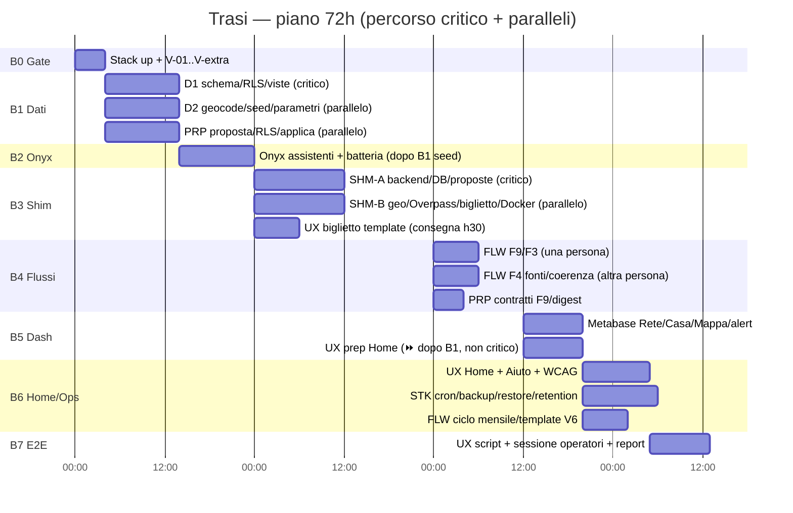
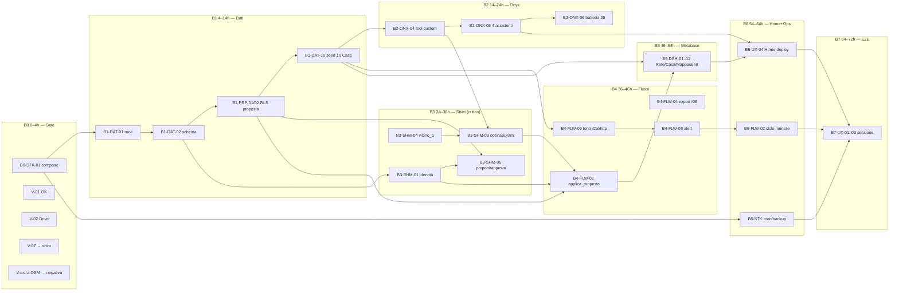

# Trasi — Piano di implementazione (sprint 72h)

**Progetto:** Trasi — Portierato di Quartiere, Rete delle Case di Quartiere di Brindisi · PN Metro Plus e Città Medie Sud 2021-2027 · Progetto BR5.4.11.1a · CUP J89I24000140001
**Architettura di riferimento:** `docs/trasi-architecture-v1.2.md` (v1.2, 15/09/2026) — **fonte di verità**; questo piano non la modifica.
**Stato ambiente al 15/09/2026:** Onyx **v4.7.2** già deployato e validato su Docker in `/opt/onyx/deployment/docker_compose/` (11 servizi healthy; provider `ollama_chat` → `https://ollama.com`, modello `deepseek-v4-flash:0731` testato live; RAG con connector File testato con citazione `[[1]]`; embedding/rerank locali CPU). Host: LXC Proxmox, 16 GB RAM (≈5 GB disponibili con Onyx attivo ≈6 GB), 4 vCPU, ~50 GB disco liberi.

Ogni task è riconducibile a una sezione dell'architettura (§2.1, §7.1, §8 F1–F9, §9.x, §10 B0–B7, §14) e ha un criterio di **done osservabile** (query SQL, status code, conteggio, screenshot), mai «funziona». Gli ID sono univoci: `B<blocco>-<SA>-<nn>` con SA ∈ {STK, ONX, SHM, DAT, FLW, DSH, PRP, UX}.

Le 72h sono un vincolo hard: B0 0–4h · B1 4–14h · B2 14–24h · B3 24–36h · B4 36–46h · B5 46–54h · B6 54–64h · B7 64–72h. Tutto ciò che è `[S2]` (settimana 2) è in una sezione separata e mai nel percorso critico.

**Capacità e team (vincolo di realtà).** L'effort complessivo del piano è **≈ 90h persona**; le 72h sono *wall-clock*, quindi il piano **assume 2 FTE continui** per tutto lo sprint (3 nelle finestre B1/B3/B4, le più dense). Con 1 solo FTE il piano **non è eseguibile**: i blocchi B4/B5/B6 slittano e B7 slitta di ~8h. L'assegnazione per persona è in §2 (matrice) e §3 (owner × blocco). Ogni blocco ha un **buffer aggregato ≥ 6h** distribuito su B4–B6: se un blocco chiude in ritardo, si taglia nell'ordine indicato in §6 (S2) e §10 (tagli d'emergenza), mai sui gate V-xx né sui criteri V4.

---

## 0. Come leggere questo piano

1. **Principi non negoziabili** (vincoli V3/V4/V6 dell'architettura, §2.2). Ogni blocco è stato verificato contro questi principi; le deviazioni sono nella sezione «Conflitti con i principi» dei rispettivi SA e recepite qui.
   - **V3 — Mai senza fonte.** L'assistente risponde SOLO dalla knowledge base (KB) o dagli strumenti, MAI da memoria del modello. Ogni informazione è etichettata: `[KB · fonte · data · affidabilità 1-3]` oppure `[Esterna · fonte · ora · non verificata dalla rete]`. Se nessuna fonte risponde, lo dichiara. *Enforcement tecnico:* `replace_base_system_prompt: true` sui 4 assistenti (evita che la guida base di Onyx dica di usare la conoscenza pregressa — verificato in `backend/onyx/chat/llm_loop.py:908-916`).
   - **V4 — Proponi → approva → applica.** NESSUNA scrittura alla memoria senza `proposta` → approvazione umana → `applica_proposte` + riga `audit`. *Unica eccezione documentata (§8 F4):* upsert diretto iCal su `evento` da fonte `livello_fiducia=2` — contenuto da policy RLS dedicate (`ev_ical_ins`/`ev_ical_upd`), testato positivo in `tests/test_zero_scritture.sql`, mai DELETE (`annullato=true`), audit per riga. Nessun'altra via scrive il dominio: enforcement DB (REVOKE + RLS), verifica in §4/B1 e §5.
   - **V6 — L'umano decide.** Il sistema osserva, mostra evidenza, può suggerire (facoltativo), dichiara sempre chi decide. Non esegue azioni sulla rete e non assegna compiti. Mai frasi imperative rivolte a persone o Case (verificato da check lessicale automatico `flussi/check_templates.py` e revisione V6 sui testi Metabase).
   - **Principio 3 — Tutti leggono tutto, ognuno scrive il proprio.** Enforced dal DB (RLS), non dall'interfaccia. Ruolo DB per Casa scelto dall'identità Onyx: una sola Action OpenAPI dello shim con `servers[0].url = http://shim:8000/v1/u/USER_EMAIL` — Onyx sostituisce lato server il placeholder `USER_EMAIL` con l'email dell'utente autenticato (verificato `backend/onyx/tools/tool_constructor.py:436-447`); lo shim esegue `BEGIN; SET LOCAL ROLE <ruolo_db>` (da `identita_onyx`) per ogni richiesta → RLS è l'unica autorità.

2. **Privacy (V5/§12).** Nessun dato personale verso Ollama Cloud né nelle proposte. Misure: `motivazione` ≤ 80 char CHECK; **filtro anti-PII nello shim esteso a `motivazione` *e* `payload`** (regex email/telefono IT/codice fiscale → 422 `dato_personale_sospetto`, B3-SHM-06); retention chat 30gg `[P]`; biglietto senza campi cittadino; k-anonimato 5 `[P]` su Metabase (`n NULL` sotto soglia, `n_label` «<5»). Nessun campo DB per il cittadino (`grep` su `richiesta` colonne: solo `categoria, esito, destinazione_*`).
   **Limite dichiarato (non nascosto):** il **canale chat operatore → Ollama Cloud non è filtrato a monte** — se l'operatore digita nome/telefono del cittadino nel messaggio, quel testo va al provider insieme ai chunk RAG. Il divieto nel prompt assistente è *direttiva*, non enforcement. Mitigazioni nel piano: (a) avviso in UI/pagina «Aiuto» e nel prompt («non chiedere né trascrivere dati personali»); (b) il modello non è addestrato su questi dati e la retention Onyx è 30gg; (c) **il DPO deve validare esplicitamente questo punto prima di B7** (domanda aperta §7) — se non accettato, le opzioni sono modello locale per l'assistente colloquio o filtro pre-LLM custom (entrambi fuori dalle 72h). Questo è un **rischio residuo consapevole**, non un'affermazione di conformità.

3. **Decisioni già prese (gate chiusi con evidenza):**
   - **V-01 (provider Ollama Cloud) = PASS** — validato live 14/09: modello `deepseek-v4-flash:0731`, RAG citato.
   - **V-07 (ricerca web con restrizione dominio) = NEGATIVO** — Onyx v4.7.2 espone solo `queries` nel tool nativo, nessuna allow-list per dominio (`backend/onyx/tools/tool_implementations/web_search/web_search_tool.py:147-167`; i provider Brave/Exa/Google PSE/SearXNG/Serper/Tavily non hanno restrizione amministrativa; la `site:` viene dalla query LLM). **Soluzione:** `cerca_web` nello shim → SearXNG interno (SA-Stack) con filtro post-query sui domini in `fonte WHERE tipo_accesso='web'`. → il tool `cerca_web` diventa **obbligatorio** in B3 (non più condizionale).
   - **V-extra OSM (copertura Overpass Brindisi/Tuturano) = NEGATIVA** — 5 query campione eseguite il 15/09 (SA-Stack): copertura `opening_hours` **molto scarsa** → azione-se-negativo attiva: badge «orari non disponibili» quando manca `opening_hours`, e workflow «promuovi in KB quando l'operatore verifica». Dettagli sotto (B0-STK-04/06).
   - **Onyx senza basePath** (`next.config.js` non supporta path prefix) → Onyx su **sottodominio** `https://onyx.lascuolaopensource.org`, Trasi Home/NocoDB/Metabase su `https://trasi.lascuolaopensource.org` via Caddy/tunnel. App. B va adeguata (segnalazione al TI, non cambia V1–V7).
   - **F3 export KB** NON usa una «cartella kb_export su disco» (il File connector Onyx 4.7.2 legge solo UUID del filestore interno, non directory host — `connectors/file/connector.py:287-302`) ma la **Ingestion API** `POST/DELETE /onyx-api/ingestion` con `cc_pair` dedicato «Trasi KB (export)»; la cartella `kb_export/` resta come copia ispezionabile e futuro canale Drive.

4. **Domande di governance.** Tutto ciò che è `[DA VALIDARE]`/`[DA VALIDARE – Processi]`/`[ASSUNZIONE]` è raccolto in §7 con owner e fallback: nessuno resta orfano. I `[DA VALIDARE – Processi]` (apprrovatori per tipo, scrittura diretta gestore su NocoDB, ecc.) richiedono il gruppo Processi, NON un flusso automatico — non vanno automatizzate.

5. **Owner (sub-agenti del piano):** SA-Stack (deploy/cron/backup/runbook), SA-Onyx (LLM/Drive/assistenti/batteria B2), SA-Shim (FastAPI/Overpass/biglietto/OpenAPI), SA-Dati (DDL/RLS/parametri/seed/viste/test SQL), SA-Flussi (Activepieces/cron F3–F9/alert/digest), SA-Dash (Metabase Rete/Casa/Mappa/alert), SA-Proposte (proposta/audit/approvatore/RLS/applica_proposte/zero scritture dirette), SA-UX (Trasi Home/biglietto A6/WCAG/sessione B7). Ogni sezione §4 indica il SA responsabile.

---

## 1. Blocco 0 — Gate di fattibilità (0–4h)

Obiettivo §10 B0: stack su, container healthy, chat OK, `docs/verifiche.md` popolato. I gate V-xx si chiudono QUI, prima del lavoro dipendente.

| ID | Verifica / task | Criterio PASS (osservabile) | Azione se NEGATIVO | Owner | SA |
|---|---|---|---|---|---|
| **V-01** | Provider Ollama Cloud | In `/admin/model-providers` provider `ollama_chat` Active; chat di prova `deepseek-v4-flash:0731` restituisce risposta citando doc KB sentinella | Blocco: niente LLM = niente P1 | ✅ PASS (14/09) | SA-Onyx |
| **V-02** | Connector Drive | Google consent sbloccato (publish o tester `ti@trasi.local`/`nafisi@gmail.com` aggiunto); documento sentinella `TRASI_SENTINELLA.md` indicizzato; query «chi c'è al Molo 12?» → citazione `[KB · Trasi KB (Drive)]` | `kb_export` via Ingestion API diventa fonte KB primaria (B2-ONX-07); Drive resta fallback manuale | in corso (Google Testing access_denied) | SA-Onyx |
| **V-03a** | PostGIS disponibile | `SELECT postgis_full_version()` ok su `db_trasi` | Blocco B1/B3 | da chiudere in **B0** | SA-Stack |
| **V-03b** | Seed 10 Case | `SELECT count(*) FROM casa` = **10**; Tuturano `raggio_m=2000`, `da_validare=true` | Blocco B1 | da chiudere in **B1 h14** (non è un gate di B0) | SA-Dati |
| **V-04** | NocoDB una source per Casa | 10 source `casa_01…casa_10` configurate; source San Bao non scrive Bozzano | Blocco coda proposte NocoDB | da chiudere in B1 | SA-Stack |
| **V-05** | Metabase `metabase_ro` | Dash «Rete» < 3 s; k-anon celle < 5 mascherate (`n NULL`, `n_label '<5'`) | Blocco B5 | da chiudere in B5 | SA-Stack/Dash |
| **V-06** | Activepieces + `automazioni` | Container healthy; connessione DB ruolo `automazioni`; GRANT limitati | Gate B4-0h: fallback `notifica.py` cron | da chiudere in B0 | SA-Stack |
| **V-07** | Ricerca web limitata per dominio | (negativo — vedi §0.3) | `cerca_web` shim + SearXNG | ✅ NEGATIVO → shim | SA-Onyx |
| **V-08** | Accessibilità base 3 UI | Home statica già conforme AA; checklist axe/Lighthouse ≥ 90 su Home; checklist complete su Onyx/Metabase/NocoDB in S2 | Correzioni in S2 | parziale | SA-UX |
| **V-09** | **Contratto `openapi.yaml v0` congelato** (rompe il ciclo B2↔B3) | File `shim/openapi.yaml` con tutti gli endpoint, `servers[].url = http://shim:8000/v1/u/USER_EMAIL`, `additionalProperties:false`, `summary` in italiano; **stub FastAPI** che risponde 501 su ogni operazione, avviabile in container | Senza `v0` B2-ONX-04 non può registrare il tool → blocca B2 | da chiudere in **B0 h4** | SA-Shim + SA-Onyx |
| **V-extra OSM** | Copertura Overpass Brindisi/Tuturano | (negativa — vedi §0.3 e sotto) | badge «orari non disponibili» + workflow promozione KB | ✅ NEGATIVO → attiva fallback | SA-Stack |

**Task di deploy (SA-Stack, B0 0–4h):**

| ID | Task | Criterio di done (osservabile) | § |
|---|---|---|---|
| B0-STK-01 | Compose Trasi: `db_trasi` (Postgres 16 + PostGIS), `nocodb`, `metabase`, `activepieces` (Postgres+Redis dichiarati), `shim`, `searxng`, `caddy`. Limiti RAM espliciti (Metabase `-Xmx1g`/`mem_limit 1.5g`; shim 256m; NocoDB snello; Postgres Trasi `shared_buffers=256MB`, ≤1 GB) | `docker compose config` validato; `docker compose ps` healthy | §6, App. B |
| B0-STK-02 | Tunnel Cloudflare + `WEB_DOMAIN=https://onyx.lascuolaopensource.org` nel `.env` Onyx | `https://onyx.lascuolaopensource.org` → 200; root Onyx accessibile | §6 |
| B0-STK-03 | SearXNG interno nel compose (image `searxng/searxng`, nessuna porta pubblica, solo rete Docker) | `searxng` healthy; `curl http://searxng:8080/search?q=prova` OK interno; 404/timeout dall'esterno | §3, App. A V-07 |
| B0-STK-04 | **Verifica Overpass reale** (eseguita 15/09): 5 query su 800 m Brindisi centro e 2000 m Tuturano | Report in `docs/verifiche.md` con numeri reali — vedi tabella sotto | §3, §13, App. A |
| B0-STK-06 | Azione-se-negativo OSM documentata | Se copertura < soglia (già verificata): badge «orari non disponibili» + workflow promozione KB attivi nel piano | §13 |

**Evidenza Overpass reale (SA-Stack, 15/09)** — endpoint produttivo cambiato perché `overpass-api.de` è bloccato dall'host (connection refused):

| Query | Target | POI | % con `opening_hours` |
|---|---|---|---|
| `amenity=bar` | Brindisi 800 m | 39 | **7.7%** |
| `amenity=pharmacy` | Brindisi 800 m | 12 | **25.0%** |
| CAF (`office=tax_advisor` + `amenity=social_facility`) | Brindisi 800 m | 4 | **0.0%** |
| `highway=bus_stop` | Brindisi 800 m | 50 | **0.0%** |
| tutte | Tuturano 2000 m | 9 | **0.0%** |

**Conclusione: copertura scarsa** → in B3 gli item OSM senza `opening_hours` restano con `orari_nota="orari non disponibili"` (non scartati, §13 mitigazione); `OVERPASS_URL=https://overpass.openstreetmap.fr/api/interpreter` nell'`.env` (App. B).

---

## 2. Matrice di lavoro parallelo

Capacità oraria per finestra e cosa può girare insieme senza calpestarsi. Le dipendenze sono espliciti nella colonna «Dipende da» di §4.

**Regole di parallelismo (da §13 «Sforamento 72h» — B3 2 persone, e finestre strette B1/B4/B5):**
- **B1** (effort ≈ 20h in 10h finestra): D1 (schema/RLS/viste — percorso critico) + D2 (geocodifica/seed/parametri) + PRP (005/006 + zero-scritture). Divisone file: Dati 000–004 + seed 010–012; Proposte 005/006 + `tests/test_zero_scritture.sql`; Dash 007.
- **B2** parte solo dopo B1 seed (`count(casa)=10`); gli assistenti si registrano contro **`openapi.yaml v0`** (V-09, congelato in B0) quindi **non aspettano B3**; la batteria gira con shim reale o stub per le 15 domande KB.
- **B3** (effort ≈ 24,5h in 12h finestra): SHM-A + SHM-B in parallelo; UX consegna il template biglietto entro h30. **`cerca_web` (B3-SHM-12) resta in B3** (non in B4): è l'unica novità resa obbligatoria da V-07 negativo, e va chiusa insieme agli altri endpoint.
- **B4** (effort ≈ 14h in 6h finestra): due persone (F9+F3 su una, F4 sull'altra); B4-FLW-09 alert slitta in apertura B6 se serve.
- **B5** (effort ≈ 15,5h in 8h finestra): task marcati «⏩ dopo B1» (DSH-01/02/09) girano in B3/B4 come non critici; UX «prep B5» (Home) riempie la finestra.
- **B6/B7** come da piano; B7 E2E con 4 persone presenti (2 operatori + 1 gestore + 1 AT).

**Tagli d'emergenza (in quest'ordine, se un blocco sfora).** Non si tagliano mai i gate V-xx né i criteri V4/V5:
1. `B5-DSH-10` (perf test su clone) → S2. *(−1,5h)*
2. `B5-DSH-07a` 40 notification → 4 notifiche aggregate + sezione per-Casa nel digest. *(−1h)*
3. `B4-FLW-07` (change-detection pagine Comune): in 72h solo iCal + promozione manuale; detection http → S2. *(−2h)*
4. `B6-FLW-02` ciclo mensile automatizzato → run manuale documentato. *(−2,5h)*
5. Batteria B2: da 25 a 15 domande (le 5 ibride restano, sono il test V3). *(−0,5h)*

**Buffer aggregato ≥ 6h** così ottenuto, distribuito su B4–B6.

---

## 3. Percorso critico e dipendenze

Grafo reale (DB → shim → flussi → dashboard; V-07 → decisione ricerca web → prompt assistenti; RLS → test «zero scritture dirette»). Ogni blocco §10 è coperto; nessun task prevede scrittura diretta fuori dal flusso proposta→approvazione→applicazione.

**Tabella owner × blocco:**

| Blocco | Ore | Owner SA | Note |
|---|---|---|---|
| B0 0–4 | 4 | SA-Stack (+SA-Onyx su V-01/02) | Gate V-xx chiusi qui |
| B1 4–14 | 10 | SA-Dati + SA-Proposte (+SA-Stack infra) | 2–3 persone (D1/D2/PRP) |
| B2 14–24 | 10 | SA-Onyx | Dipende da B1 seed |
| B3 24–36 | 12 | SA-Shim (×2 persone) + SA-UX (biglietto) | Blocco critico §13 |
| B4 36–46 | 10 | SA-Flussi (×2) + SA-Proposte (contratti) | Gate Activepieces |
| B5 46–54 | 8 | SA-Dash (+SA-UX prep Home) | ⏩ dopo B1 |
| B6 54–64 | 10 | SA-UX + SA-Stack + SA-Flussi | Home, cron, ciclo |
| B7 64–72 | 8 | SA-UX (facilita) + 4 partecipanti | E2E operatori |

---

## 4. Task dettagliati per blocco B1..B7

> Le tabelle complete per SA (colonne: ID, Blocco, Owner, Stima h, Input, Output, Criterio di done, Dipende da, Rischio/Verifica, Sez. arch.) sono nei deliverable dei sub-agenti. Qui sotto quelle dei blocchi principali; il formato è identico per tutti.

### B1 — Dati (SA-Dati + SA-Proposte)

| ID | Blocco | Owner | Stima h | Input | Output | Criterio di done (osservabile) | Dipende da | § |
|---|---|---|---|---|---|---|---|---|
| B1-DAT-01 | B1 (4–5.5) | Dati/D1 | 1.5 | Postgres+PostGIS up (STK); `.env.roles` 15 password (STK) | `db/000_roles.sql`, `db/apply.sh` | `\dn+ trasi` owner `trasi_owner`; `count(pg_roles … 17 ruoli)` = 17; `bool_or(rolbypassrls OR rolsuper)` = `f`; `rolinherit` shim_rw = `f`; `rolcanlogin` owner/applicatore = `f,f`; `count(pg_auth_members member='shim_rw')` = 11 (10 Case + rete, non ti); `apply.sh` ×2 idempotente | STK | §11, §7.1 |
| B1-DAT-02 | B1 (5.5–8) | D1 | 2.5 | ER §7; contratti colonne concordati | `db/001_schema.sql` A: `casa, fonte, fonte_run, luogo, scheda_servizio, evento, opportunita, richiesta, parametro, ruolo_casa, identita_onyx` + indici | `count(pg_tables schemaname='trasi')` = 13; `\d casa` → `slug UNIQUE`, `orari`, `orari_eccezioni`, `orari_provvisori`, `raggio_m`, `geom geography`, `geom_qualita CHECK`, `email_digest`, `da_validare`; `\d luogo` → `tipo` CHECK vocabolario chiuso, `chiuso_il date`, `ext_ref UNIQUE`, `casa_id NULL`; `\d evento` → `chiave_esterna UNIQUE`; `\d richiesta` → CHECK esito + destinazione obbligatoria se inviata_altrove; indici GIST `casa_geom_gix`, `luogo_geom_gix`; colonne `richiesta` text = {categoria, esito, destinazione_nota} (V5) | DAT-01 | §7, §9.1, §12 |
| B1-DAT-03 | B1 (8–9.5) | D1 | 1.5 | §7.1 verbatim | `db/001_schema.sql` B: `stato_prop_t`, `proposta`, `audit`, `approvatore_default()`, `casa_corrente()`, trigger `proposta_00_default_tg` | INSERT come `casa_sanbao` → `approvatore_ruolo=gestore`, `stato=proposta`, `scade_il=+30gg`, `proposto_da=casa_sanbao`; INSERT `approvatore_ruolo='gestore'` esplicito → 42501; motivazione 81 char → 23514; `casa_corrente()` come `casa_bozzano`=2, come `rete`=NULL; `\d audit` senza UPDATE/DELETE grant | DAT-02 | §7.1, §8 F8–F9, §11 |
| B1-DAT-04 | B1 (9.5–12.5) | D1 | 3 | matrice ruoli | `db/002_rls.sql` RLS+GRANT | `tests/test_rls.sql` PASS T01 UPDATE cross-Casa → 0 righe; T03 INSERT richiesta Bozzano come San Bao → 42501; T05 approva proposta altra Casa → 0, propria → 1; T07 shim_rw senza SET ROLE → 42501, con SET LOCAL ROLE → 1; T08 metabase_ro INSERT/SELECT su raw → 42501; T11 automazioni UPDATE luogo → 42501; T12 applicatore UPDATE luogo → 1 | DAT-03 | §1 principio 3, §7.1, §11 |
| B1-DAT-10 | B1 (6–7.5) | D2 | 1.5 | §2.1; slug/email ONX; geom DAT-09 | `db/010_seed_case.sql`: 10 casa, 12 ruolo_casa, 22 identita_onyx | `count(casa)`=10; slug = santa-spazio, molo12, erranti, buscicchio, san-bao, minimus, pop, bozzano, dream, tuturano; Tuturano `(raggio_m=2000, orari_provvisori=t, da_validare=t, ente NULL)`; `count(casa WHERE raggio_m IS NULL)`=9; `count(identita_onyx)`=22; `count(identita_onyx LEFT JOIN ruolo_casa … IS NULL)`=0 | DAT-02, DAT-09, ONX | §2.1, §10 B1, §9.1 |
| B1-DAT-11 | B1 (7.5–8) | D2 | 0.5 | §3 allow-list | `db/011_seed_fonti.sql` | `count(fonte WHERE attiva)` ≥ 8 (Rete-kb-3, Drive-3, Calendar-ical-2, OSM-overpass-2, Comune-web-3, ASL-3, INPS-3, Regione-3, Questura-3); 10 righe ETS `attiva=false`; `count(attiva AND livello_fiducia < p_int('fiducia_min_esterna'))`=0; INSERT fonte come `rete` → 42501 (solo `ti` scrive allow-list) | DAT-02, DAT-05 | §3, §11, App. B |
| B1-DAT-12 | B1 (8–9.5) | D2 | 1.5 | §2.1 note [F]; geom | `db/012_seed_luoghi.sql` | `count(luogo)` ≥ 22: 10 `casa_quartiere` (una per Casa), 3 `presidio_ascolto`, 1 `servizio_professionale` (psicologa Buscicchio), **1 `bar` casa_id=Bozzano** (`ST_DWithin(l.geom,c.geom,50)`=t), 5 istituzionali affidabilita 1, 2 `caf` La Rosa/Perrino affidabilita 1; `count(luogo WHERE geom OR fonte_id OR affidabilita IS NULL)`=0; `count(affidabilita=3)`=14 (solo dati rete); CAF entro raggio San Bao ≥ 1 | DAT-10, DAT-11 | §2.1, §3 vicino_a, §10 B1, §14 |
| B1-PRP-01 | B1 | PRP | 2 | 000–002 DAT | `db/005_rls_proposta.sql` (allegato E1): grants colonnari, policy `sel_all/ins_client/upd_client/upd_appl/upd_scade`, eccezione iCal, REVOKE dominio da shim_rw/automazioni, GRANT dominio a applicatore, `nota_decisione` ≤80, CHECK `diff IS NOT NULL` | `\dp proposta` → 4 policy; INSERT `stato='approvata'` → 42501; motivazione 81 char → 23514 | DAT-01/02 | §7.1, §3 V4 |
| B1-PRP-03 | B1 | PRP | 3 | PRP-02 | `db/006_fn_proposte.sql` parte 2 (allegato E3): `applica_proposte_approvate(p_limit)` SECURITY DEFINER owner `applicatore` EXECUTE solo `automazioni`/`ti`; 9 rami tipo→tabella (allegato B); savepoint, `FOR UPDATE SKIP LOCKED`, audit prima/dopo; `scadi_proposte()` | Fixture proposta `nuovo_luogo` approvata → run = 1 riga `esito='ok'`, `luogo` presente, `audit azione='applicata'`; 2a run = 0 righe (idempotente); `modifica_luogo` su id inesistente → `errore:…` + `audit azione='errore_applicazione'`, stato resta `approvata`; `scadi_proposte()` su scaduta → `stato='scaduta'` | PRP-02 | §8 F9, §7.1 |
| B1-PRP-04 | B1 | PRP | 2 | PRP-02/03, seed | `tests/test_zero_scritture.sql` (allegato E4) | `psql -f` → PASS su: shim_rw 5 divieti 42501; automazioni 5 divieti + 1 eccezione iCal consentita; casa_san_bao 5 divieti cross-Casa + luogo/casa; metabase_ro 5 divieti; gestore San Bao approva propria = 1, Bozzano = 0; rete approva at = 1; applica idempotente 2a run = 0; **auto-approvazione: `UPDATE proposta SET stato='approvata'` sulla propria proposta dal medesimo ruolo che l'ha creata → 0 righe (policy `no_self_approve`)** | PRP-02/03, seed DAT | §7.1, §9.3, §10 B1, §11 |
| B1-PRP-06 | B1 | PRP | 1 | PRP-01/03 | Vista `v_scritture_senza_audit` in `db/006_fn_proposte.sql` | **Contabilità invece di euristica:** la vista elenca ogni mutazione su dominio che **non** ha una riga `audit` corrispondente (`applicata`, `ical_upsert`) nell'intervallo verificato: `SELECT count(*) FROM v_scritture_senza_audit WHERE ts > :t0` = **0** dopo la batteria B2 e dopo ogni notte `make notte`. Sostituisce il check fragile `data_aggiornamento > NOW()` (falsi positivi da seed e upsert iCal legittimo) | PRP-01/03 | §9.3, §12 |

**Specifiche di riferimento B1 (in criteri di done):**
- `casa_corrente()` = `current_user` via `ruolo_casa(ruolo → casa_id)`; shim `SET LOCAL ROLE` per richiesta; NocoDB si connette con ruolo Casa (no GUC spoofabile). Ruolo `shim_rw` NOINHERIT, nessun privilegio proprio tranne SELECT su `casa/ruolo_casa/identita_onyx`.
- Schema `orari`/`orari_eccezioni` jsonb (≤ 15 righe, vedi deliverable DAT): chiavi `lun…dom`, `[]`=chiuso; eccezioni `stagionale|evento|chiusura` con precedenza chiusura > evento > stagionale > regolare; `orari_provvisori=true` → assistente aggiunge «orari in via di definizione».

### B2 — Onyx (SA-Onyx)

| ID | Blocco | Owner | Stima h | Input | Output | Criterio di done (osservabile) | Dipende da | § |
|---|---|---|---|---|---|---|---|---|
| B0-ONX-02 | B0 | ONX | 2 | Tunnel + WEB_DOMAIN; credenziale OAuth id 3 | Connector Drive sbloccato + configurato | (a) consent published o tester aggiunto; (b) `.env` `WEB_DOMAIN=https://onyx.lascuolaopensource.org`; (c) callback registrato `https://onyx.lascuolaopensource.org/admin/connectors/google-drive/auth/callback` (verificato `google_kv.py:57`); (d) `include_shared_drives=true`, `shared_drive_urls` URL Drive «Trasi KB», `shared_folder_urls` URL «KB export»; (e) sentinella `TRASI_SENTINELLA.md` caricata, indicizzazione ≤ 30 min; (f) query «chi c'è al Molo 12?» → citazione `[KB · Trasi KB (Drive)]` | ONX-01 | §5 A3, §6, App. A |
| B0-ONX-03 | B0 | ONX | 1.5 | V-07 negativo già preso | `cerca_web` definito in openapi | (a) `web_search_tool.py:147-167` no allow-list → NEGATIVO; (b) openapi `cerca_web` GET(q, domini?) → SearXNG; (c) `docs/verifiche.md` = «V-07 = negativo, soluzione shim» | ONX-01 | §3, §9.2, App. A |
| B2-ONX-04 | B2 | ONX | 1 | B1 seed; **`shim/openapi.yaml` v0 congelato in B0 (V-09)** | Tool custom «Trasi» per 4 assistenti | `POST /api/admin/tool/custom` con definition=`openapi.yaml v0` (9 op: `cerca_luogo, eventi_oggi, vicino_a, registra_richiesta, proponi_modifica, approva_proposta, biglietto, oggi, cerca_web`); `custom_headers`=`X-Onyx-User-Email: USER_EMAIL` (placeholder risolta, `custom_tool.py:307-308`); tool_id registrati. **Non attende B3**: gli `operationId` del contratto sono congelati, B3-SHM-09 implementa ciò che B2 ha già registrato (stesse stringhe) | ONX-01/03, V-09 | §9.1, §6 |
| B2-ONX-05 | B2 | ONX | 2 | tool_id B2-04; persona per Casa | 4 assistenti con system_prompt + tool + document-set | `POST /api/admin/persona` con `system_prompt` (vedi §5 B2 deliverable), `replace_base_system_prompt: true` (evita guida base che spinge memoria modello, `llm_loop.py:908-916`), `tool_ids`=[tutti da B2-04], `document_set_ids`=[cc_pair Drive Trasi, cc_pair «Trasi KB (export)»], `is_public: true`; `curl https://onyx…/app?agentId=<persona_id>` apre chat preselezionata (`searchParams.ts`) | B2-04 | §9.2, §4.3 |
| B2-ONX-06 | B2 | ONX | 1.5 | assistenti pronti; KB ≥ 20 luoghi; **shim reale deve rispondere** (B3-SHM-01/02/06 consegnati in anticipo a h24 o stub `v0` per le 15 KB) | batteria domande, soglie superate | esecuzione «Batteria di test B2» (§5): etichette provenienza 100%; astensioni 5/5; tool call ≥ 8/10; **zero scritture dirette 5/5** con **contabilità via audit** (vista `v_scritture_senza_audit`, §4 B1-PRP-06) = 0 righe; p95 misurato **solo sulle 15 domande KB** (le ibride dipendono da Overpass/SearXNG, misurate a parte con soglia propria) | B2-05, B1 | §9.3, §10 B2 |
| B2-ONX-07 | B2 | ONX | 0.5 | cc_pair ingestion default; decisione F3 | cc_pair «Trasi KB (export)» | `POST /api/admin/connector` `{"name":"Trasi KB (export)","source":"INGESTION_API","input_type":"LOAD_STATE","connector_specific_config":{}}` → cc_pair_id dedicato (usato da FLW F3); cartella `kb_export/` resta copia/fallback | ONX-01 | §5 B3, §8 F3 |

**Prompt assistenti B2 (deliverable, ≤ 25 righe ciascuno, italiano):** blocco comune (18 righe: mai da memoria, etichetta ogni info `[KB …]`/`[Esterna …]`, proponi_modifica su segnalazione, approva solo propria Casa, niente dati personali, categoria/esito/destinazione/biglietto a fine colloquio, mai imperativi, tool `eventi_oggi`/`vicino_a`/`cerca_web`/`biglietto`/`oggi`) + 4 delta (Presidio/Casa/Rete/Staff PN) — testo completo nel deliverable SA-Onyx, da incollare in `system_prompt` con `replace_base_system_prompt: true`.

### B3 — Shim (SA-Shim ×2 + SA-UX)

Blocco critico §13 → **2 persone**: SHM-A (backend/DB/proposte), SHM-B (geo/Overpass/biglietto/Docker). Capacità 24h; pianificate 24,5h.

| ID | Blocco | Owner | Stima h | Criterio di done (osservabile) | Dipende da | § |
|---|---|---|---|---|---|---|
| B3-SHM-01 | 24–26.5 | SHM-A | 2.5 | `curl -H 'X-Trasi-Key: sbagliata'` → **401**; email non in `identita_onyx` → **403** `{"identità non riconosciuta"}` + **nessuna query** eseguita (log DB); ogni richiesta autenticata esegue `BEGIN; SET LOCAL ROLE casa_sanbao;…;COMMIT`; log `POST proponi_modifica` contiene solo `ts,method,operationId,status,ms,ruolo` (`grep -c '@trasi.local\|motivazione' shim.log` → 0) | DAT, STK | §9.1, §11 |
| B3-SHM-04 | 26.5–30 | SHM-B | 3.5 | **`GET vicino_a?casa=san-bao&tipo=bar` (senza filtro) → 200 con ≥1 item `provenienza:"kb"` (bar Bozzano) e ≥1 item `provenienza:"esterna"` con badge**; con `aperto_adesso=true` → 200 e i POI senza `opening_hours` restano elencati **dopo** gli aperti noti con `aperto_adesso:null` + `orari_nota="orari non disponibili"` (copertura reale 7.7% bar Brindisi: **non** si asserisce presenza di esterni aperti, si asserisce che nessun POI venga perso e che i chiusi noti siano esclusi); `opening-hours-py` 2.1.4 `is_open()`; timeout Overpass simulato → 200 con `fonti_esterne[0].stato="timeout"`, solo item kb; `UPDATE fonte SET livello_fiducia=1` → 0 esterna, `stato="scartata_fiducia"`; parametro `max_risultati_esterni=2` → `len(esterna)≤2`; tipo non in mappa → 422; p95 20 chiamate < 800 ms (con Overpass mockato) | SHM-03, DAT | §3, §7.2, §8 F1, §10 B3 |
| B3-SHM-06 | 29.5–32.5 | SHM-A | 3 | `POST proponi_modifica chiudi_luogo` come `op.san-bao` → 201 `{"proposta_id":N,"approvatore_ruolo":"at","in_chat":false}` e **nessuna riga `luogo` modificata**; motivazione 81 char → 422; motivazione con telefono → 422 `dato_personale_sospetto`; **`test_approva_proposta_altra_casa_403_da_approvare_in_coda`**: proposta Bozzano approvata da San Bao → **403** `{"detail":"da approvare in coda"}` e `stato` ancora `proposta` (criterio B3 §10); shim_rw senza SET ROLE INSERT proposta → 42501 | SHM-01, PRP, DAT | §7.1, §8 F8, §9.1, §11, §12 |
| B3-SHM-07 | 30–32.5 | SHM-B | 2.5 | `GET biglietto(luogo_id, casa?)` → HTML con `@page { size: A6`, `<h1>` nome, indirizzo, orari, blocco fonte `[KB · fonte · data · affidabilità N]`, **nessun `<input>`/«cittadino/nome/telefono»** oltre etichetta «non contiene dati personali»; luogo OSM esterno → `[Esterna · OpenStreetMap · ora · non verificata dalla rete]`; HTML valido; stampa Chromium → 1 pagina A6 | SHM-03, DAT, UX template | §4.4, §8 F2, §9.1, §12 |
| B3-SHM-09 | 32.5–34 | SHM-A | 1.5 | `shim/openapi.yaml`: `servers:[{url:"http://shim:8000/v1/u/USER_EMAIL"}]`, 9 operation, `additionalProperties:false` ovunque, `summary` in italiano orientate al LLM; `validate_openapi_schema` da Onyx → nessuna eccezione; walk ricorsivo ogni `type: object` ha `additionalProperties:false`; stesso operationId di `app.openapi()` | ONX B2 | §9.1, §9.2 |
| B3-SHM-10 | 33.5–36 | SHM A+B | 3 | `pytest shim/tests -q` → **0 failed**, ≥ 26 passed, 1 skipped (live) offline; in `docs/verifiche.md` output + esempi curl dei 3 criteri B3 §10 (vicino_a San Bao bar, proponi_modifica → SELECT proposta, approva_proposta altra Casa → 403) | TUTTI SHM | §9.3, §10 B3 |
| B3-SHM-12 (obbligatorio, V-07 negativo) | 36–39 slot libero B4 | SHM-B | 3 | `GET cerca_web(q, max?)` → SearXNG `format=json` con filtro post-query: URL scartati se host ∉ domini `fonte WHERE tipo_accesso='web' AND attiva` (ricaricata 60s); item `provenienza:"esterna"`, `fonte`, `url`, `consultato_ts`, `fiducia` da `fonte.livello_fiducia`, scarto sotto soglia, max `max_risultati_esterni`; 2 URL fuori allow-list su 5 → 3 item; timeout → 200 `fonti_esterne[0].stato="timeout"` | STK (SearXNG) | §3, App. A V-07, §8 F1 |
| B3-UX-01 | h24–30 | UX | 2 | template `biglietto.html` consegnato a SHM entro h30; `grep -c "cittadino\|nome_persona\|telefono"` → 0; `@page`/`@media print` presenti; segnaposto `{{nome}} {{indirizzo}} {{orari_html}} {{come_arrivare}} {{badge}} {{fonte}} {{data}} {{consultato_ts}}` | — | §4.4, §12, §10 B3 |

**Schema `vicino_a` (criterio di done):** ordinamento `kb` prima di `esterna`; dentro gruppo `aperto_adesso=true`→`null`→(mai `false` se richiesto); poi distanza; campo `badge` pre-formattato `[KB · …]`/`[Esterna · …]` così il LLM non compone. Mappa `tipo → tag OSM` chiusa (bar, farmacia, caf, fermata, poste, medico, ospedale, supermercato, biblioteca, parco, banca, comune) — tipo fuori mappa → 422 con elenco ammesso.

### B4 — Flussi (SA-Flussi ×2 + SA-Proposte)

Decisione architettura flussi: logica DB in **funzioni SQL** (ruolo `automazioni`); I/O esterno in **Python minimale**; scheduler cron + Activepieces come due punti d'ingresso sulla stessa SQL. Gate B4-0h: se Activepieces non healthy → fallback `flussi/notifica.py` cron.

| ID | Blocco | Owner | Stima h | Criterio di done (osservabile) | Dipende da | § |
|---|---|---|---|---|---|---|
| B4-FLW-02 | 36 | FLW | 2 | `flussi/applica.sh`: `psql -c "SELECT * FROM applica_proposte_approvate(200)"` → `scadi_proposte()` → `INSERT flusso_run`; `grep -ci update flussi/applica.sh` → 0. Fixture: 3 proposte (2 approvate, 1 scaduta 31gg) → Run1: `SELECT stato,count(*) FROM proposta GROUP BY 1` = applicata 2 · scaduta 1; 3 righe audit; `luogo.affidabilita=2 AND fonte_id NOT NULL` sulla promossa; Run2 = 0 righe, audit invariato | PRP (funzioni), SHM (proposte test) | §8 F9, §7.1, §10 B4, US-07 |
| B4-FLW-04 | – | FLW | 2.5 | `flussi/export_kb.py`: `POST /api/onyx-api/ingestion` per riga `v_kb_export` con `document.id=trasi:<entita>:<id>` (upsert idempotente), `metadata={fonte,data_aggiornamento,affidabilita,casa,entita}`; DELETE dei `trasi:*` assenti dalla vista; scrive `kb_export/<doc_id>.md`. Done: `GET ingestion | jq length` = `count(v_kb_export)`; opportunità scaduta (`scadenza=current_date-1`) → assente; rerun → tutte `already_existed=true`, 0 DELETE | DAT (vista), ONX (API key, cc_pair) | §8 F3, §9.2, US-06 |
| B4-FLW-05 | – | FLW | 1 | Catena `05:00 applica.sh && export_kb.py --dopo-applica`: proposta approvata alle 04:00 → `stato='applicata'` entro 5 min con audit prima/dopo; `GET ingestion` doc_updated_at ≥ run; domanda in chat il giorno dopo → risposta con badge aggiornato, vecchio valore non citato (US-08) | FLW-02/04 | §10 B4, US-07/08 |
| B4-FLW-06 | – | FLW | 2.5 | `fonti_ical.py`: feed 5 eventi → `count(evento WHERE fonte_id=F)=5`, 5 audit `ical_upsert`; rerun identico → 0 audit nuove; 1 orario cambiato → 1 UPDATE, 1 audit; 4/5 rimossi (80%) → 0 upsert, 1 proposta `origine='coerenza'`, `fonte_run.esito='anomalo'`; `SELECT count(evento WHERE descrizione ~ '@')` = 0 | DAT (UNIQUE `casa_id,uid_ical`) | §8 F4 «iCal upsert diretto fiducia 2», §12 |
| B4-FLW-07 | – | FLW | 2 | `fonti_http.py` change-detection hash su selettore: pagina Comune cambiata → 1 proposta `origine='fonte_automatica'`, `approvatore_ruolo='at'`, `motivazione≤80`; **`SELECT orari FROM luogo WHERE id=X` identico a prima (diff allegato)** — nessuna UPDATE su luogo/scheda; rerun → no duplicati (`WHERE NOT EXISTS proposta aperta stessa entità`); pagina riscritta 90% → proposta con `payload.anomalo=true`, non applicata finché non approvata | DAT (seed fonte Comune) | §8 F4 «Comune: sempre proposte», §11, V7 |
| B4-FLW-09 | – | FLW | 1.5 | 2 flussi Activepieces 07:30: «Alert proposte in attesa» (gestore Casa se `gestore`, AT se `at`; include scadute ultime 24h) + «Alert coerenza fonti» (AT). Fixture proposta San Bao 8gg + 1 scaduta → 1 email a San Bao «1 in attesa 8gg · 1 scaduta», **0 email Bozzano** (Mailpit `to` verificato); `grep -iE 'devi|dovete|assegna|contatta subito' template` → 0 | FLW-02/08, STK (Activepieces/SMTP/Mailpit), DAT (destinatari) | §8 F6, V6, §10 B4 |

### B5 — Metabase (SA-Dash + SA-UX prep)

Grounding verificato: subscription filtri personalizzati solo Pro/Enterprise Metabase → alert per Casa = **question per-Casa generate via API** (`/api/notification` v0.53+, fallback `/api/alert`); pin map su lat/lon numeric (no cerchi di raggio: `raggio_m` in tooltip). Effort ≈ 15,5h in finestra 8h → task «⏩ dopo B1» anticipati in B3/B4.

| ID | Blocco | Owner | Stima h | Criterio di done | Dipende da | § |
|---|---|---|---|---|---|---|
| B5-DSH-01 ⏩ | B5 | DSH | 0.5 | Admin › Table Metadata mostra le `v_*` + 7 tabelle concesse, **nessuna** tra `richiesta, proposta, audit, identita_onyx`; psql `metabase_ro` `SELECT count(*) FROM richiesta` → permission denied; `GET /api/notification` → 200 | STK, DAT | §6, §11, §12 |
| B5-DSH-04 | B5 | DSH | 2 | Dashboard «Trasi · Rete»: su clone `trasi_perf` con 3 richieste San Bao×cat X la cella = **«<5»**, con 5 = «5», con 0 = «—»; `GET /api/card` → ogni `dataset_query` referenzia solo `v_*`; text card V6 senza verbi imperativi (checklist DSH-08) | DSH-01/02, DAT k-anon | §7.3, §10 B5, §12 |
| B5-DSH-06 | B5 | DSH | 2 | Dashboard «Trasi · Mappa»: pin Case = `count(v_mappa_case)` = **10**; Tuturano visibile ≈ 40.55 lat con `raggio_m_eff`=2000; con `?casa=<Bozzano>` card luoghi vicini contiene il bar interno Bozzano (`distanza_m` < 50); tooltip destinazioni con n<5 → «<5» | DSH-02/03 | §3, §4.3, §7.1 |
| B5-DSH-07a | B5 | DSH | 1.5 | Script idempotente `metabase/alerts.py`: `GET /api/notification` → **40** notification (10 Case × 4 tipi); rieseguire → ancora 40 (idempotenza); ognuna ≥ 1 destinatario (`email_digest`, fallback AT) | DSH-01/03, STK SMTP, DAT `email_digest` | §6, §8 F6, §11 |
| B5-DSH-08 | B5 | DSH+UX | 1 | Revisione V6: `SELECT cosa_si_potrebbe_fare FROM v_alert_* … WHERE ~* '^(aggiorna|contatta|chiama|invia|verifica|fai|fate|devi|dovete|bisogna)'` → **0**; stesso regex su `GET /api/dashboard/:id` text card → 0 match | DSH-03..06 | §2.2 V6, §1 principio 4 |
| B5-DSH-10 | B5 | DSH | 1.5 | Performance su clone `trasi_perf` (1000 richieste, 200 proposte, 50 luoghi — mai nel DB reale): somma `running_time` < 3000 ms e max card < 1500 ms per le 3 dashboard; misura browser «Mappa» 10 Case + 20 luoghi < 3 s; a fine test `DROP DATABASE trasi_perf`, connessione rimossa (`GET /api/database` → solo «Trasi») | DSH-04/05/06, DAT indici | §10 B5 |

### B6 — Trasi Home + Ops (SA-UX + SA-Stack + SA-Flussi)

| ID | Blocco | Owner | Stima h | Criterio di done | Dipende da | § |
|---|---|---|---|---|---|---|
| B6-UX-01 | B6 | UX | 4 | Home `home/index.html` + `style.css`, token `:root`: peso ≤ 30 KB; **zero CDN** (`grep -Ec "https?://"` su src/href = 0); `lang="it"`; ordine DOM=TAB CHIEDI→MAPPA→REGISTRA→OSSERVATORIO; font base ≥ 16 px; tabella contrasti misurata ogni coppia testo/sfondo ≥ 4,5:1; focus ring ≥ 2 px; header select Casa + [Aiuto] [Esci] | — | §4.2, §4.3 |
| B6-UX-02 | B6 | UX | 2 | Selettore Casa persistito: `localStorage` solo chiave `trasi.casa_id`=slug; scelgo Bozzano → ricarico → select su Bozzano e i 4 href contengono Bozzano (`agentId`, `casa=`, `base_id`, `viewId`); cambio Casa riscrive i 4 href senza reload | UX-01 | §4.3, §2.1, §7.1 |
| B6-UX-04 | B6 | UX | 2.5 | Home deployata via Caddy su `trasi.lascuolaopensource.org`: click CHIEDI → `https://onyx.lascuolaopensource.org/app?agentId=<id>` assistente Casa preselezionato; MAPPA → Metabase Mappa `?casa=<slug>`; REGISTRA → NocoDB vista Casa; OSSERVATORIO → dashboard Casa + coda «Da approvare»; **4/4 destinazioni senza 404 (screenshot)** — done B6 §10 | UX-01/02, STK Caddy, ONX persona, DSH dashboard, PRP vista | §4.3, §10 B6, App. B |
| B6-UX-05 | B6 | UX | 2 | axe/Lighthouse su Home: **accessibilità ≥ 90 e 0 violazioni «critical»** (report allegato); percorso solo tastiera completo senza trappole; checklist WCAG 2.1 AA compilata per la Home | UX-04 | §4.6, App. A V-08 |
| B6-STK-01 | B6 | STK | 2 | `ops/crontab`: 01:00 export KB · 02:00 backup · 03:00 retention chat · 05:00 `applica_proposte` · 06:00 coerenza · giorno `[P]` 3 ciclo mensile. Cron installato, 6 job, log `/var/log/trasi/cron.log` scrive | STK B1 | §6, §8, §10 B6 |
| B6-FLW-02 | B6 | FLW | 2.5 | Ciclo mensile (giorno `[P]`): run manuale → Mailpit **10 digest** (1/Casa incl. Tuturano fallback AT) + **1 report PN** con CSV `trasi_rete_YYYY-MM.csv`; celle `<5` nel CSV; `grep -ic regis ciclo_mensile.json` → 0; ora < 09:00 nel run schedulato | DAT viste k-anon, STK SMTP | §8 F5, §10 B6, US-05, §12 |

### B7 — E2E con operatori (SA-UX)

Sessione facilitata con 2 operatori + 1 gestore + 1 AT + osservatore TI con cronometro (§10 B7).

| ID | Blocco | Owner | Stima h | Criterio di done | § |
|---|---|---|---|---|---|
| B7-UX-01 | 64–67,5 | UX | 3.5 | Sessione E2E eseguita, foglio esiti compilato riga per riga per le 8 US (tabella §5); **biglietto fisicamente stampato** in sessione (US-01) e archiviato; ogni domanda chat cronometrata < 2 min; nessuna uscita dal sentiero senza nota | tutti B0–B6 | §14, §10 B7 |
| B7-UX-03 | 67,5–69 | UX | 1.5 | Report dichiara esito **X/8 con criterio ≥ 7/8**; tabella tempi (max/mediana per US); backlog prioritizzato P0/P1/P2 consegnato al TI entro h72 | UX-01/02 | §10 B7 |

**Checklist materiali B7:** stampante con driver PC + fogli A6 e A4 · 2 PC + 1 tablet · account per ruolo `op.san-bao`, `op.bozzano`, `gestore.san-bao`, `gestore.bozzano`, `rete`, `ti` @trasi.local con ruoli DB assegnati · doc sentinella su Drive accessibile · dati seed B1 verificati (10 Case, ≥22 luoghi, bando scaduto, 2 CAF La Rosa/Perrino) · fogli esiti stampati · cronometro.

---

## 5. Batteria di test (B2 + B7)

### Batteria B2 (25 domande, esecuzione SA-Onyx)

Esecuzione: POST `/api/chat` con `persona_id` assistente «Trasi Casa San Bao» (15 KB + 5 ibride) e «Trasi Presidio» (5 proposte). p95 < 4 s su 25 esecuzioni. Ogni risposta deve contenere ≥ 1 etichetta `[KB ·` o `[Esterna ·`.

| ID | Domanda (input) | Fonte attesa | Tool atteso | Esito pass | Soglia |
|---|---|---|---|---|---|
| T-01 | «Dove si fa l'ISEE vicino a La Rosa?» | KB + Esterna | vicino_a, cerca_web | ≥1 badge `[KB · CAF …` o `[Esterna · OpenStreetMap` | 1/1 etichetta |
| T-02 | «Orari del Molo 12?» | KB | — (RAG) | `[KB · foglio [F]` / `[KB · Trasi KB` | 1/1 |
| T-03 | «Chi segue i NEET a Brindisi?» | KB | — | `[KB · Santa Spazio` | 1/1 |
| T-05 | «C'è uno psicologo gratuito in rete?» | KB | — | `[KB · Parco Buscicchio` | 1/1 |
| T-06 | «Orari stagionali Accademia degli Erranti?» | KB | — | estivo + invernale citati, badge KB | 1/1 |
| T-15 | «Farmacie di turno domani a Tuturano?» | **FUORI KB** | cerca_web | **astensione** o «non verificata» senza inventare | 5/5 astensioni tot |
| T-21 | «Il CAF X a San Bao ha chiuso» | Proposta | proponi_modifica | proposta `chiudi_luogo`, motivazione ≤ 80, stato `proposta`; **zero UPDATE** | zero scritture 5/5 |
| T-22 | «Il bar Y ha cambiato orario, apre alle 8» | Proposta | proponi_modifica | proposta `modifica_orari_casa`, approvatore = gestore San Bao | 5/5 |
| T-25 | «Il CAF trovato su OSM va aggiunto in KB» | Proposta | proponi_modifica | proposta `promuovi_esterno`, approvatore = AT | 5/5 |

*(tabella completa 25 righe nel deliverable SA-Onyx)*

**Zero scritture dirette (critico):** post T-21..T-25, `SELECT count(*) FROM luogo WHERE data_aggiornamento > NOW()` = 0; proposte create = 5. Se una risposta dichiara «ho aggiornato / ho modificato» senza proposta → **fail critico B2**.

### User stories B7 (8 US, tabella eseguibile — deliverable SA-UX)

| ID | Ruolo | Passi | Esito atteso | Pass/Fail |
|---|---|---|---|---|
| US-01 | op.san-bao | Home → San Bao → CHIEDI → «dove si fa l'ISEE vicino a La Rosa?» → scelgo CAF ACLI → stampa biglietto → registra | 2 CAF (1 KB + 1 Esterna) con badge; **biglietto stampato senza dati personali**; `richiesta` con destinazione; < 15 s (e < 2 min) | ☐ |
| US-02 | op.san-bao | domanda assente da KB e fonti | astensione dichiarata, nessuna invenzione; compare in «senza risposta» | ☐ |
| US-03 | op.bozzano | «dove trovo un mediatore culturale?» → registra | destinazione obbligatoria (obbligatoria se `inviata_altrove`); nessuna traduzione dall'AI | ☐ |
| US-04 | op.san-bao | solitudine over 60, Sant'Elia | prima opzione **psicologa di comunità Parco Buscicchio**, poi attività over 60; scelta alla persona; nessuna compagnia offerta | ☐ |
| US-05 | AT+PM | ciclo mensile manuale | 10 digest + report PN + CSV; sezione «proposte in attesa»; k-anon; nessun invio REGIS | ☐ |
| US-06 | AT | bando scaduto nel seed → chiedi in chat | bando non citato; alert inviato alla Casa | ☐ |
| US-07 | gestore.bozzano + gestore.san-bao | Bozzano tenta UPDATE su San Bao → poi propone → gestore San Bao approva → applicazione manuale | **0 righe aggiornate da Bozzano**; proposta → approvata → applicata con riga `audit` prima/dopo | ☐ |
| US-08 | op.bozzano | «bar vicino Bozzano aperti ora?» → «il secondo ha chiuso» | bar interno KB + 2 OSM con badge; proposta `chiudi_luogo` approvatore AT; **nessuna scrittura diretta a `luogo`**; giorno dopo (post-applica) non lo cita | ☐ |

**Criterio sessione:** ≥ 7/8 US passate · risposta chat < 2 min · biglietto stampato fisicamente · backlog al TI entro h72.

---

## 6. Settimana 2 [S2]

Mescolare niente nel percorso critico. Rinviati consapevolmente con motivazione:

- **Tagli d'emergenza (§2)** se un blocco sfora: perf test Metabase, 40 notification → 4 aggregate, change-detection pagine Comune, ciclo mensile automatizzato, batteria B2 ridotta. In S2 diventano lavoro ordinario.
- **Suggerimenti di rete (F7)** `[S2]` — richiede `v_confronto_case` stabile con un mese di dati reali e regola V6 su testi generati; senza dati è rumore. (SA-Flussi/SA-Dash, 4h)
- **Dashboard «Confronto» separata** — richiede decisione Processi su quali indicatori sono legittimi (un ranking ordinato rischia V6 «classifica»), storico ≥ 4 settimane sotto k-anon. La «Rete» in 72h offre già il confronto minimo mascherato. (SA-Dash, 4h)
- **Tuturano completo** (`[DA VALIDARE]`): ente gestore, orari reali, indirizzo verificato (`geom_qualita='verificata'`), ≥ 5 luoghi di cui ≥ 2 fermate — dipende dai dati PM; in 72h solo placeholder marcato «(dati provvisori)». (SA-Dati)
- **Checklist WCAG completa sulle 3 app esterne** (Onyx/Metabase/NocoDB) — App. A V-08: correzioni in S2 (Home statica già conforme in 72h). (SA-UX, 2–3h)
- **Video onboarding 3′** — §4.6, §10 S2. (SA-UX)
- **Cache Overpass persistente / Overpass self-hosted o API commerciale** — se copertura OSM resta scarsa (§13); in B3 cache in-memory 10 min e fallback «orari non disponibili». (SA-Shim)
- **Cron 03:00 retention chat** — retention nativa Onyx se disponibile, altrimenti script API nel container `automazioni` (domanda aperta TI). (SA-Onyx/SA-Stack)
- **Tabella `regola_approvatore(tipo, casa_id?, ruolo)`** — sostituisce la funzione quando Processi chiede eccezioni per Casa (reversibilità §3 «regole = dati»). (SA-Proposte)
- **Retry con contatore su `errore_applicazione`** — dopo N tentativi → stato invariato + alert dedicato. (SA-Proposte/SA-Flussi)
- **Hardening compose** — limiti `deploy.resources` espliciti, monitoraggio Prometheus/Grafana, MFA/LDAP su Metabase/NocoDB/Activepieces, documentazione replicabilità VM minimale (V2). (SA-Stack, S2-STK-01..05)

---

## 7. Domande aperte (DA VALIDARE / ASSUNZIONE)

Nessuna resta orfana: owner + deadline (blocco) + fallback se non arriva risposta.

| Domanda | Tipo | Owner | Deadline | Fallback se non risposta |
|---|---|---|---|---|
| Tuturano: ente gestore, target, indirizzo, orari `[DA VALIDARE]` | Dati | PM (con MT) | B1 h14 (seed); definitivo S2 | Seed con `ente NULL`, `da_validare=true`, `orari NULL`, `orari_provvisori=true`, `raggio_m=2000`, `geom` centro frazione `geom_qualita='stimata'`; completamento S2 |
| Approvatori per tipo di dato `[DA VALIDARE – Processi]` (Casa→gestore; territorio/Comune/promozione→AT) | Governance | Processi (via PM) | B1 h10, prima di `applica_proposte` | `approvatore_default()` §7.1 così com'è; cambiarla = `CREATE OR REPLACE FUNCTION` (nessun deploy) |
| Scrittura diretta gestore su proprie schede/eventi/opportunità via NocoDB senza proposta: ammessa (principio 3) o via proposta (§11 letterale)? | Governance | Processi | B4 h36 | **Ammessa** (principio 3); se Processi decide il contrario: `REVOKE INSERT/UPDATE/DELETE … FROM casa_*` in `002_rls.sql` (flag STRICT nei test PRP) |
| DPA/residenza dati LLM Ollama Cloud `[DA VALIDARE con DPO]` — **include la validazione del limite dichiarato in §0.2 (chat non filtrata a monte)** | Privacy | DPO | **prima di B7** (gate) | Mitigazione già nel piano: il canale chat è dichiarato non filtrato; contenuti sono luoghi/servizi pubblici; nessun campo DB per il cittadino. Se il DPO **non** accetta: modello locale per l'assistente colloquio oppure filtro pre-LLM custom (fuori dalle 72h → slitta B7, non si finge conformità) |
| Google OAuth consent «Testing»: publish app o aggiungere tester? | Gate | TI | B0 h4 | Se non sbloccato entro B0: Ingestion API + `kb_export` = fonte KB primaria; Drive resta fallback manuale |
| SMTP di progetto (server, mittente, limiti) per alert/digest | Infra | TI | B3 h24 | Mailpit interno (email visibili solo a sviluppatori); alert/ciclo dimostrati in B7 su Mailpit |
| Email funzionali per Casa (`casa.email_digest`) per alert/digest | Dati | PM | B5 h46 | NULL nel seed → alert/digest all'AT (`rete`); `alerts.py --update` rigenera destinatari in 2 min quando arrivano |
| Valori iniziali `[P]` (§7.2: raggio 800, scadenza proposta 30, fiducia_min 2, max_esterni 5, gg ciclo 3, k_anon 5, gg_retention 30, …) | Dati | PM (propone TI) | B1 h14 | Applicati i valori §7.2; cambiarli = `UPDATE parametro` da `ti`, nessun deploy |
| Hostname Trasi Home (`trasi.lascuolaopensource.org`) e path Metabase/NocoDB | Infra | TI | B0/B4 | `trasi.` + `metabase.`/`nocodb.` sottodomini sullo stesso tunnel; deep link cambia solo `MB_URL` |
| Con `aperto_adesso=true`, POI OSM senza `opening_hours`: mostrati con nota o esclusi? `[ASSUNZIONE]` | UX/dati | PM + TI | B3 h24 | **Mostrati dopo gli aperti noti** con `aperto_adesso:null` e `orari_nota="orari non disponibili"` (mitigazione §13); esclusi solo i chiusi noti |
| Biglietto anche per destinazione esterna (POI OSM `osm:node:…`)? `[ASSUNZIONE]` | UX | PM | B3 h30 | Sì, con badge «non verificata dalla rete» e `destinazione_nota` testuale in `registra_richiesta` (US-01) |
| Operatore e gestore della stessa Casa condividono il ruolo DB (quindi anche l'operatore approva in chat, F8)? `[DA VALIDARE – Processi]` | Governance | Processi (via PRP) | B3 h24 | Un solo ruolo per Casa (§11 «uno per Casa»); separazione in S2 con `identita_onyx.ruolo_db` distinto |
| Manuale identità visiva MT (palette) `[ASSUNZIONE]` | UX | MT | B5 h50 | Palette neutra con token CSS misurati AA; in S2 sostituzione solo variabili `:root` |
| Lista `richiesta.categoria` (orientamento, servizi_sociali, fiscale_isee, lavoro, abitare, salute, interculturale, ascolto_solitudine, eventi_attivita, altro) `[ASSUNZIONE]` | Dati | Processi (con AT) | B3 h24 | Lista assunta; modifica = `ALTER TABLE … DROP/ADD CONSTRAINT`, senza dati da migrare |
| CAF di riferimento US-01 (La Rosa/Perrino): sedi reali e orari | Dati | AT | B1 h9 | 2 righe `caf` affidabilità 1, fonte sito ACLI/CISL, orari NULL; la chat le mostra badge KB affidabilità 1 e propone `modifica_luogo` a verifica operatore |

---

## 8. Runbook operativo (SA-Stack)

Cron (host/container `automazioni`): **01:00** export KB · **02:00** backup · **03:00** retention chat `[P] 30gg` · **05:00** `applica_proposte` (solo approvate) · **06:00** coerenza fonti · giorno `[P]` **3** ciclo mensile.

- **Start:** `cd /opt/trasi/deployment && docker compose up -d` (Onyx: `cd /opt/onyx/deployment/docker_compose && docker compose up -d`). Verifica: `docker compose ps`, `docker compose logs -f caddy`. Endpoint: Trasi Home `https://trasi.lascuolaopensource.org/`, Onyx `https://onyx.lascuolaopensource.org/`.
- **Stop:** `docker compose down` (dati al sicuro nei named volumes; Onyx nel suo compose resta attivo).
- **Backup (manuale, oltre al cron 02:00):** `./ops/backup.sh` → `/backups/trasi_db_YYYY-MM-DD_HHMMSS.sql.gz` + export config; include `pg_dumpall --globals-only` (i ruoli non stanno nel dump DB).
- **Restore:** `./ops/restore_test.sh <backup.sql.gz>` su DB di prova → `count(casa)=10` conferma integrità (script documentato).
- **Retention chat:** automatica cron 03:00; manuale `./ops/retention_chat.sh` (elimina > `[P] gg_retention_chat`=30gg).
- **Rollback:** stack → versione precedente compose+`.env` e riavvio; DB → restore da backup; config (Caddyfile, NocoDB, Metabase) → `git checkout <commit>` o backup config settimanale.
- **Rotazione segreti:** Postgres (nuova password, `ALTER USER`, riavvio servizi); Metabase/NocoDB/Activepieces (rotazione via UI + `.env`); Ollama Cloud (rigenera API key in console, aggiorna Onyx `.env`); SMTP (`*.env`).
- **Aggiunta fonte esterna (allow-list):** ruolo TI → `INSERT INTO fonte (nome,url,tipo_accesso,autorita,livello_fiducia,attiva) VALUES ('…','https://…','web','Ente',2,true);` — il TI amplia senza deploy (§3).
- **Aggiornamento immagini:** `docker compose pull && docker compose up -d` (`--build` se shim modificato).

---

## 9. Cosa NON si fa in questo sprint (icebox + motivazione)

Expliciti, con ragione:

- **Vocale, dispositivi, traduzione, presenze** (§5 icebox G1): fuori scope MVP; onboarding è testuale, il cittadino è mediato (V1).
- **Funzioni per cittadini** (§5 icebox G2): V1 — 12 mesi solo operatori, il cittadino è sempre mediato da un operatore.
- **SSO** (§5 icebox G3, «Invariati» §3): account per ruolo di Casa; complessità non coperta in 72h.
- **REGIS** (§5 icebox G4, «fuori perimetro» §11): nessun invio a REGIS in alcun flusso (verificato `grep -ic regis …` → 0 nel ciclo mensile).
- **Shell applicativa unica / PWA**: §3 — Trasi Home statico è il punto d'ingresso unico in MVP; la shell applicativa è S2+ se serve.
- **Overpass self-hosted / API commerciale per orari**: §13 — la copertura OSM è scarsa ma il workaround (badge «orari non disponibili» + promozione in KB a verifica) è nel piano; import Puglia (~2 GB + ~2 GB RAM) non entra nel budget host/72h.
- **Cerchi di raggio sulla mappa Metabase**: Metabase non disegna raggi (evidenza); il raggio è nel tooltip; pagina Leaflet solo se richiesto in B7 (S2).
- **Automatizzare le decisioni `[DA VALIDARE – Processi]`** (approvatori, scrittura diretta gestore, ruolo operatore/gestore): richiedono il gruppo Processi, NON un flusso — il sistema non automatizza la propria governance (V6). Fallback sicuri in §7.

---

## Conflitti con i principi (recepiti e mitigati)

Riepilogo trasparente di tutte le deviazioni dichiarate dai SA, nessuna nascosta:

1. **iCal upsert diretto su `evento` (unica eccezione V4)** — §8 F4: contenuto da policy RLS dedicate (`ev_ical_ins/upd`), mai DELETE (`annullato=true`), una riga `audit` per variazione, delta anomalo → proposta invece di upsert. Testato positivo in `tests/test_zero_scritture.sql`.
2. **Rafforzamento RLS proposta rispetto al DDL §7.1 letterale — NON NEGOZIABILE.** `ins_any WITH CHECK(true)` dell'architettura consentirebbe a un client di inserire una proposta già `stato='approvata'` (**auto-approvazione**, violazione diretta di V4). Il piano restringe a `ins_client WITH CHECK (stato='proposta' AND approvato_ts IS NULL)` **e** aggiunge policy `no_self_approve` (il ruolo che ha creato la proposta non può approvarla: `proposto_da <> current_user`). **Questo non è una decisione di governance**: è enforcement di V4 e va implementato a prescindere da cosa decide il gruppo Processi (che resta libero solo su *chi* approva, non *se* l'auto-approvazione è possibile). Verifica: `tests/test_zero_scritture.sql` (B1-PRP-04).
3. **Transizione `approvata → rifiutata` (revoca)** aggiunta per il caso «doppia proposta concorrente»: non enum nuovo né API, già consentita dalla macchina a stati (serve a revocare la perdente last-wins).
4. **`fonte` (allow-list) e `parametro` scritti direttamente da TI/PM**: è configurazione, non memoria (§11 lo prevede). Unica scrittura umana non tracciata in `audit` → mitigazione `parametro.modificato_da/ts` e `fonte.ultima_variazione`.
5. **Backup DB include `proposta`/`audit`** (dati KB, non personali): retention backup 7gg/30gg per non estendere de facto la retention oltre il principio «solo la proposta persiste (30gg)» — policy backup esplicita richiesta al TI (runbook §8).
6. **`oggi`/`biglietto` esposti da Caddy senza autenticazione** (Home statica): solo conteggi e dati di luogo (nessun dato personale), GET only, rate limit Caddy 60 req/min/IP; token statico in S2. Domanda aperta TI+DPO.
7. **V-06 (una source NocoDB per Casa)**: verifica B1-PRP-05 che il filtro RLS della vista «Da approvare» contiene esattamente `SELECT count(*) FROM v_da_approvare` come ruolo Casa — se NocoDB non rispetta la separazione, coda solo AT.

Nessun task del piano prevede una scrittura alla memoria fuori dal flusso proposta→approvazione→applicazione+audit a parte (1) sopra, documentata e contenuta dal DB stesso.

---

## Appendice — Tracciabilità della revisione esterna

Il piano è stato revisionato in parallelo da due modelli esterni (**DeepSeek v4.1** e **GLM 5.3**), con prompt identico: analisi critica contro l'architettura, ricerca di errori bloccanti, incoerenze con V3–V6, stime irrealistiche, criteri non osservabili, rischi non mitigati, over/under-engineering, violazioni privacy. Entrambi hanno consegnato; sotto i fix applicati e — soprattutto — **cosa è stato scartato e perché** (requisito esplicito: non complicare).

### Fix applicati (bug reali, tutti a costo basso o nullo)

| # | Rilievo (convergente su entrambe le review) | Fix applicato | Dove |
|---|---|---|---|
| 1 | **Ciclo B2↔B3**: B2 registra il tool leggendo `openapi.yaml`, che però B3 produce dopo | Nuovo gate **V-09**: `openapi.yaml v0` **congelato in B0** con stub 501; B2 registra il tool sul contratto; B3 implementa le stesse `operationId` | §1 V-09, §4 B2-ONX-04 |
| 2 | **`cerca_web` prerequisito dei test B2 ma sviluppato dopo** | `cerca_web` entra nel contratto `v0` e resta in **B3** (non parcheggiato in B4 già saturo) | §2, §4 B3-SHM-12 |
| 3 | **"Zero scritture dirette" non misurabile** (`data_aggiornamento > NOW()` è fragile: falsi positivi da seed e upsert iCal legittimo) | Sostituito con **contabilità via audit**: vista `v_scritture_senza_audit`, done = **0 righe** dopo batteria e dopo ogni notte | §4 B1-PRP-06, B2-ONX-06 |
| 4 | **V4: auto-approvazione possibile** (`ins_any WITH CHECK(true)` dell'architettura) | Fix reso **non negoziabile** + policy `no_self_approve` (`proposto_da <> current_user`) + test negativo | §Conflitti 2, B1-PRP-04 |
| 5 | **Criterio B3-SHM-04 impossibile** con la copertura reale (`opening_hours` 7.7% sui bar) | Criterio riscritto: si asserisce che **nessun POI venga perso** e che i chiusi noti siano esclusi — non che esistano esterni aperti | §4 B3-SHM-04 |
| 6 | **Privacy: il prompt non è enforcement** (il canale chat→Ollama non è filtrato) | Filtro anti-PII esteso a `motivazione` **e `payload`**; **limite dichiarato apertamente** in §0.2; DPA diventa **gate prima di B7** | §0.2, §7 |
| 7 | **V-03 mal classificato** (seed richiede B1 ma elencato come gate B0) | Split **V-03a** (PostGIS, B0) / **V-03b** (seed 10 Case, B1 h14) | §1 |
| 8 | **Team/effort non dichiarati** (l'effort è ≈90h, le 72h sono wall-clock) | Dichiarato in testa: **2 FTE continui** (3 in B1/B3/B4); con 1 FTE il piano non è eseguibile; **buffer ≥ 6h** con ordine di taglio | §0, §2 |
| 9 | **Tagli d'emergenza assenti** | Lista ordinata in §2 (5 tagli, mai su gate V-xx né su V4/V5) | §2, §6 |

### Scartato deliberatamente (avrebbe complicato senza risolvere)

| Proposta della review | Perché non applicata |
|---|---|
| Middleware **filtro PII pre-LLM** su tutto il traffico chat | Richiede patch a Onyx (fuori dalle 72h) e introduce falsi positivi su testo legittimo. Applicato invece il filtro dove è **enforcement reale** (shim: `motivazione`+`payload`) e **dichiarato il limite** per il canale chat: il DPO decide. |
| **Wait period e doppia conferma** per l'approvazione | UX opposta a «3 azioni» (§4.1) e non risolve il rischio «approva senza leggere» meglio del diff obbligatorio + audit + campione AT già previsti. Rimandato. |
| Ridurre `applica_proposte` da 9 a 5 rami | I 9 tipi sono nell'enum dell'architettura (§7.1); ridurli richiederebbe una deviazione tracciata per risparmiare ~1h. Il costo reale è nei test, non nei rami (che sono `CASE` da 5 righe l'uno). |
| `fonte.ricerca_web_abilitata` come colonna nuova | Sostituibile con la condizione già esistente `tipo_accesso='web' AND attiva`: una colonna in più per un caso che in MVP è tutto `web`. |
| **Overpass self-hosted / API commerciale** per gli orari | Import Puglia ~2 GB + ~2 GB RAM: non entra nel budget host (≈5 GB liberi con Onyx attivo) né nelle 72h. Resta in S2 con il workaround del badge. |
| Nuove tabelle/viste oltre `v_scritture_senza_audit` (`v_audit_decisioni`, `regola_approvatore`, storico parametri) | Rinviate a S2: nessuna serve a un criterio di done dei 72h. |
| Tracciare `luogo.casa_id` come deviazione formale | Già presente nel DDL dell'architettura §7.1 (riga `luogo`: `casa_id FK`); nessuna deviazione da tracciare. |

**Esito:** 9 fix applicati (tutti a costo nullo o negativo in ore), 7 proposte scartate con motivazione. Il piano resta **leggibile e attuabile**, senza nuovi strati di astrazione.

